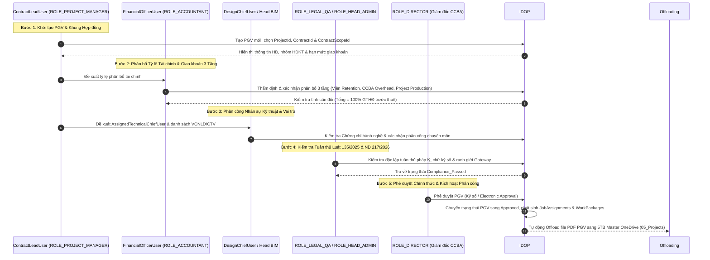
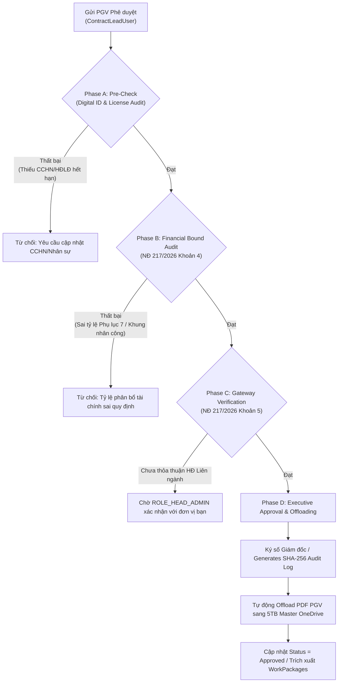

# Kế hoạch & Nội dung Cập nhật Đặc tả Kỹ thuật Module PMO (R2 Revision Plan)

> **Dự án**: Integrated Digital Operation Platform (IDOP) — CCBA / IBST  
> **Module**: `process_execution/pmo` (`specs/modules/process_execution/pmo/spec.md`)  
> **Tác giả**: Explorer 2 (`teamwork_preview_explorer_m1_2`)  
> **Phiên bản đặc tả**: R2 (Revision 2)  
> **Ngày lập**: 2026-08-02  

---

## 1. Tóm tắt Mục tiêu Cập nhật R2 (Executive Summary)

Module PMO (Quản lý Phân công Công việc & Phiếu Giao việc PGV) là trái tim của quy trình vận hành sản xuất nội bộ CCBA. Phiên bản R2 của đặc tả `specs/modules/process_execution/pmo/spec.md` được nâng cấp toàn diện nhằm đáp ứng các yêu cầu kiến trúc và pháp lý mới:

1. **Số hóa Quy trình 5 Bước Nhập liệu PGV (5-Step PGV Data Entry Sequence)**: Chuyển đổi từ luồng 4 bước tổng quát sang quy trình 5 bước kỹ thuật chặt chẽ, gắn liền với chuỗi 7 bước nghiệp vụ IDOP và 4 luồng PGV (Điều 7 QCTK 2815).
2. **Phân định Rõ ràng 4 Vai trò Kỹ thuật & Quản lý**: Làm rõ trách nhiệm, quyền hạn và tương tác giữa `ContractLeadUser`, `DesignChiefUser`, `FinancialOfficerUser`, và `AssignedTechnicalChiefUser`.
3. **Quy tắc Nghiệp vụ Phân bổ Đa Hạng mục (Multi-Scope) & Đa Phòng ban (Multi-Department)**: Chuẩn hóa logic tính toán phân bổ tài chính 3 tầng (Trích nộp Viện, Kinh phí Đơn vị, Kinh phí Chủ trì & Dự án) trên các hợp đồng phức tạp bao gồm nhiều `ContractScopes` (theo Phụ lục 7 QCCTNB 3209) và liên kết nhiều đơn vị/phòng ban (Điều 7.1c & 7.7 QCTK 2815).
4. **Tuân thủ Pháp lý Luật 135/2025/QH15 & NĐ 217/2026/NĐ-CP (Khoản 4 & Khoản 5 Điều 26)**: Tích hợp các yêu cầu về hợp đồng điện tử, chữ ký số, tính không thể chối bỏ (non-repudiation), kiểm soát tính độc lập của kiểm tra nội bộ và cơ chế bảo toàn dữ liệu offloading 5TB Master OneDrive.
5. **Ma trận Từ điển Ngôn ngữ Thống nhất (Ubiquitous Language Matrix)**, **Hệ thống Vai trò 3 Tầng (3-Tier Role Hierarchy)** và **Luồng Phê duyệt Verification Luật 135/2025**.

---

## 2. Ma trận Từ điển Ngôn ngữ Thống nhất & Hệ thống Vai trò 3 Tầng

### 2.1 Ma trận Từ điển Ngôn ngữ Thống nhất (Ubiquitous Language Matrix)

| Thuật ngữ Nghiệp vụ CCBA / IBST | Thự thể / SharePoint List IDOP | Vai trò / Entra ID Group | Quy chế / Căn cứ Pháp lý Dẫn chiếu |
|:---|:---|:---|:---|
| **Phiếu Giao Việc (PGV)** | `JobAssignments`, `AssignmentDetails` | `ROLE_PROJECT_MANAGER`, `ROLE_DIRECTOR` | QCTK 2815 Điều 7; Quy chế CCBA Điều 11 |
| **Chủ trì Hợp đồng (Contract Lead)** | `JobAssignments` (`ContractLeadUser`) | `ROLE_PROJECT_MANAGER` (`CCBA_ChuTri_All`) | QCTK 2815 Điều 3.2a & Điều 9.4 |
| **Chủ nhiệm Thiết kế (Design Chief)** | `JobAssignments` (`DesignChiefUser`) | `ROLE_HEAD_BIM_DESIGN` (`CCBA_PhongBIMThietKe`) | QCTK 2815 Điều 3.2b & Điều 7.5 |
| **Phụ trách Kế toán (Financial Officer)**| `JobAssignments` (`FinancialOfficerUser`) | `ROLE_ACCOUNTANT` (`CCBA_KeToan`) | QCCTNB 3209 Điều 8.2; Quy chế CCBA Điều 9 |
| **Chủ trì Kỹ thuật Phụ trách (Assigned Tech Chief)** | `JobAssignments` (`AssignedTechnicalChiefUser`) | `ROLE_STAFF` / `ROLE_HEAD_BIM_PROJECT` | QCTK 2815 Điều 3.2c & Điều 7.5 |
| **Hạng mục Hợp đồng (Contract Scope)** | `ContractScopes` (`ContractScopeId`) | `ROLE_PROJECT_MANAGER`, `ROLE_ACCOUNTANT` | QCCTNB 3209 Phụ lục 7 & Phụ lục 8 |
| **Phân bổ Doanh thu 3 Tầng** | `allocations` (`SharedCostAllocations`) | `ROLE_ACCOUNTANT`, `ROLE_DIRECTOR` | QCCTNB 3209 Phụ lục 7 & QCTK Bảng 1 |
| **Hợp đồng Điện tử & Chữ ký Số** | `cde_documents`, `approvals` | `ROLE_LEGAL_QA`, `ROLE_HEAD_ADMIN` | Luật 135/2025/QH15; NĐ 217/2026 Khoản 4, 5 Điều 26 |

### 2.2 Hệ thống Vai trò 3 Tầng (3-Tier Role Hierarchy) trong PMO

```
┌────────────────────────────────────────────────────────────────────────────────────────┐
│ TẦNG 1: QUẢN TRỊ & PHÊ DUYỆT CHIẾN LƯỢC (STRATEGIC & EXECUTIVE CONTROL)               │
│ - ROLE_DIRECTOR (Giám đốc Trung tâm): Phê duyệt PGV cuối cùng, ban hành QĐ phân công    │
│ - ROLE_DEPUTY_DIRECTOR (Phó Giám đốc): Phê duyệt PGV thuộc khối quản lý được ủy quyền  │
│ - ROLE_LEGAL_QA (Cố vấn Pháp lý & QLCL): Thẩm định tính tuân thủ Luật 135/2025 & NĐ 217│
└────────────────────────────────────────────────────────────────────────────────────────┘
                                           │
                                           ▼
┌────────────────────────────────────────────────────────────────────────────────────────┐
│ TẦNG 2: QUẢN LÝ VẬN HÀNH & KẾ TOÁN (OPERATIONAL MANAGEMENT & GATEWAY)                   │
│ - ROLE_HEAD_ADMIN (Trưởng phòng TH): Gateway thẩm tra luồng 4 HĐ Viện ký / HĐ liên ngành│
│ - FinancialOfficerUser / ROLE_ACCOUNTANT: Thẩm tra định mức tài chính 3 tầng          │
│ - DesignChiefUser / ROLE_HEAD_BIM_DESIGN: Kiểm duyệt giải pháp kỹ thuật thiết kế       │
│ - ROLE_HEAD_BIM_PROJECT: Kiểm duyệt năng lực thực thi & kế hoạch hiện trường          │
└────────────────────────────────────────────────────────────────────────────────────────┘
                                           │
                                           ▼
┌────────────────────────────────────────────────────────────────────────────────────────┐
│ TẦNG 3: THỰC THI & SẢN XUẤT NỘI BỘ (EXECUTION & PRODUCTION)                             │
│ - ContractLeadUser / ROLE_PROJECT_MANAGER: Khởi tạo PGV, chịu trách nhiệm P&L        │
│ - AssignedTechnicalChiefUser: Trực tiếp điều hành kỹ thuật gói việc/hiện trường        │
│ - ROLE_STAFF (Viên chức NLĐ): Thực thi nhiệm vụ, ghi nhận Timesheet                   │
│ - ROLE_EXTERNAL_PARTNER (Cộng tác viên/CTV): Thực hiện HĐ giao khoán chuyên môn        │
└────────────────────────────────────────────────────────────────────────────────────────┘
```

---

## 3. Phân định Rõ ràng 4 Vai trò Tham gia PGV

| Vai trò Kỹ thuật / Hệ thống | Vai trò Tổ chức (`ROLE_ID`) | Trách nhiệm Giải trình & Quyền hạn theo QCTK 2815 & QCCTNB 3209 |
|:---|:---|:---|
| **`ContractLeadUser`** *(Chủ trì Hợp đồng)* | `ROLE_PROJECT_MANAGER` | - Là người chịu trách nhiệm cao nhất, toàn diện về tài chính và kỹ thuật của nhiệm vụ (Điều 3.2a & Điều 9.4 QCTK 2815).<br/>- Khởi tạo PGV, đề xuất danh sách nhân sự, phân chia tỷ lệ sản lượng dự kiến.<br/>- Trực tiếp quản lý và chi tiêu trong phần kinh phí được giao khoán đúng pháp luật và Quy chế CCBA. |
| **`DesignChiefUser`** *(Chủ nhiệm Thiết kế)* | `ROLE_HEAD_BIM_DESIGN` | - Chịu trách nhiệm về giải pháp kỹ thuật, sự phù hợp tiêu chuẩn/quy chuẩn thiết kế và QA/QC bản vẽ (Điều 3.2b & Điều 9.1b QCTK 2815).<br/>- Kiểm duyệt chuyên môn thiết kế trên PGV, phân công Chủ trì bộ môn (kết cấu, kiến trúc, M&E, PCCC).<br/>- Quản lý và duyệt việc sử dụng thư viện BIM Family nội bộ. |
| **`FinancialOfficerUser`** *(Phụ trách Kế toán)* | `ROLE_ACCOUNTANT` | - Kiểm tra tính hợp lý, hợp pháp của định mức giao khoán 3 tầng theo Phụ lục 7 QCCTNB 3209.<br/>- Đảm bảo tỷ lệ trích nộp Viện (CPQL + KHTS) và quỹ điều hành CCBA được tính đúng theo từng `ContractScopeId`.<br/>- Kiểm soát chứng từ thanh quyết toán, khấu trừ thuế TNCN và đôn đốc giải ngân. |
| **`AssignedTechnicalChiefUser`** *(Chủ trì Kỹ thuật Phụ trách)* | `ROLE_STAFF` / `ROLE_HEAD_BIM_PROJECT` | - Là cá nhân trực tiếp đảm nhận chức danh chuyên môn (Giám sát trưởng, Chỉ huy trưởng công trường, Chủ trì bộ môn - Điều 3.2c & Điều 7.5 QCTK 2815).<br/>- Phải có chứng chỉ hành nghề phù hợp và HĐLĐ đang có hiệu lực với Viện/CCBA.<br/>- Chịu trách nhiệm trực tiếp về chất lượng sản phẩm kỹ thuật và nhật ký hiện trường. |

---

## 4. Trình tự 5 Bước Nhập liệu Phiếu Giao Việc PGV (5-Step PGV Data Entry Sequence)

Quy trình nhập liệu và phê duyệt PGV trên IDOP được chuẩn hóa theo 5 bước tuần tự:



### Chi tiết Kỹ thuật từng Bước:

1. **Bước 1: Khởi tạo PGV & Khung Hợp đồng (PGV Initiation & Scope Binding)**
   - *Thực hiện*: `ContractLeadUser` (`ROLE_PROJECT_MANAGER`).
   - *Thao tác*: Tạo mới bản ghi `JobAssignments` (PGV Header), chọn `ProjectId`, `ContractId` và chọn 1 hoặc nhiều `ContractScopeId` từ danh sách `ContractScopes`.
   - *Ràng buộc*: `ContractId` phải ở trạng thái `IBST_Approved` (HĐ Viện ký) hoặc `Approved` (HĐ CCBA ký).

2. **Bước 2: Phân bổ Tỷ lệ Tài chính & Giao khoán 3 Tầng (Financial Allocation & Tier 1/2/3 Split)**
   - *Thực hiện*: `FinancialOfficerUser` (`ROLE_ACCOUNTANT`) phối hợp với `ContractLeadUser`.
   - *Thao tác*: Nhập tỷ lệ/giá trị trích nộp:
     - **Tầng 1 (Trích nộp Viện)**: Lấy tự động theo `TyLeVienCPQL` + `TyLeVienKHTS` của `ContractScopeId` (Phụ lục 7 QCCTNB 3209).
     - **Tầng 2 (Kinh phí Đơn vị CCBA)**: Trích quỹ điều hành nội bộ CCBA (theo Quy chế CCBA 2026 Điều 11).
     - **Tầng 3 (Kinh phí Giao khoán Sản xuất)**: Phần kinh phí còn lại giao cho Chủ trì HĐ và nhóm thực hiện dự án.
   - *Ràng buộc*: Hệ thống tự động validation formula:  
     $$\text{Tier 1} + \text{Tier 2} + \text{Tier 3} = \text{Giá trị Hạng mục trước thuế (VND)}$$

3. **Bước 3: Phân công Nhân sự Kỹ thuật & Vai trò (Technical Personnel & Role Assignment)**
   - *Thực hiện*: `DesignChiefUser` (`ROLE_HEAD_BIM_DESIGN` / `ROLE_HEAD_BIM_PROJECT`) và `ContractLeadUser`.
   - *Thao tác*: Gán `AssignedTechnicalChiefUser` cho từng hạng mục công việc. Thêm các `ROLE_STAFF` và `ROLE_EXTERNAL_PARTNER` (CTV).
   - *Ràng buộc*:
     - Kiểm tra Chứng chỉ hành nghề phù hợp với loại công trình/gói thầu (Điều 7.4 & 7.5 QCTK 2815).
     - CTV phải có Hợp đồng giao khoán công việc được Giám đốc CCBA phê duyệt (Điều 7.6 QCTK 2815).

4. **Bước 4: Kiểm tra Tuân thủ Luật 135/2025 & NĐ 217/2026 (Compliance Audit & Verification)**
   - *Thực hiện*: `ROLE_LEGAL_QA` (Cố vấn Pháp lý) & `ROLE_HEAD_ADMIN` (Gateway).
   - *Thao tác*: Kiểm tra tính độc lập của bộ phận kiểm soát nội bộ (Điều 4.8 QCTK 2815 & Khoản 4 Điều 26 NĐ 217/2026). Xác nhận tính hợp lệ của chữ ký số/thông điệp dữ liệu theo Luật 135/2025/QH15.
   - *Ràng buộc*: Nếu PGV thuộc HĐ Liên ngành (nhiều đơn vị thuộc Viện), `ROLE_HEAD_ADMIN` phải xác nhận tỷ lệ thỏa thuận với đơn vị bạn trước khi chuyển Giám đốc duyệt.

5. **Bước 5: Phê duyệt Chính thức & Kích hoạt Phân công (Executive Approval & Offloading)**
   - *Thực hiện*: `ROLE_DIRECTOR` (Giám đốc CCBA) hoặc `ROLE_DEPUTY_DIRECTOR` (Phó Giám đốc được ủy quyền).
   - *Thao tác*: Phê duyệt điện tử / Ký số PGV.
   - *Kết quả System*:
     - Khóa cứng (Lock) dữ liệu tài chính PGV, không cho chỉnh sửa trực tiếp.
     - Phát sinh tự động các bản ghi `WorkPackages` và `Activities` tương ứng.
     - Xuất bản bản in PDF chính thức của PGV và đẩy về **5TB Master OneDrive (`ccba@ibst-bim.vn/05_Projects/<ProjectCode>/PGV/`)**.

---

## 5. Quy tắc Nghiệp vụ Phân bổ Đa Hạng mục (Multi-Scope) & Đa Phòng ban (Multi-Department)

### 5.1 Quy tắc Phân bổ Đa Hạng mục Hợp đồng (Multi-Scope Allocation)

Khi một Hợp đồng Kinh tế bao gồm nhiều gói dịch vụ/hạng mục khác nhau (ví dụ: vừa Thiết kế N2a, vừa Thí nghiệm tại hiện trường N2d, vừa Thí nghiệm trong phòng N2f):

1. **Bắt buộc phân rã `ContractScopes`**: Mỗi hạng mục trong hợp đồng phải được khai báo thành 1 bản ghi trong list `ContractScopes` kèm theo `NhomHopDongKT` tương ứng.
2. **Áp dụng tỷ lệ trích nộp Viện riêng biệt cho từng Scope**:
   - Scope A (N2a): Trích nộp Viện 9.0% (7% CPQL + 2% KHTS), giao đơn vị 91.0%.
   - Scope B (N2f): Trích nộp Viện 26.0% (16% CPQL + 10% KHTS), giao đơn vị 74.0%.
3. **Công thức tính Trích nộp Viện tổng hợp của Hợp đồng**:
   $$\text{Total\_Vien\_Retention} = \sum_{i=1}^{n} \left( \text{AmountBeforeVAT}_i \times (\text{TyLeVienCPQL}_i + \text{TyLeVienKHTS}_i) \right)$$
4. **Quản lý Khung Chi phí Nhân công**: Chi phí nhân công cho từng Scope không được vượt quá khoảng $[\text{KhungNhanCongMin}_i, \text{KhungNhanCongMax}_i]$ quy định tại Phụ lục 8 QCCTNB 3209.

### 5.2 Quy tắc Phân bổ Đa Phòng ban / HĐ Liên ngành (Multi-Department Allocation)

Khi hợp đồng do CCBA chủ trì nhưng có sự tham gia của các đơn vị/trung tâm khác thuộc Viện IBST (hoặc phối hợp giữa các phòng nội bộ CCBA):

1. **Đơn vị Chủ trì & Đơn vị Phối hợp**: Chỉ có 01 Đơn vị chủ trì giữ vai trò đầu mối. Đơn vị chủ trì cử `ContractLeadUser` quản lý toàn bộ PGV.
2. **Thỏa thuận Tỷ lệ Sản lượng (PGV Ratio Agreement)**: Tỷ lệ giá trị phân chia giữa CCBA và các đơn vị phối hợp phải được ghi rõ trong PGV dưới dạng % sản lượng và số tiền tuyệt đối.
3. **Gateway Trưởng phòng Tổng Hợp (`ROLE_HEAD_ADMIN`)**:
   - Đối với đơn vị ngoài CCBA (thuộc Viện): `ROLE_HEAD_ADMIN` làm gateway thống nhất biên bản thỏa thuận tỷ lệ phân chia với Trưởng đơn vị bạn (Điều 7.1c QCTK 2815) trước khi trình Lãnh đạo Viện / Giám đốc CCBA phê duyệt.
   - Trạng thái trên IDOP: `Pending_InterDept_Agreement` $\rightarrow$ `InterDept_Approved`.
4. **Hạch toán Kinh phí Quản lý Phối hợp**: Trưởng đơn vị chủ trì thực hiện việc phân bổ kinh phí quản lý chung cho các đơn vị phối hợp theo đúng tỷ lệ đã ký kết trên PGV (Điều 9.1i QCTK 2815).

---

## 6. Tuân thủ Pháp lý: Luật 135/2025/QH15 & NĐ 217/2026/NĐ-CP (Khoản 4 & Khoản 5 Điều 26)

### 6.1 Luật 135/2025/QH15 (Hợp đồng Điện tử & Giao dịch Số trong Cơ quan KH&CN Public)
- **Giá trị Pháp lý tương đương Văn bản Giấy**: Mọi PGV, Quyết định phân công và Bản thỏa thuận giao khoán được khởi tạo, ký số và phê duyệt trên IDOP có giá trị pháp lý ràng buộc toàn bộ VCNLĐ CCBA (QCTK 2815 Điều 3.2n).
- **Tính Không thể Chối bỏ (Non-Repudiation)**: Khi `ROLE_DIRECTOR` hoặc `ContractLeadUser` xác thực phê duyệt PGV, hệ thống tự động ghi lại SHA-256 Digest, Timestamp ISO 8601 và User Certificate Identity vào `ApprovalAuditLogs`.

### 6.2 NĐ 217/2026/NĐ-CP (Khoản 4 & Khoản 5 Điều 26)

- **Khoản 4 Điều 26 — Phân định Trách nhiệm Tài chính & Độc lập Kiểm soát**:
  - Giám đốc CCBA và Chủ trì HĐ chịu trách nhiệm liên đới toàn diện về tính hợp lý, hợp pháp của chứng từ và tỷ lệ phân bổ tài chính trên PGV (QCTK 2815 Điều 4.9 & Điều 9.1c).
  - Bộ phận kiểm soát nội bộ (`ROLE_LEGAL_QA`) phải hoạt động độc lập với nhóm trực tiếp thực hiện dự án (QCTK 2815 Điều 4.8).

- **Khoản 5 Điều 26 — Kiểm soát Minh bạch Dữ liệu & Offloading Kiến trúc**:
  - Cấm sửa đổi trực tiếp dữ liệu PGV sau khi đã duyệt (`Immutable PGV Status`). Mọi thay đổi về Chủ trì HĐ, Chủ trì Kỹ thuật hoặc Tỷ lệ phân bổ phải lập **PGV Điều chỉnh** theo đúng trình tự 5 bước (QCTK 2815 Điều 7.1c).
  - Tuân thủ rào cản kiến trúc Metadata-First: File PDF скан/Ký số PGV chính thức được offload hoàn toàn sang 5TB Master OneDrive (`ccba@ibst-bim.vn`), chỉ lưu URL link và metadata trên SharePoint List `JobAssignments` để bảo vệ tenant quota.

---

## 7. Luồng Phê duyệt Verification Luật 135/2025 (4-Phase Automated Integrity Audit)



---

## 8. Đề xuất Nội dung Chi tiết Cập nhật `specs/modules/process_execution/pmo/spec.md` (R2 Revision Text)

Dưới đây là **TOÀN BỘ NỘI DUNG MỚI** đề xuất ghi đè / cập nhật vào file `specs/modules/process_execution/pmo/spec.md`:

```markdown
# Đặc Tả Kỹ Thuật Module: PMO (Quản lý Phân công Công việc & Phiếu Giao việc PGV) - Phiên bản R2

> **Mã Module**: `process_execution/pmo`  
> **Phiên bản Đặc tả**: R2 (Revision 2)  
> **Căn cứ Pháp lý**: QCTK 2815/QĐ-VKH (Điều 7), QCCTNB 3209/QĐ-VKH (Điều 8, Phụ lục 7 & 8), Quy chế CCBA 2026 (Điều 9, 11), Luật 135/2025/QH15, Nghị định 217/2026/NĐ-CP (Khoản 4 & Khoản 5 Điều 26).  
> **Kiến trúc Dẫn chiếu**: [05_ccba_ibst_boundary_map.md](../../../../.md/system_blueprint/05_ccba_ibst_boundary_map.md) (Bước 3), [06_ccba_org_role_matrix.md](../../../../.md/system_blueprint/06_ccba_org_role_matrix.md).

---

## 1. Mục tiêu & Phạm vi (Goal & Scope)

### 1.1 Mục tiêu
- Số hóa toàn bộ quy trình Giao việc, Phân công nhân sự và Lập Phiếu giao việc (PGV) nội bộ CCBA trên nền tảng IDOP v2.0.
- Thực thi chuẩn hóa Step 3 Giao việc (`giao_viec_pgv`) trong Chuỗi 7 bước nghiệp vụ IDOP theo 4 luồng PGV (Điều 7 QCTK 2815).
- Thiết lập quy trình 5 bước nhập liệu PGV chặt chẽ, hỗ trợ phân bổ tài chính đa hạng mục (Multi-Scope) và hợp đồng liên ngành đa đơn vị (Multi-Department).
- Tích hợp 4 vai trò quản lý kỹ thuật & tài chính (`ContractLeadUser`, `DesignChiefUser`, `FinancialOfficerUser`, `AssignedTechnicalChiefUser`).
- Tuân thủ nghiêm ngặt các quy định pháp lý về Hợp đồng điện tử (Luật 135/2025/QH15) và cơ chế kiểm soát minh bạch tài chính (NĐ 217/2026/NĐ-CP Khoản 4 & 5 Điều 26).

### 1.2 Phạm vi (Scope)
- **Bao gồm (In-Scope)**:
  - Trình tự 5 bước nhập liệu và phê duyệt PGV trên IDOP.
  - Phân định thẩm quyền phê duyệt nội bộ của Giám đốc CCBA và phân bổ tài chính 3 tầng (Viện Retention, CCBA Overhead, Project Production Budget).
  - Tích hợp dữ liệu giữa `JobAssignments`, `AssignmentDetails`, `ContractScopes`, `SharedCostAllocations` và `WorkPackages`.
  - Cơ chế Offloading file PDF PGV đã phê duyệt sang 5TB Master OneDrive (`05_Projects`).
- **Không bao gồm (Out-of-Scope)**:
  - Quản lý quy trình nội bộ của các đơn vị Viện IBST bên ngoài CCBA (IDOP chỉ ghi nhận vai trò Gateway của Phòng Tổng Hợp `ROLE_HEAD_ADMIN`).
  - Nộp tài liệu CDE kỹ thuật chi tiết (đã thuộc module `cde_documents`).
  - Thực chi lương và hoàn ứng thực tế (đã thuộc module `cash_data/expenses`).

---

## 2. User Stories & Ma trận Vai trò (Role Matrix)

### 2.1 User Stories (Theo Tiêu chuẩn 15 ROLE_ID SSOT)

| Mã US | Vai trò (`ROLE_ID`) | Nội dung User Story | Căn cứ Quy chế |
|:---|:---|:---|:---|
| **US-PMO-01** | `ROLE_PROJECT_MANAGER`<br/>(`ContractLeadUser`) | Với tư cách Chủ trì Hợp đồng, tôi muốn khởi tạo Phiếu giao việc (PGV) trên IDOP, gắn `ContractScopeId` và đề xuất phân bổ nhân sự/tài chính để triển khai sản xuất. | Điều 7 & 9.4 QCTK 2815; Điều 11 Quy chế CCBA |
| **US-PMO-02** | `ROLE_ACCOUNTANT`<br/>(`FinancialOfficerUser`) | Với tư cách Phụ trách Kế toán Đơn vị, tôi muốn thẩm định tỷ lệ trích nộp 3 tầng trên PGV theo đúng Phụ lục 7 QCCTNB 3209 để đảm bảo an toàn tài chính. | Điều 8.2 QCCTNB 3209; Khoản 4 Điều 26 NĐ 217/2026 |
| **US-PMO-03** | `ROLE_HEAD_BIM_DESIGN`<br/>(`DesignChiefUser`) | Với tư cách Trưởng phòng BIM Thiết kế, tôi muốn kiểm duyệt giải pháp kỹ thuật và phân công Chủ trì bộ môn trên PGV để đảm bảo chất lượng thiết kế. | Điều 3.2b & 7.5 QCTK 2815 |
| **US-PMO-04** | `ROLE_HEAD_ADMIN`<br/>(`Gateway Admin`) | Với tư cách Trưởng phòng Tổng Hợp, tôi muốn thẩm tra các PGV thuộc luồng HĐ Viện ký hoặc HĐ Liên ngành để thống nhất tỷ lệ phân chia với đơn vị bạn trước khi trình duyệt. | Điều 7.1c & 7.3 QCTK 2815 |
| **US-PMO-05** | `ROLE_LEGAL_QA`<br/>(`Compliance Auditor`) | Với tư cách Cố vấn Pháp lý & QLCL, tôi muốn kiểm tra tính tuân thủ Luật 135/2025 và NĐ 217/2026 của PGV để đảm bảo tính độc lập của kiểm tra nội bộ. | Điều 4.8 QCTK 2815; Khoản 4, 5 Điều 26 NĐ 217/2026 |
| **US-PMO-06** | `ROLE_DIRECTOR`<br/>(`Executive Approver`) | Với tư cách Giám đốc CCBA, tôi muốn phê duyệt điện tử / ký số PGV trên IDOP để ban hành Quyết định phân công và khóa cứng tỷ lệ tài chính. | Điều 7.1 QCTK 2815; Luật 135/2025/QH15 |
| **US-PMO-07** | `ROLE_STAFF`<br/>(`AssignedTechChief`) | Với tư cách Chủ trì Kỹ thuật / VCNLĐ được giao việc, tôi muốn xem PGV và phạm vi công việc của mình trên IDOP để thực hiện nhiệm vụ và ghi nhận Timesheet. | Điều 7.5 QCTK 2815 |
| **US-PMO-08** | `ROLE_EXTERNAL_PARTNER`<br/>(`Collaborator`) | Với tư cách Cộng tác viên (CTV), tôi muốn xem nội dung giao khoán chuyên môn trên PGV để tuân thủ Hợp đồng giao khoán đã ký. | Điều 7.6 QCTK 2815 |

### 2.2 Ma trận Vai trò (Role Matrix)

> Tham chiếu SSOT: [06_ccba_org_role_matrix.md](../../../../.md/system_blueprint/06_ccba_org_role_matrix.md)  
> Ký hiệu: **C** = Create, **R** = Read, **U** = Update, **A** = Approve, **Admin** = System Management, `*` = Phạm vi dự án/phòng ban được phân công.

| Vai trò Kỹ thuật / Hệ thống | `ROLE_ID` chuẩn | Quyền hạn PGV | Ghi chú Trách nhiệm |
|:---|:---|:---:|:---|
| Ban Giám đốc | `ROLE_DIRECTOR` | R, A | Phê duyệt PGV chính thức (Ký số) |
| Ban Giám đốc (Ủy quyền) | `ROLE_DEPUTY_DIRECTOR` | R, A* | Phê duyệt PGV thuộc khối quản lý được giao |
| Cố vấn Pháp lý & QLCL | `ROLE_LEGAL_QA` | R, A* | Audit tuân thủ Luật 135 & NĐ 217 (Độc lập) |
| Trưởng phòng Tổng Hợp | `ROLE_HEAD_ADMIN` | R, U*, A* | Gateway thẩm tra HĐ Viện ký & HĐ Liên ngành |
| Phụ trách Kế toán | `ROLE_ACCOUNTANT` (`FinancialOfficerUser`) | C*, R, U, A* | Thẩm định & duyệt phân bổ tài chính 3 tầng |
| Trưởng phòng BIM Thiết kế | `ROLE_HEAD_BIM_DESIGN` (`DesignChiefUser`) | C*, R, U, A* | Duyệt giải pháp kỹ thuật & nhân sự thiết kế |
| Trưởng phòng BIM Dự án | `ROLE_HEAD_BIM_PROJECT` | C*, R, U, A* | Duyệt năng lực thi công & kế hoạch hiện trường |
| Chủ trì Hợp đồng | `ROLE_PROJECT_MANAGER` (`ContractLeadUser`) | C, R, U | Khởi tạo PGV, quản lý P&L dự án |
| Chủ trì Kỹ thuật / VCNLĐ | `ROLE_STAFF` (`AssignedTechnicalChiefUser`) | R* | Thực thi công việc theo PGV, báo cáo tiến độ |
| Cộng tác viên ngoài | `ROLE_EXTERNAL_PARTNER` | R* | Thực hiện phần việc theo HĐ giao khoán |

---

## 3. Phân định Rõ ràng 4 Vai trò Kỹ thuật & Quản lý PGV

1. **`ContractLeadUser` (Chủ trì Hợp đồng)**:
   - Gắn với `ROLE_PROJECT_MANAGER` (hoặc Giám đốc chỉ định).
   - Chịu trách nhiệm toàn diện về tiến độ, chất lượng và P&L của hợp đồng (Điều 3.2a & 9.4 QCTK 2815).
   - Chủ trì khởi tạo PGV trên IDOP, chọn `ContractScopeId`, phân bổ sản lượng dự kiến cho từng thành viên.
2. **`DesignChiefUser` (Chủ nhiệm Thiết kế)**:
   - Gắn với `ROLE_HEAD_BIM_DESIGN` (hoặc KTS/KS chủ nhiệm được giao).
   - Phụ trách giải pháp kỹ thuật, tính phù hợp của tiêu chuẩn/quy chuẩn thiết kế và QA/QC (Điều 3.2b & 9.1b QCTK 2815).
   - Kiểm duyệt phần phân công Chủ trì bộ môn (kết cấu, kiến trúc, M&E, PCCC) trên PGV.
3. **`FinancialOfficerUser` (Phụ trách Kế toán)**:
   - Gắn với `ROLE_ACCOUNTANT` (Ghế ⑤ thuộc Phòng Tổng Hợp).
   - Kiểm tra tính chính xác của tỷ lệ trích nộp Viện (CPQL + KHTS) theo Phụ lục 7 QCCTNB 3209 và trích quỹ điều hành CCBA.
   - Thẩm định hạn mức giao khoán sản xuất trước khi trình Giám đốc duyệt.
4. **`AssignedTechnicalChiefUser` (Chủ trì Kỹ thuật Phụ trách)**:
   - Gắn với `ROLE_STAFF` hoặc `ROLE_HEAD_BIM_PROJECT` có Chứng chỉ hành nghề phù hợp (Giám sát trưởng, Chỉ huy trưởng, Chủ trì bộ môn).
   - Chịu trách nhiệm trực tiếp về sản phẩm kỹ thuật và nhật ký công việc (Điều 3.2c & 7.5 QCTK 2815).

---

## 4. Quy trình Nghiệp vụ 5 Bước Nhập liệu PGV (5-Step PGV Data Entry Sequence)

### 4.1 Mô tả Trình tự 5 Bước

- **Bước 1: Khởi tạo PGV & Ràng buộc Hợp đồng (`PGV Initiation & Scope Binding`)**:
  - `ContractLeadUser` khởi tạo bản ghi PGV trên IDOP, liên kết `ProjectId`, `ContractId` và các `ContractScopeId` tương ứng.
- **Bước 2: Phân bổ Tài chính 3 Tầng (`3-Tier Financial Allocation`)**:
  - `FinancialOfficerUser` kiểm tra và xác nhận định mức tài chính:
    - *Tầng 1*: Trích nộp Viện (tự động tính theo Phụ lục 7 QCCTNB 3209 cho từng Scope).
    - *Tầng 2*: Chi phí quản lý & điều hành CCBA (theo Quy chế CCBA 2026).
    - *Tầng 3*: Kinh phí giao khoán sản xuất cho Chủ trì HĐ & nhóm thực hiện.
- **Bước 3: Phân công Nhân sự Kỹ thuật & Vai trò (`Technical Assignment & License Check`)**:
  - `DesignChiefUser` / Trưởng phòng chuyên môn kiểm duyệt đề xuất nhân sự. Hệ thống tự động kiểm tra Chứng chỉ hành nghề của `AssignedTechnicalChiefUser` và Hợp đồng giao khoán của CTV (`ROLE_EXTERNAL_PARTNER`).
- **Bước 4: Thẩm tra Tuân thủ & Gateway (`Compliance & Gateway Audit`)**:
  - `ROLE_LEGAL_QA` kiểm tra tính độc lập và tuân thủ NĐ 217/2026.
  - Nếu PGV thuộc HĐ Liên ngành (nhiều đơn vị thuộc Viện), `ROLE_HEAD_ADMIN` thực hiện gateway xác nhận biên bản thỏa thuận tỷ lệ với đơn vị bạn.
- **Bước 5: Phê duyệt Giám đốc & Offloading (`Executive Approval & Offloading`)**:
  - `ROLE_DIRECTOR` phê duyệt ký số PGV. Hệ thống tự động sinh `WorkPackages`, xuất file PDF PGV chính thức và offload về **5TB Master OneDrive (`ccba@ibst-bim.vn/05_Projects/<ProjectCode>/PGV/`)**.

---

## 5. Quy tắc Nghiệp vụ Phân bổ Multi-Scope & Multi-Department

### 5.1 Quy tắc Multi-Scope (Đa Hạng mục Hợp đồng)
1. Mỗi hạng mục công việc có `NhomHopDongKT` khác nhau phải được ghi nhận riêng biệt bằng `ContractScopeId`.
2. Tỷ lệ trích nộp Viện Tầng 1 ($\text{Retention}_i = \text{CPQL}_i + \text{KHTS}_i$) được áp dụng độc lập cho từng Scope theo Phụ lục 7 QCCTNB 3209.
3. Tổng kinh phí trích nộp Viện của PGV là tổng số tiền trích nộp của tất cả các Scope cấu thành.
4. Tỷ lệ kinh phí nhân công giao khoán cho từng Scope phải nằm trong khung $[\text{KhungNhanCongMin}, \text{KhungNhanCongMax}]$ của Phụ lục 8 QCCTNB 3209.

### 5.2 Quy tắc Multi-Department (Đa Phòng ban / HĐ Liên ngành)
1. Hợp đồng có nhiều đơn vị/phòng ban tham gia phải chỉ định 01 đơn vị chủ trì và 01 `ContractLeadUser`.
2. Tỷ lệ phân chia sản lượng giữa CCBA và các đơn vị phối hợp phải được lập thành phụ lục thỏa thuận và ghi rõ trên PGV.
3. `ROLE_HEAD_ADMIN` đóng vai trò Gateway duyệt trạng thái `InterDept_Approved` trước khi Giám đốc phê duyệt PGV.

---

## 6. Tuân thủ Pháp lý: Luật 135/2025/QH15 & NĐ 217/2026/NĐ-CP (Khoản 4 & Khoản 5 Điều 26)

1. **Luật 135/2025/QH15 (Giao dịch Số & Hợp đồng Điện tử)**:
   - PGV phê duyệt trên IDOP sử dụng chữ ký số / định danh điện tử có giá trị pháp lý chính thức.
   - Mọi thao tác tạo, sửa, duyệt PGV đều được ghi nhận vào `ApprovalAuditLogs` với SHA-256 Digest và ISO 8601 Timestamp.
2. **NĐ 217/2026/NĐ-CP (Khoản 4 Điều 26 - Trách nhiệm Giải trình Tài chính)**:
   - Giám đốc CCBA và `ContractLeadUser` chịu trách nhiệm toàn diện về tính chính xác của dự toán và chứng từ tài chính.
   - Đảm bảo tính độc lập tuyệt đối giữa bộ phận kiểm soát chất lượng (`ROLE_LEGAL_QA`) và bộ phận thực thi.
3. **NĐ 217/2026/NĐ-CP (Khoản 5 Điều 26 - Minh bạch & Offloading Lưu trữ)**:
   - Khóa cứng dữ liệu PGV sau phê duyệt. Thay đổi nhân sự/tài chính bắt buộc phải lập PGV Điều chỉnh.
   - Áp dụng nguyên tắc Metadata-First: File PDF PGV lưu trên 5TB Master OneDrive, IDOP chỉ lưu trữ URL link và chỉ số Metadata.

---

## 7. Quy trình Verification Luật 135/2025 (4-Phase Automated Integrity Audit)

Hệ thống IDOP tự động thực hiện 4 pha kiểm tra trước khi kích hoạt phê duyệt PGV:
- **Phase A (Pre-Check)**: Kiểm tra Chứng chỉ hành nghề còn hiệu lực của `AssignedTechnicalChiefUser` & HĐLĐ đang hoạt động.
- **Phase B (Financial Bound Audit)**: Kiểm tra công thức cân đối tài chính 3 tầng và định mức Phụ lục 7 QCCTNB 3209.
- **Phase C (Gateway Audit)**: Kiểm tra trạng thái thỏa thuận HĐ Liên ngành của `ROLE_HEAD_ADMIN` (nếu có).
- **Phase D (Executive Sign-Off & Offloading)**: Ký số Giám đốc, tạo log audit chống chối bỏ, offload file PDF PGV sang 5TB Master OneDrive.

---

## 8. Acceptance Criteria & List Mapping

### 8.1 Data Mapping Table (Danh mục List Liên quan)
- `JobAssignments`: Lưu trữ thông tin Header PGV (`ProjectId`, `ContractId`, `ContractLeadUser`, `DesignChiefUser`, `FinancialOfficerUser`, `Status`).
- `AssignmentDetails`: Lưu trữ chi tiết nhân sự (`EmployeeId`, `AssignedTechnicalChiefUser`, `TaskDescription`, `AllocatedRatio`).
- `ContractScopes`: Lưu trữ chi tiết hạng mục HĐ (`NhomHopDongKT`, `AmountBeforeVAT`, `TyLeGiaoDonVi`, `TyLeVienCPQL`, `TyLeVienKHTS`).
- `SharedCostAllocations`: Lưu trữ kết quả phân bổ tài chính 3 tầng.

### 8.2 Tiêu chí Chấp nhận (Acceptance Criteria)
- **AC-PMO-01**: `JobAssignment` bắt buộc phải chứa thông tin `ContractId`, `ContractScopeId`, `ContractLeadUser`, `DesignChiefUser` và `FinancialOfficerUser`.
- **AC-PMO-02**: Hệ thống từ chối duyệt PGV nếu tổng tỷ lệ phân bổ tài chính 3 tầng khác 100% giá trị hạng mục trước thuế.
- **AC-PMO-03**: Hệ thống báo lỗi nếu `AssignedTechnicalChiefUser` không có Chứng chỉ hành nghề phù hợp hoặc CTV không có HĐ giao khoán.
- **AC-PMO-04**: File PDF PGV sau khi Giám đốc phê duyệt được tự động offload về thư mục OneDrive `05_Projects/<ProjectCode>/PGV/` và cập nhật link vào `JobAssignments`.
```

---

## 9. Đánh giá Rủi ro & Tác động (Risk & Impact Analysis)

1. **Tác động đến Data Model JSON Schemas**:
   - Schema `job_assignments.json` cần được bổ sung thêm các trường Lookup: `ContractScopeId`, `ContractLeadUser`, `DesignChiefUser`, `FinancialOfficerUser`.
   - Schema `assignment_details.json` cần bổ sung trường Lookup `AssignedTechnicalChiefUser` và `RoleType`.
2. **Tác động đến Workflow & UI**:
   - UI màn hình lập PGV cần hỗ trợ Form 5 bước có wizard hướng dẫn và validation tự động.
   - Thêm nút xác nhận Gateway cho `ROLE_HEAD_ADMIN` đối với các HĐ Liên ngành.
3. **Tác động đến Phân quyền Entra ID / SharePoint Groups**:
   - Đảm bảo `CCBA_Legal_QA` có quyền Read + Approve (QA Audit) trên list `JobAssignments`.
   - Đảm bảo `CCBA_KeToan` có quyền Contribute/Approve phần tài chính 3 tầng.

---

## 10. Lộ trình Triển khai Cập nhật (Execution Roadmap)

- **Bước 1**: Đệ trình bản `spec_update_plan.md` cho Parent Orchestrator và Sentinel review.
- **Bước 2**: Sau khi được duyệt, tiến hành ghi đè cập nhật file `specs/modules/process_execution/pmo/spec.md`.
- **Bước 3**: Chuyển giao thông tin cho Implementer 1 để cập nhật tương ứng JSON schemas (`job_assignments.json`, `assignment_details.json`) và triển khai validation scripts.
