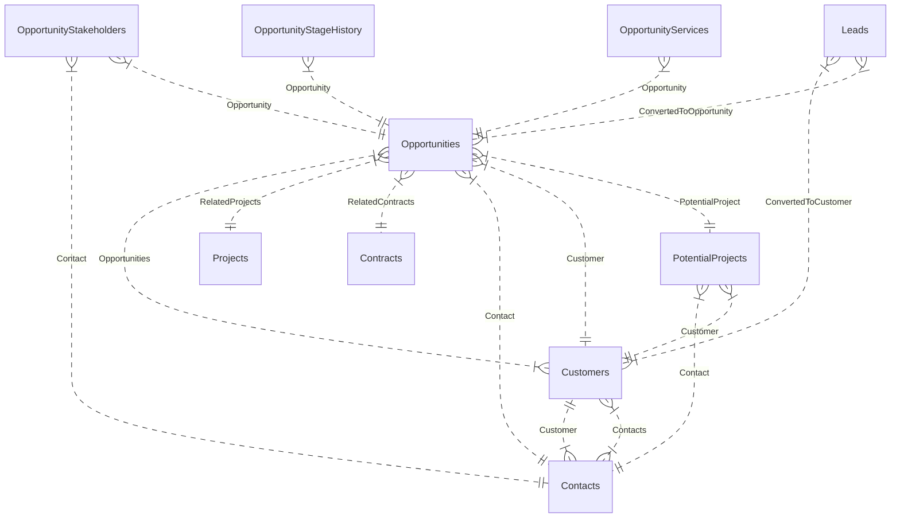
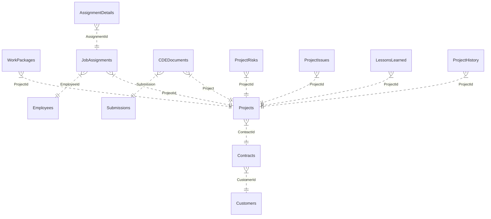
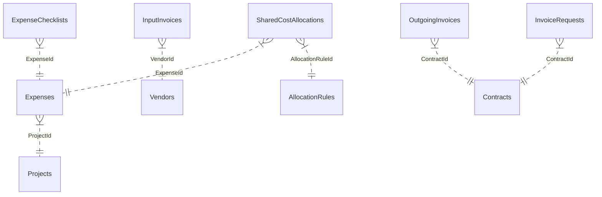

# Technical Deep-Dive Analysis: Core Modules 1–3 (`strategy_crm`, `process_execution`, `cash_data`)

**Project**: `idop-ccba-way`  
**Author**: Explorer 2 (`teamwork_preview_explorer_m2_crm_proc_cash`)  
**Date**: 2026-07-28  
**Scope**: Technical analysis of SharePoint List Schemas (`datamodel/sharepoint/lists/`), Taxonomy Term Sets (`datamodel/sharepoint/taxonomy/`), and Specification Docs (`specs/modules/`).

---

## Executive Summary

This deep-dive investigation covers **31 SharePoint List Schemas** across 3 core modules (`strategy_crm`: 9 lists, `process_execution`: 11 lists, `cash_data`: 11 lists) and **19 Taxonomy Term Sets**. 

Key architectural insights:
1. **Bidding Process Representation**: The bidding workflow (`dot_thau`, `ho_so_dieu_kien`) is not modeled as separate SharePoint lists, but embedded directly inside `Opportunities.json` via 11 dedicated columns (e.g. `BiddingCode`, `BiddingFolderDriveItemId`, `BiddingFolderUrl`, `BiddingFolderState`, `BiddingFolderPhase`, `BidTeam`, `ParticipationDecision`).
2. **Key Referential Discrepancies**: 
   - `PotentialProjects` spec dictates an `OpportunityId` lookup, but `potential_projects.json` lacks this lookup field (instead, `opportunities.json` holds a `PotentialProject` lookup).
   - `Expenses.json` uses `CCBA_LoaiChiPhi` taxonomy instead of `CCBA_LoaiChiPhiPhanBo` as specified in `cash_data/spec.md`.
   - `pmo/spec.md` is empty (`...`), leaving PMO lists (`JobAssignments`, `AssignmentDetails`, `ProjectHistory`) without documented spec constraints.
3. **Taxonomy & Choice Field Mismatches**: Priority and severity fields in `ProjectRisks` and `ProjectIssues` use hardcoded `Choice` values ("Low", "Medium", "High") rather than binding to `CCBA_MucDoUuTien` taxonomy.

---

## 1. Module 1: `strategy_crm`

### 1.1 Entities List

| List Name | Display Name | Internal Name / Schema | Purpose |
|---|---|---|---|
| **Leads** | Leads | `strategy_crm/leads.json` | Stores inbound leads from Microsoft Forms, landing pages, and manual capture, with automated follow-up sequence tracking and scoring. |
| **Customers** | Customers | `strategy_crm/customers.json` | Master repository for client entities (Chủ đầu tư, Cơ quan Nhà nước, Đối tác, etc.), storing tax codes, contact details, and financial links. |
| **Contacts** | Contacts | `strategy_crm/contacts.json` | Key contact individuals assigned to client entities, mapped with strategic role types. |
| **Opportunities** | Opportunities | `strategy_crm/opportunities.json` | Business opportunity pipeline tracking, value calculation, risk flags, influence scores, and embedded Bidding Process management. |
| **OpportunityServices** | OpportunityServices | `strategy_crm/opportunity_services.json` | Line item breakdown for multi-service opportunities, tracking service type, estimated value, probability, and dates. |
| **OpportunityStageHistory**| OpportunityStageHistory | `strategy_crm/opportunity_stage_history.json` | Audit trail logging stage transitions, duration in previous stage, timestamp, and user. |
| **OpportunityStakeholders**| OpportunityStakeholders | `strategy_crm/opportunity_stakeholders.json` | Stakeholder matrix mapping for opportunity decision-making, influence weight, support level, and engagement status. |
| **PotentialProjects** | PotentialProjects | `strategy_crm/potential_projects.json` | Bridge entity capturing pre-contract project definitions derived from qualified CRM opportunities before formal contract signing. |
| **ServiceCatalog** | ServiceCatalog | `strategy_crm/service_catalog.json` | Master catalog of standardized CCBA service offerings with default pricing and duration. |

---

### 1.2 Lookup Relationships Mapping



**Detailed Lookup Field Configurations**:

| Source List | Lookup Column Internal Name | Target List | Target Field | Behavior | Display Name |
|---|---|---|---|---|---|
| `Leads` | `ConvertedToOpportunity` | `Opportunities` | `ID` | `restrict` | Converted Opportunity |
| `Leads` | `ConvertedToCustomer` | `Customers` | `ID` | `restrict` | Converted Customer |
| `Customers` | `Contacts` | `Contacts` | `ID` | `restrict` | Liên hệ |
| `Customers` | `Opportunities` | `Opportunities` | `ID` | `restrict` | Cơ hội |
| `Contacts` | `Customer` | `Customers` | `ID` | `restrict` | Khách hàng |
| `Opportunities` | `PotentialProject` | `PotentialProjects` | `ID` | `restrict` | Tiềm năng dự án |
| `Opportunities` | `Customer` | `Customers` | `ID` | `restrict` | Khách hàng |
| `Opportunities` | `Contact` | `Contacts` | `ID` | `restrict` | Liên hệ |
| `Opportunities` | `RelatedContracts` | `Contracts` | `ID` | `restrict` | Hợp đồng liên quan |
| `Opportunities` | `RelatedProjects` | `Projects` | `ID` | `restrict` | Dự án liên quan |
| `OpportunityServices` | `Opportunity` | `Opportunities` | `ID` | `restrict` | Opportunity |
| `OpportunityStageHistory` | `Opportunity` | `Opportunities` | `ID` | `restrict` | Opportunity |
| `OpportunityStakeholders` | `Opportunity` | `Opportunities` | `ID` | `restrict` | Opportunity |
| `OpportunityStakeholders` | `Contact` | `Contacts` | `ID` | `restrict` | Liên hệ |
| `PotentialProjects` | `Customer` | `Customers` | `ID` | `restrict` | Khách hàng |
| `PotentialProjects` | `Contact` | `Contacts` | `ID` | `restrict` | Liên hệ |

---

### 1.3 Taxonomy Term Sets Mapping (`strategy_crm`)

| Term Set Name | Term Set ID | Target Field(s) | Business Logic Usage |
|---|---|---|---|
| `CCBA_NguonGocCoHoi` | `e664ed01-1af3-4864-9da9-4d0dea2e9d2e` | `Leads.Source`<br>`Customers.Source`<br>`Opportunities.Source` | Tracks marketing channel effectiveness and lead origin (Website, Recommendation, Workshop, Tender). |
| `CCBA_LoaiHinhDichVu` | `ef5e1bb4-d514-4707-9580-67e7f1396ad7` | `Leads.ServiceInterest`<br>`Opportunities.ServiceType`<br>`OpportunityServices.ServiceType`<br>`PotentialProjects.ServiceType`<br>`ServiceCatalog.Category` | Classifies service types (BIM, TVGS, Design, Management), triggering revenue distribution rules. |
| `CCBA_NganhLinhVuc` | `e61cf26e-e3ed-498c-b126-24309805a789` | `Leads.Industry`<br>`Customers.Industry`<br>`Opportunities.Industry`<br>`PotentialProjects.Industry` | Industry sector classification (Infrastructure, Civil, Industrial, Maritime) for pipeline segmentation. |
| `CCBA_MucDoUuTien` | `44883010-2e06-43bb-810d-da6a547cf29b` | `Leads.Priority`<br>`PotentialProjects.Priority` | Priority level tagging for sales SLA enforcement. |
| `CCBA_LoaiKhachHang` | `c823a9ab-b2b4-4c5d-b4d6-ee0811916f15` | `Customers.CustomerType` | Client organization category (Investor, Government, Partner, PM Unit, Design Unit, General Contractor). |
| `CCBA_VaiTroLienHe` | `96150086-5902-4efa-9e25-fe050b081c96` | `Contacts.Role`<br>`OpportunityStakeholders.RoleType` | Key contact stakeholder classification (Decision Maker, Technical Evaluator, Finance Gatekeeper, Champion, Opposer). |
| `CCBA_LoaiCongTrinh` | `fb193202-a7bc-467b-a5b9-41012ef48b7a` | `PotentialProjects.ProjectType` | Facility type classification based on Decree 175/2024/NĐ-CP Appendix X. |

---

### 1.4 Spec vs JSON Schema Audit (`strategy_crm`)

1. **Bidding Process Modeling**:
   - *Spec expectation*: User prompt and BPMN specs reference Bidding process (`dot_thau`, `ho_so_dieu_kien`).
   - *Schema implementation*: Rather than separate lists, `opportunities.json` embeds fields:
     ```json
     { "Name": "BiddingCode", "Type": "Text" },
     { "Name": "BiddingFolderDriveItemId", "Type": "Text" },
     { "Name": "BiddingFolderUrl", "Type": "Hyperlink" },
     { "Name": "BiddingFolderPath", "Type": "Text" },
     { "Name": "BiddingFolderState", "Type": "Choice", "Choices": ["Not Created", "Creating", "Created", "Failed"] },
     { "Name": "BiddingFolderPhase", "Type": "Choice", "Choices": ["Draft", "Confirmed", "Archived"] },
     { "Name": "BidTeam", "Type": "User", "AllowMultiple": true },
     { "Name": "ParticipationDecision", "Type": "Choice", "Choices": ["Unknown", "Yes", "No"] },
     { "Name": "DecisionDate", "Type": "DateTime" },
     { "Name": "DecisionNote", "Type": "Note" },
     { "Name": "DecisionEmailLink", "Type": "Hyperlink" }
     ```
2. **`PotentialProjects` Lookup Discrepancy**:
   - `specs/modules/strategy_crm/potential_projects/spec.md` specifies `OpportunityId (Lookup -> Opportunities)` as a core field.
   - In `datamodel/sharepoint/lists/strategy_crm/potential_projects.json`, **`OpportunityId` is missing**. Instead, `Opportunities.json` has `PotentialProject` lookup pointing to `PotentialProjects.ID`.
3. **`OpportunityServices` to `ServiceCatalog` Link**:
   - `OpportunityServices.json` does not include a direct Lookup to `ServiceCatalog`. It uses `ServiceType` (Taxonomy) and `ServiceDescription` (Text).
4. **Influence Score & Risk Calculation Fields**:
   - `Opportunities.json` cleanly implements fields required by `opportunities/spec.md` lines 36-40: `AdjustedProbability`, `InfluenceScore`, `RiskFlags` (MultiChoice: `InfluenceLow`, `MissingRoles`, `StakeholderOpposition`, `DataGap`), `ServiceMixSummary`.

---

## 2. Module 2: `process_execution`

### 2.1 Entities List

| List Name | Display Name | Internal Name / Schema | Purpose |
|---|---|---|---|
| **Projects** | Projects | `process_execution/projects.json` | Master project execution repository, tracking project code, budget, service type, execution status, and start/end dates. |
| **Contracts** | Contracts | `process_execution/contracts.json` | Economic contracts signed with customers, capturing contract value (Gross/Net), currency, VAT rate, and status. |
| **WorkPackages** | WorkPackages | `process_execution/work_packages.json` | Project WBS work packages assigned to team members with target timelines. |
| **JobAssignments** | JobAssignments | `process_execution/job_assignments.json` | Resource assignment mapping linking employees to projects with assigned role and duration. |
| **AssignmentDetails** | AssignmentDetails | `process_execution/assignment_details.json` | Detailed work logging (task description, hours worked, notes) per job assignment. |
| **Activities** | Activities | `process_execution/activities.json` | Operational activities across CRM, Potential Projects, Marketing, R&D, and Administration. |
| **CDEDocuments** | CDEDocuments | `process_execution/cde_documents.json` | Common Data Environment (CDE) document register tracking versions, disciplines, document types, file URLs, and retention policies. |
| **ProjectRisks** | ProjectRisks | `process_execution/project_risks.json` | Project risk register capturing risk title, severity, mitigation plan, owner, and status. |
| **ProjectIssues** | ProjectIssues | `process_execution/project_issues.json` | Issue tracking log recording project issues, priority, description, owner, report/resolution dates, and status. |
| **LessonsLearned** | LessonsLearned | `process_execution/lessons_learned.json` | Knowledge management repository capturing lessons learned categorized by domain. |
| **ProjectHistory** | ProjectHistory | `process_execution/project_history.json` | Audit and baseline history log recording project changes and version flags. |

---

### 2.2 Lookup Relationships Mapping



**Detailed Lookup Field Configurations**:

| Source List | Lookup Column Internal Name | Target List | Target Field | Behavior | Display Name |
|---|---|---|---|---|---|
| `Contracts` | `CustomerId` | `Customers` | `ID` | `restrict` | CustomerId |
| `Projects` | `ContractId` | `Contracts` | `ID` | `restrict` | ContractId |
| `WorkPackages` | `ProjectId` | `Projects` | `ID` | `restrict` | ProjectId |
| `JobAssignments` | `ProjectId` | `Projects` | `ID` | `restrict` | ProjectId |
| `JobAssignments` | `EmployeeId` | `Employees` | `ID` | `restrict` | EmployeeId |
| `AssignmentDetails` | `AssignmentId` | `JobAssignments` | `ID` | `restrict` | AssignmentId |
| `CDEDocuments` | `Project` | `Projects` | `ID` | `restrict` | Dự án |
| `CDEDocuments` | `Submission` | `Submissions` | `ID` | `cascade` | Hồ sơ nộp |
| `ProjectRisks` | `ProjectId` | `Projects` | `ID` | `restrict` | ProjectId |
| `ProjectIssues` | `ProjectId` | `Projects` | `ID` | `restrict` | ProjectId |
| `LessonsLearned` | `ProjectId` | `Projects` | `ID` | `restrict` | ProjectId |
| `ProjectHistory` | `ProjectId` | `Projects` | `ID` | `restrict` | ProjectId |

---

### 2.3 Taxonomy Term Sets Mapping (`process_execution`)

| Term Set Name | Term Set ID | Target Field(s) | Business Logic Usage |
|---|---|---|---|
| `CCBA_LoaiHinhDichVu` | `ef5e1bb4-d514-4707-9580-67e7f1396ad7` | `Projects.ServiceType`<br>`CDEDocuments.ServiceType` | Service classification driving project financial allocation and document taxonomy. |
| `CCBA_TrangThaiChung` | `901f7f53-65e3-4f88-ab8d-410b3fab77df` | `Projects.Status`<br>`Contracts.Status`<br>`WorkPackages.Status`<br>`Activities.Status`<br>`CDEDocuments.Status`<br>`ProjectRisks.Status`<br>`ProjectIssues.Status` | Standardized status lifecycle management across project entities. |
| `CCBA_LoaiTaiLieu` | `76040b61-39cc-4948-aeb7-b0c02c44e372` | `CDEDocuments.DocumentType` | CDE document metadata classification (Drawings, Specifications, Reports, BIM models). |
| `CCBA_ChucDanhXayDung` | `7070726d-93e7-4edc-86b7-f5ea3c0a0faa` | `CDEDocuments.Discipline` | Engineering/construction discipline tagging (Architectural, Structural, MEP, Civil). |
| `CCBA_PhanLoaiBaiHoc` | `0a1b2c3d-4e5f-6071-8293-a4b5c6d7e813` | `LessonsLearned.Category` | Categorization of project lessons (Technical & Quality, Project Management, Financial). |

---

### 2.4 Spec vs JSON Schema Audit (`process_execution`)

1. **Incomplete Specification Files**:
   - `specs/modules/process_execution/pmo/spec.md` is empty (`...`).
   - The schemas `job_assignments.json`, `assignment_details.json`, `project_history.json`, and `lessons_learned.json` exist in JSON but lack detailed specification text in `pmo/spec.md`.
2. **Choice vs Taxonomy Inconsistencies**:
   - `project_issues.json` defines `Priority` as a `Choice` (`["High", "Medium", "Low"]`) instead of `ManagedMetadata` referencing `CCBA_MucDoUuTien`.
   - `project_risks.json` defines `Severity` as a `Choice` (`["Low", "Medium", "High"]`) instead of taxonomy `CCBA_MucDoUuTien`.
3. **Missing Opportunity / PotentialProject Link in `Projects`**:
   - `projects.json` only contains `ContractId` lookup. There is no direct lookup to `Opportunities` or `PotentialProjects`, forcing resolution through `Contracts.CustomerId` or `Opportunities.RelatedProjects`.

---

## 3. Module 3: `cash_data`

### 3.1 Entities List

| List Name | Display Name | Internal Name / Schema | Purpose |
|---|---|---|---|
| **FinancialPlans** | FinancialPlans | `cash_data/financial_plans.json` | Annual corporate and departmental financial plans tracking year and total budget limits. |
| **Expenses** | Expenses | `cash_data/expenses.json` | Project expense line items capturing expense type, currency, VAT rate, gross/net amounts, and date. |
| **InputInvoices** | InputInvoices | `cash_data/input_invoices.json` | Accounts Payable input invoices received from vendors, linking vendor ID, invoice number, amounts, and dates. |
| **OutgoingInvoices** | OutgoingInvoices | `cash_data/outgoing_invoices.json` | Accounts Receivable output invoices issued to clients, linked to Contract ID. |
| **InvoiceRequests** | InvoiceRequests | `cash_data/invoice_requests.json` | Formal requests to issue outgoing invoices for project milestones. |
| **SharedCostAllocations** | SharedCostAllocations | `cash_data/shared_cost_allocations.json` | Overhead and shared expense distribution records linking Expenses to Allocation Rules. |
| **AllocationRules** | AllocationRules | `cash_data/allocation_rules.json` | Pre-defined cost allocation rules and formulas. |
| **BankAccounts** | BankAccounts | `cash_data/bank_accounts.json` | Corporate bank account register storing bank name, account number, account holder name, and currency. |
| **Vendors** | Vendors | `cash_data/vendors.json` | Vendor master directory tracking supplier code, name, and service offering type. |
| **DocumentRequirements** | DocumentRequirements | `cash_data/document_requirements.json` | Financial compliance document checklist requirements (Contract, Invoice, Expense). |
| **ExpenseChecklists** | ExpenseChecklists | `cash_data/expense_checklists.json` | Audit completion checklist items per expense item. |

---

### 3.2 Lookup Relationships Mapping



**Detailed Lookup Field Configurations**:

| Source List | Lookup Column Internal Name | Target List | Target Field | Behavior | Display Name |
|---|---|---|---|---|---|
| `Expenses` | `ProjectId` | `Projects` | `ID` | `restrict` | ProjectId |
| `InputInvoices` | `VendorId` | `Vendors` | `ID` | `restrict` | VendorId |
| `OutgoingInvoices` | `ContractId` | `Contracts` | `ID` | `restrict` | ContractId |
| `InvoiceRequests` | `ContractId` | `Contracts` | `ID` | `restrict` | ContractId |
| `SharedCostAllocations` | `ExpenseId` | `Expenses` | `ID` | `restrict` | ExpenseId |
| `SharedCostAllocations` | `AllocationRuleId` | `AllocationRules` | `ID` | `restrict` | AllocationRuleId |
| `ExpenseChecklists` | `ExpenseId` | `Expenses` | `ID` | `restrict` | ExpenseId |

---

### 3.3 Taxonomy Term Sets Mapping (`cash_data`)

| Term Set Name | Term Set ID | Target Field(s) | Business Logic Usage |
|---|---|---|---|
| `CCBA_LoaiChiPhi` | `91587b8c-45a1-4b7b-9b9f-0b8c4e7a2f01` | `Expenses.ExpenseType` | General expense classification (Human Resources, Materials, Services, Travel, Other). |
| `CCBA_LoaiHinhDichVu` | `ef5e1bb4-d514-4707-9580-67e7f1396ad7` | `Vendors.ServiceType` | Supplier service capabilities classification. |
| `CCBA_LoaiChiPhiPhanBo` *(Defined in Taxonomy but missing in Schema)* | `cb134001-14df-4bef-aa76-4eca2d60a693` | *(Specified for `Expenses` & `SharedCostAllocations` in spec)* | Hierarchical allocation taxonomy (CPTT, PB_VIEN, PB_DV, THUE) per QCCTNB internal regulations. |

---

### 3.4 Spec vs JSON Schema Audit (`cash_data`)

1. **`CCBA_LoaiChiPhiPhanBo` Taxonomy Discrepancy**:
   - `specs/modules/cash_data/spec.md` states:
     > `CCBA_LoaiChiPhiPhanBo`: Phân loại chi phí (Material, Labor, Equipment, Overhead)
   - However, in `datamodel/sharepoint/lists/cash_data/expenses.json`, `ExpenseType` references **`CCBA_LoaiChiPhi`** instead of `CCBA_LoaiChiPhiPhanBo`. `SharedCostAllocations.json` has **no taxonomy column at all**.
2. **Minimalistic Schema Definitions**:
   - `FinancialPlans.json` has only 3 columns (`PlanName`, `Year`, `TotalBudget`) with no lookups to Projects, Departments, or Allocation Rules.
   - `Vendors.json` lacks tax code (`TaxCode`), phone, address, and bank info (unlike `Customers.json`).
   - `BankAccounts.json` lacks status, balance, and department owner columns.
3. **Currency Definition**:
   - `cash_data/spec.md` references taxonomy `CCBA_DongTien` for currencies (VND, USD, EUR).
   - In all JSON schemas (`Expenses`, `InputInvoices`, `OutgoingInvoices`, `InvoiceRequests`, `BankAccounts`), `Currency` is implemented as a plain `Choice` field (`["VND", "USD", "EUR"]`).

---

## 4. Summary of Spec vs Schema Discrepancies & Recommendations

| Module | Topic / Item | Spec Description | JSON Schema Implementation | Impact & Recommended Action |
|---|---|---|---|---|
| `strategy_crm` | Bidding Process | Implies separate process (`dot_thau`, `ho_so_dieu_kien`) | Embedded in `Opportunities.json` (11 Bidding columns) | Accept schema design; update spec documentation to clarify embedded Bidding model in `Opportunities`. |
| `strategy_crm` | `PotentialProjects` Lookup | Spec: `PotentialProjects` has `OpportunityId` lookup | Schema: `OpportunityId` missing in `PotentialProjects.json`; `Opportunities.json` has `PotentialProject` lookup | Add `OpportunityId` lookup column to `PotentialProjects.json` for bidirectional consistency. |
| `process_execution` | PMO Specification | `pmo/spec.md` contains blank placeholder `...` | Schemas `JobAssignments`, `AssignmentDetails`, `ProjectHistory`, `LessonsLearned` implemented | Populate `pmo/spec.md` to document business rules for resource assignment and PMO logs. |
| `process_execution` | Severity & Priority Types | `ProjectRisks` & `ProjectIssues` expected taxonomy bindings | Hardcoded `Choice` (`Low`, `Medium`, `High`) | Upgrade fields to `ManagedMetadata` referencing `CCBA_MucDoUuTien`. |
| `cash_data` | Allocation Taxonomy | Spec specifies `CCBA_LoaiChiPhiPhanBo` for QCCTNB cost rules | `Expenses.json` uses `CCBA_LoaiChiPhi`; `SharedCostAllocations.json` has no taxonomy field | Add `AllocationType` (`CCBA_LoaiChiPhiPhanBo`) column to `Expenses.json` and `SharedCostAllocations.json`. |
| `cash_data` | `FinancialPlans` Schema | Spec describes full budget allocation ecosystem | Schema has only 3 minimal columns without lookups | Extend `FinancialPlans.json` with `Department` (`CCBA_DonViPhongBan`), `Status`, and child allocation lookups. |
