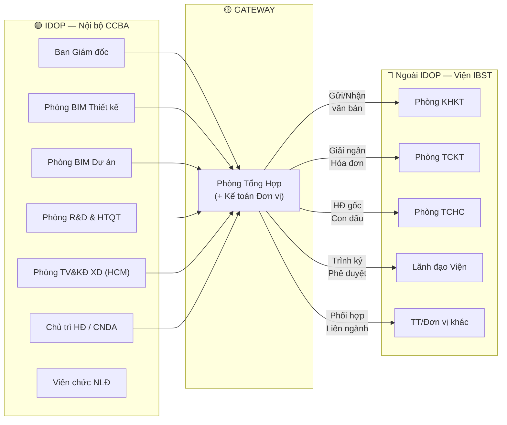
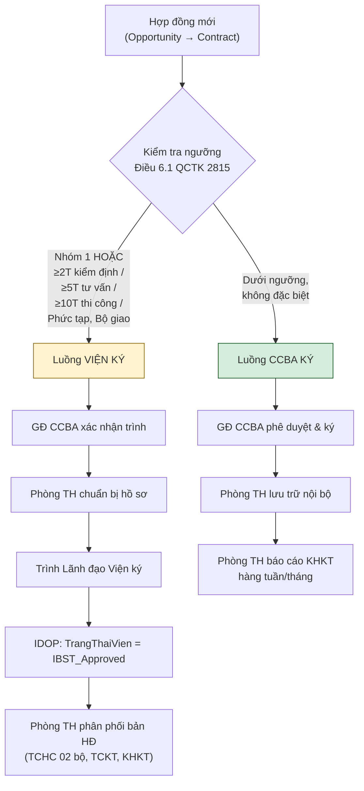
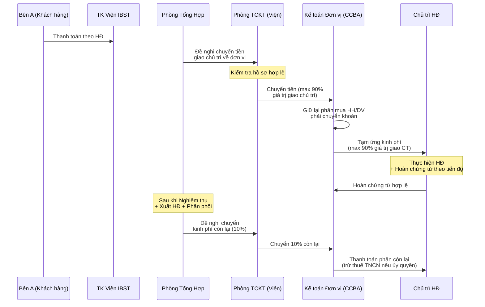

# 05 — Bản đồ Ranh giới Vận hành CCBA ↔ Viện IBST (Operational Boundary Map)

> **Phiên bản**: 1.0  
> **Tham chiếu**: QĐ 2815/QĐ-VKH (QCTK), QĐ 3209/QĐ-VKH (QCCTNB), Quy chế CCBA 2026, QĐ 2816/QĐ-VKH (KHCN)  
> **Nguyên tắc**: Tài liệu này **tham chiếu** đến các blueprint 01-04, không sao chép nội dung.

---

## Phần 1 — Nguyên tắc Thiết kế: IDOP = Nội bộ CCBA

**IDOP (Integrated Digital Operation Platform)** là nền tảng vận hành **NỘI BỘ** của Trung tâm Tư vấn và Ứng dụng BIM trong xây dựng (CCBA), đơn vị hạch toán phụ thuộc Viện KHCN Xây dựng (IBST).

### Ranh giới hệ thống

| Bên trong IDOP (Internal) | Bên ngoài IDOP (External) |
|:---|:---|
| Toàn bộ quy trình vận hành nội bộ CCBA | Quy trình nội bộ của Viện IBST |
| 6 module: strategy_crm, process_execution, cash_data, people_assets, performance_okrs, system_governance | Phòng KHKT, TCKT, TCHC, Lãnh đạo Viện |
| Phê duyệt nội bộ (GĐ CCBA, Trưởng phòng) | Phê duyệt cấp Viện (Viện trưởng, PVT) |
| Dữ liệu giao dịch chi tiết | Chỉ trạng thái tổng hợp (status fields) |

### Cơ chế Gateway

**Phòng Tổng Hợp** là đầu mối duy nhất (gateway) cho mọi tương tác đối ngoại giữa CCBA và Viện IBST. IDOP **không** tạo task hay workflow cho phía Viện — chỉ ghi nhận trạng thái đối ngoại.

### Trạng thái đối ngoại trong IDOP

IDOP ghi nhận các trạng thái đối ngoại dưới dạng **status fields** trên các entity liên quan:

| Trạng thái | Ý nghĩa | Người cập nhật |
|:---|:---|:---|
| `Draft` | Đang soạn nội bộ | Chủ trì / Trưởng phòng |
| `Pending_PTH_Review` | Chờ Phòng TH kiểm tra hồ sơ | Chủ trì |
| `Submitted_to_IBST` | Phòng TH đã gửi Viện | Phòng Tổng Hợp |
| `IBST_Reviewing` | Viện đang xử lý | Phòng Tổng Hợp |
| `IBST_Approved` | Viện đã phê duyệt/ký | Phòng Tổng Hợp |
| `IBST_Rejected` | Viện từ chối / yêu cầu bổ sung | Phòng Tổng Hợp |
| `IBST_Disbursed` | TCKT Viện đã giải ngân | Kế toán Đơn vị |

---

## Phần 2 — Bảng tương tác đối ngoại theo Quy trình 7 Bước

> Tham chiếu: [01_qctk_2815_project_management.md](../governance_constitution/01_qctk_2815_project_management.md) Điều 5-12

### Bước 1 — Đấu thầu (Điều 5 QCTK 2815)

| Khía cạnh | Chi tiết |
|:---|:---|
| **Hành động nội bộ CCBA** | GĐ đơn vị chỉ định chủ trì lập HSDT → Cập nhật `Opportunities` (stage: Bidding) → GĐ kiểm tra, phê duyệt HSDT |
| **Entity IDOP** | `opportunities`, `potential_projects`, `lead_capture` |
| **Hành động đối ngoại (Phòng TH)** | Đăng ký đơn vị đầu mối với Phòng KHKT Viện (Điều 5.1c) → Chờ ý kiến Lãnh đạo Viện → Nhận phản hồi giao/không giao đấu thầu |
| **Trạng thái IDOP** | `Submitted_to_IBST` → `IBST_Approved` (được giao) / `IBST_Rejected` |
| **SLA Viện** | Phòng KHKT phản hồi sau khi có ý kiến Lãnh đạo Viện (Điều 5.1c) |

### Bước 2 — Xây dựng & Ký kết HĐ (Điều 5.2, Điều 6 QCTK 2815)

| Khía cạnh | Chi tiết |
|:---|:---|
| **Hành động nội bộ CCBA** | Soạn thảo HĐ → Cố vấn Pháp lý thẩm định → GĐ CCBA phê duyệt (HĐ CCBA ký) hoặc xác nhận trình Viện (HĐ Viện ký) |
| **Entity IDOP** | `contracts`, `approvals` (Submissions) |
| **Hành động đối ngoại (Phòng TH)** | **HĐ Nhóm 1**: Báo cáo Viện trưởng trước khi xây dựng HĐ. **HĐ vượt ngưỡng**: Trình phiếu ký HĐ lên Lãnh đạo Viện. **HĐ đơn vị ký**: Lưu trữ nội bộ, báo cáo KHKT hàng tuần/tháng |
| **Trạng thái IDOP** | `Pending_PTH_Review` → `Submitted_to_IBST` → `IBST_Approved` (Viện đã ký) |
| **SLA Viện** | Chuyển lưu HĐ trong 30 ngày kể từ ngày ký đủ các bên (Điều 6.3) |

### Bước 3 — Phiếu Giao Việc (Điều 11 Quy chế CCBA 2026)

| Khía cạnh | Chi tiết |
|:---|:---|
| **Hành động nội bộ CCBA** | Chủ trì lập PGV → Đề xuất nhân sự, thỏa thuận phân chia tài chính → GĐ CCBA phê duyệt PGV |
| **Entity IDOP** | `pmo` (Phiếu giao việc), `work_packages`, `allocations` |
| **Hành động đối ngoại (Phòng TH)** | **HĐ liên ngành**: Phối hợp TT/đơn vị khác thuộc Viện thỏa thuận tỷ lệ phân chia (Điều 7.1c,3 QCTK 2815). **HĐ quản lý tập trung**: GĐ CCBA trực tiếp điều hành (Điều 11 Quy chế CCBA) |
| **Trạng thái IDOP** | `Draft` → `Approved` (PGV nội bộ, không cần trạng thái Viện trừ HĐ liên ngành) |
| **SLA Viện** | Không áp dụng (quy trình nội bộ CCBA) |

### Bước 4 — Thực hiện Dự án (Điều 8-9 QCTK 2815)

| Khía cạnh | Chi tiết |
|:---|:---|
| **Hành động nội bộ CCBA** | Triển khai công việc theo PGV → Cập nhật tiến độ, chất lượng → Chủ trì quản lý kinh phí giao khoán → Cập nhật nhật ký dự án lên IDOP |
| **Entity IDOP** | `projects`, `work_packages`, `cde_documents`, `expenses` |
| **Hành động đối ngoại (Phòng TH)** | Báo cáo tiến độ định kỳ nếu Viện yêu cầu. Đề nghị giải ngân tạm ứng (max 90%) khi Bên A trả tiền |
| **Trạng thái IDOP** | `In_Progress` |
| **SLA Viện** | TCKT giải ngân sau khi nhận đủ hồ sơ hợp lệ (Điều 22.2 QCCTNB 3209) |

### Bước 5 — Kiểm tra Nội bộ (Điều 10 QCTK 2815)

| Khía cạnh | Chi tiết |
|:---|:---|
| **Hành động nội bộ CCBA** | Cố vấn QA/QC kiểm tra tuân thủ → Trưởng phòng chuyên môn review → Lập biên bản kiểm tra nội bộ |
| **Entity IDOP** | `cde_documents` (QA/QC 5 cấp CDE), `lessons_learned` |
| **Hành động đối ngoại (Phòng TH)** | Không có tương tác Viện ở bước này (hoàn toàn nội bộ CCBA) |
| **Trạng thái IDOP** | `QC_Reviewing` → `QC_Passed` / `QC_Failed` |
| **SLA Viện** | Không áp dụng |

### Bước 6 — Nghiệm thu (Điều 11 QCTK 2815)

| Khía cạnh | Chi tiết |
|:---|:---|
| **Hành động nội bộ CCBA** | Chủ trì lập hồ sơ nghiệm thu → GĐ CCBA phê duyệt nội bộ |
| **Entity IDOP** | `finance` (Hóa đơn, Biên bản nghiệm thu), `contracts` (trạng thái) |
| **Hành động đối ngoại (Phòng TH)** | **HĐ Viện ký**: Nộp hồ sơ nghiệm thu cho Phòng KHKT/TCKT. **HĐ đơn vị ký**: Phòng TH lưu trữ như Phòng TCHC, báo cáo KHKT |
| **Trạng thái IDOP** | `Pending_Acceptance` → `Submitted_to_IBST` → `IBST_Approved` |
| **SLA Viện** | Theo quy trình nghiệm thu Viện (Điều 11 QCTK 2815) |

### Bước 7 — Quyết toán & Thanh lý (Điều 12 QCTK 2815, Điều 22.2 QCCTNB 3209)

| Khía cạnh | Chi tiết |
|:---|:---|
| **Hành động nội bộ CCBA** | Chủ trì hoàn chứng từ → Kế toán Đơn vị kiểm tra, đối chiếu → Xuất hóa đơn, phân phối doanh thu |
| **Entity IDOP** | `allocations` (phân bổ 3 tầng), `finance` (hóa đơn), `expenses` (chứng từ) |
| **Hành động đối ngoại (Phòng TH)** | Đề nghị TCKT Viện chuyển phần kinh phí còn lại (10%). Nộp chứng từ quyết toán cho TCKT Viện |
| **Trạng thái IDOP** | `Settlement_Pending` → `IBST_Disbursed` → `Closed` |
| **SLA Viện** | Chuyển kinh phí còn lại sau khi nghiệm thu + xuất HĐ + phân phối (Điều 22.2.1 QCCTNB 3209) |

---

## Phần 3 — Vai trò Gateway của Phòng Tổng Hợp (4 Trục Đối ngoại)

> Tham chiếu: [03_ccba_charter_2026.md](../governance_constitution/03_ccba_charter_2026.md) Điều 9 — Phòng Tổng hợp

Phòng Tổng Hợp thực hiện chức năng hậu cần, hành chính, văn thư lưu trữ và quản lý nhân sự (Điều 9 Quy chế CCBA). Trong vai trò gateway, Phòng TH phân luồng tương tác đối ngoại theo **4 trục**:

### Trục 1 — Kỹ thuật (Đối tác: Phòng KHKT Viện)

| Tương tác đối ngoại | Điều khoản | Entity IDOP liên quan |
|:---|:---|:---|
| Đăng ký đơn vị đầu mối đấu thầu | Điều 5.1c QCTK 2815 | `opportunities` |
| Nhận phản hồi giao/không giao đấu thầu | Điều 5.1c QCTK 2815 | `opportunities` (status) |
| Trình HĐ Nhóm 1 để xây dựng | Điều 5.2a QCTK 2815 | `contracts` |
| Gửi phiếu trình ký HĐ vượt ngưỡng | Điều 6.1 QCTK 2815 | `approvals` (Submissions) |
| Nộp hồ sơ nghiệm thu | Điều 11 QCTK 2815 | `finance`, `cde_documents` |
| Báo cáo thống kê HĐKT hàng tuần/tháng | Điều 6.3 QCTK 2815 | `contracts`, `projects` |
| Nhận QĐ giao việc / ủy quyền | Điều 6.2 QCTK 2815 | `governance` (Biến MT) |

### Trục 2 — Tài chính (Đối tác: Phòng TCKT Viện)

| Tương tác đối ngoại | Điều khoản | Entity IDOP liên quan |
|:---|:---|:---|
| Đề nghị giải ngân (tạm ứng max 90%) | Điều 22.2.1 QCCTNB 3209 | `allocations`, `finance` |
| Đề nghị chuyển kinh phí còn lại (10%) | Điều 22.2.1 QCCTNB 3209 | `allocations` |
| Nộp chứng từ quyết toán HĐ | Điều 22.2.2 QCCTNB 3209 | `expenses` |
| Xuất hóa đơn GTGT | Điều 22.2.2 QCCTNB 3209 | `finance` |
| Đối chiếu công nợ, doanh thu | Điều 22.2 QCCTNB 3209 | `finance` (báo cáo) |
| Nộp thuế TNCN ủy quyền | Điều 22.2.2 QCCTNB 3209 | `hr` (thu nhập NLĐ) |

### Trục 3 — Pháp nhân & Nhân sự (Đối tác: Phòng TCHC Viện)

| Tương tác đối ngoại | Điều khoản | Entity IDOP liên quan |
|:---|:---|:---|
| Nộp 02 bộ HĐ chính (Viện ký, ký trực tiếp) | Điều 6.3 QCTK 2815 | `contracts` |
| Gửi email bản HĐ ký số (HĐ điện tử) | Điều 6.3 QCTK 2815 | `cde_documents` |
| Đóng dấu pháp nhân Viện | Điều 6.1 QCTK 2815 | `contracts` (status) |
| Quản lý BHXH, hợp đồng lao động | Quy chế CCBA Điều 9 (Phòng TH) | `hr` |
| Lưu trữ hồ sơ pháp lý | Quy chế CCBA Điều 9 | `cde_documents` |

### Trục 4 — Phối hợp Liên đơn vị (Đối tác: Trung tâm/Đơn vị khác thuộc Viện)

| Tương tác đối ngoại | Điều khoản | Entity IDOP liên quan |
|:---|:---|:---|
| HĐ liên ngành nhiều đơn vị cùng thực hiện | Điều 7.1c, 7.3 QCTK 2815 | `contracts`, `pmo` |
| Thỏa thuận tỷ lệ phân chia giá trị HĐ trên PGV | Điều 7.1c QCTK 2815 | `allocations`, `pmo` |
| Chia sẻ/điều tiết nhân lực & thiết bị | Điều 4.6 QCTK 2815 | `hr`, `assets` |
| Cử cộng tác viên từ đơn vị khác | Điều 9.2f QCTK 2815 | `hr` (CTV), `work_packages` |
| Gửi bản sao HĐ cho phòng TH đơn vị phối hợp | Điều 6.3 QCTK 2815 | `contracts`, `cde_documents` |

---

## Phần 4 — Phân loại 2 Luồng Hợp đồng (Viện ký vs CCBA ký)

> Tham chiếu: [01_qctk_2815_project_management.md](../governance_constitution/01_qctk_2815_project_management.md) Điều 6.1  
> Tham chiếu: [02_idop_v2_operations_finance.md](../system_blueprint/02_idop_v2_operations_finance.md) — Luồng HĐ

### Bảng ngưỡng phân loại

| Điều kiện | Viện ký (Viện trưởng/PVT) | CCBA ký (GĐ CCBA, bằng pháp nhân đơn vị) |
|:---|:---|:---|
| **HĐ Nhóm 1** (giám định sự cố theo yêu cầu cơ quan chức năng) | ✅ Bắt buộc Viện trưởng/PVT ký | ❌ |
| **Kỹ thuật phức tạp, chính trị/pháp lý quan trọng, Bộ giao** | ✅ Bắt buộc báo cáo Viện trưởng | ❌ |
| **Gói thầu ≥ 2 tỷ** (kiểm định, đánh giá hiện trạng) | ✅ Phải trình Viện trưởng | ❌ |
| **Gói thầu ≥ 5 tỷ** (tất cả HĐ tư vấn) | ✅ Phải trình Viện trưởng | ❌ |
| **Gói thầu ≥ 10 tỷ** (HĐ thi công) | ✅ Phải trình Viện trưởng | ❌ |
| **HĐ còn lại** (dưới ngưỡng, không thuộc nhóm đặc biệt) | ❌ | ✅ GĐ CCBA ký theo ủy quyền |

**Nguồn**: Điều 6 khoản 1 QĐ 2815/QĐ-VKH

### Field IDOP quyết định luồng

Trong entity `contracts` (SharePoint List), các field sau quyết định luồng xử lý:

| Field | Kiểu | Mô tả |
|:---|:---|:---|
| `NhomHopDong` | Choice (N1a, N2a-g, N3, N4) | Phân loại theo Phụ lục 7 QĐ 3209 |
| `GiaTriHopDong` | Currency | Giá trị HĐ trước thuế |
| `LoaiKyKet` | Choice (VienKy / CCBAKy) | Tự động gợi ý dựa trên ngưỡng, GĐ CCBA xác nhận cuối |
| `TrangThaiVien` | Choice (trạng thái đối ngoại) | Phòng TH cập nhật |

### Flowchart 2 luồng

---

## Phần 5 — Thông tin Tài chính: Tỷ lệ Trích nộp & Luồng Giải ngân

> Tham chiếu: [02_qcctnb_3209_financial_norms.md](../governance_constitution/02_qcctnb_3209_financial_norms.md) Phụ lục 7, Điều 22.2

### Bảng tỷ lệ phân bổ chi phí theo Nhóm HĐKT (% GTHĐ trước thuế)

| # | Nhóm | Nội dung | Giao đơn vị (%) | CPQL, LN, chi khác (%) | KHTS (%) |
|:---:|:---|:---|:---:|:---:|:---:|
| 1 | N1a | Giám định XD, kiểm định sự cố | 96,00 | 2,00 | 2,00 |
| 2 | N2a | TV QLDA, TV đầu tư XD, CGCN | 91,00 | 7,00 | 2,00 |
| 3 | N2b | Chứng nhận HCHQ, Hiệu chuẩn TB | 85,00 | 13,00 | 2,00 |
| 4 | N2c | Tập huấn, đào tạo | 85,00 | 13,00 | 2,00 |
| 5 | N2d | Khảo sát XD, kiểm định CLCT, quan trắc, trắc đạc, TN hiện trường | 87,00 | 8,00 | 5,00 |
| 6 | N2e | TN VL tại phòng TN hiện trường, TN cấu kiện | 82,00 | 8,00 | 10,00 |
| 7 | N2f | TN VL trong phòng | 74,00 | 16,00 | 10,00 |
| 8 | N2g | TN đặc thù (chịu lửa, bao che, khí động, động đất) | 91,00 | 6,00 | 3,00 |
| 9 | N3 | Thi công xây dựng | 95,00 | 4,50 | 0,50 |
| 10 | N4 | Cung ứng vật tư, máy móc, thiết bị | 96,00 | 3,50 | 0,50 |

**Nguồn**: Phụ lục 7, QĐ 3209/QĐ-VKH  
**Ghi chú**: KHKT và đơn vị có thể đề nghị Viện trưởng điều chỉnh tỷ lệ để cạnh tranh hoặc khuyến khích công nghệ mới.

**Cách đọc**: Cột "Giao đơn vị" = phần CCBA được giữ lại. Cột "CPQL + KHTS" = phần trích nộp Viện.

### Entity IDOP ánh xạ

| Tầng tài chính | Entity IDOP | Mô tả |
|:---|:---|:---|
| Tầng 1: Trích nộp Viện | `allocations` (LoaiChiPhi = "Phân bổ về Viện") | CPQL + KHTS theo Nhóm HĐ |
| Tầng 2: Điều hành CCBA | `allocations` (LoaiChiPhi = "Chi phí điều hành") | Quỹ vận hành, quản lý chung |
| Tầng 3: Lương sản xuất | `allocations` (LoaiChiPhi = "Giao khoán chủ trì") | Phân bổ cho Chủ trì & nhân sự DA |

### Sequence Diagram Luồng Giải ngân (Góc nhìn CCBA)

**Nguồn**: Điều 22.2.1, 22.2.2 QĐ 3209/QĐ-VKH

---

## Phần 6 — Nhiệm vụ Khoa học & Công nghệ (Góc nhìn nội bộ CCBA)

> Tham chiếu: [04_ibst_science_tech_regulations.md](../governance_constitution/04_ibst_science_tech_regulations.md) Điều 6, 8, 9, 12  
> Tham chiếu: [03_ccba_charter_2026.md](../governance_constitution/03_ccba_charter_2026.md) Điều 9 — Phòng R&D & HTQT

### Quy trình nội bộ CCBA

| Giai đoạn | Hành động nội bộ | Vai trò chính | Phòng TH gửi Viện |
|:---|:---|:---|:---|
| 1. Đề xuất | Phòng R&D lập đề xuất NCKH | Trưởng phòng R&D | Gửi Phòng KHKT Viện |
| 2. Phê duyệt đề cương | GĐ CCBA phê duyệt nội bộ | GĐ CCBA | Trình Hội đồng Viện bảo vệ đề cương |
| 3. Triển khai | Nhóm NC thực hiện, cập nhật tiến độ lên IDOP | Chủ nhiệm đề tài | Báo cáo tiến độ định kỳ (nếu yêu cầu) |
| 4. Nghiệm thu | Lập hồ sơ nghiệm thu nội bộ | Cố vấn QA/QC | Trình Hội đồng nghiệm thu Viện |

### Trạng thái IDOP cho Nhiệm vụ KH&CN

| Trạng thái | Ý nghĩa |
|:---|:---|
| `Research_Proposed` | Đề xuất đã lập, chờ GĐ CCBA duyệt |
| `Submitted_to_IBST` | Phòng TH đã gửi KHKT Viện |
| `IBST_Council_Review` | Đang bảo vệ/nghiệm thu tại Hội đồng Viện |
| `IBST_Approved` | Hội đồng Viện thông qua |
| `Published` | Bài báo/kết quả đã công bố |

### Yêu cầu đặc biệt

- **Bài báo bắt buộc**: Đăng tải tạp chí chuyên ngành (Điều 12 QĐ 2816/QĐ-VKH)
- **Thời hạn**: 30-45 ngày hoàn thành từ khi có QĐ giao nhiệm vụ
- **Tỷ lệ phân bổ kinh phí KH&CN**: Theo Phụ lục 2 QĐ 2816/QĐ-VKH (tách riêng khỏi Phụ lục 7 QĐ 3209)
