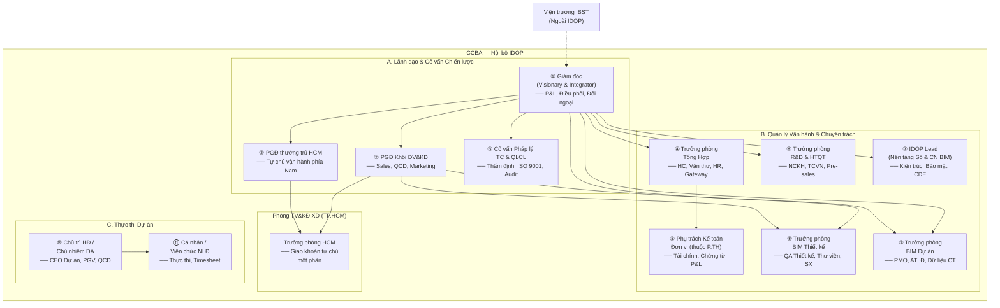

# 06 — Ma trận Vai trò & Phân quyền Tổ chức CCBA (Org & Role Matrix)

> **Phiên bản**: 1.0  
> **Tham chiếu**: Quy chế CCBA 2026 (Điều 7-9, Phụ lục 01), Kiến trúc IDOP (Phần VIII - Security Groups)  
> **Vai trò**: Nguồn sự thật duy nhất (SSOT) cho cơ cấu tổ chức và phân quyền CCBA trong IDOP.  
> **Quy tắc**: Mọi file `spec.md` khi viết User Stories và Role Matrix PHẢI tham chiếu tài liệu này.

---

## Phần 1 — Sơ đồ Tổ chức CCBA (The Accountability Chart)

> Tham chiếu: [03_ccba_charter_2026.md](../governance_constitution/03_ccba_charter_2026.md) Phụ lục 01

Sơ đồ dưới đây phản ánh **Sơ đồ Trách nhiệm Giải trình** (Accountability Chart), xác định các "Ghế" (Seats) chức năng — không phụ thuộc chức danh hành chính. Mỗi Ghế có 05 vai trò cốt lõi.



### Bảng tổng hợp 11 Ghế chức năng

| # | Ghế | Nhóm | 5 vai trò cốt lõi (tóm tắt) | Báo cáo cho |
|:---:|:---|:---|:---|:---|
| ① | Giám đốc (Visionary & Integrator) | A | Chiến lược, P&L, Integrator, Đối ngoại, LMA Leadership Team | Viện trưởng |
| ② | PGĐ Khối DV&KD | A | LMA Khối DV, Sales/Doanh số, QCD, Marketing, Hài lòng KH | GĐ |
| ②' | PGĐ thường trú HCM | A | Quản lý bộ phận HCM, Tự chủ vận hành, Tự cân đối chi phí | GĐ |
| ③ | Cố vấn Pháp lý, TC & QLCL | A | Thẩm định pháp lý, BIM Standards, QMS ISO 9001, Audit, Đào tạo | GĐ (trực tiếp) |
| ④ | Trưởng phòng Tổng Hợp | B | LMA Hành chính, HC&QT, HR/BHXH, Hỗ trợ IDOP L1, Điều phối | GĐ |
| ⑤ | Phụ trách Kế toán Đơn vị | B | Tuân thủ TC, Chứng từ, Báo cáo TC, Dòng tiền, Dữ liệu IDOP | Trưởng P.TH |
| ⑥ | Trưởng phòng R&D & HTQT | B | LMA NC, NCKH/Bài báo, HTQT, Pre-sales, Biên soạn TCVN | GĐ |
| ⑦ | IDOP Lead (Nền tảng Số) | B | Chiến lược CN, Quản trị hệ thống, Tích hợp AI, CDE, Đào tạo L2 | GĐ |
| ⑧ | Trưởng phòng BIM Thiết kế | B | LMA KTS/KS, Design QA, Thư viện Family, Tổ chức SX, Đào tạo | GĐ |
| ⑨ | Trưởng phòng BIM Dự án | B | LMA TVGS/QLDA, PMO, ATLĐ, Hỗ trợ hiện trường, Dữ liệu CT | PGĐ DV&KD |
| ⑩ | Chủ trì HĐ / CNDA | C | Trách nhiệm toàn diện DA, TC Dự án, Scope, Lãnh đạo nhóm, Dữ liệu IDOP | GĐ (theo QĐ 2815) |
| ⑪ | Cá nhân / Viên chức NLĐ | C | Hoàn thành NV, Tuân thủ, Dữ liệu cá nhân, Học hỏi, Phối hợp | Chủ trì / TP |

---

## Phần 2 — Ma trận Vai trò IDOP (Role Matrix)

> Ký hiệu: **C** = Create, **R** = Read, **U** = Update, **A** = Approve, **Admin** = Quản trị hệ thống  
> `*` = chỉ trong phạm vi dự án/phòng ban mình phụ trách

### Module 1: strategy_crm

| Vai trò | lead_capture | opportunities | potential_projects | crm |
|:---|:---:|:---:|:---:|:---:|
| ① GĐ | R, A | R, A | R, A | R, A |
| ② PGĐ DV&KD | C, R, U, A | C, R, U, A | R, A | C, R, U |
| ③ Cố vấn Pháp lý | R | R, A (thẩm định HSDT) | R | R |
| ④ TP Tổng Hợp | R | R | R | R |
| ⑥ TP R&D | C, R, U | C, R, U (Pre-sales) | R | R |
| ⑧ TP BIM Thiết kế | C*, R | C*, R, U* | R | R |
| ⑨ TP BIM Dự án | C*, R | C*, R, U* | R | R |
| ⑩ Chủ trì HĐ | C, R, U | C, R, U | R | C, R, U |
| ⑪ NLĐ | C*, R* | R* | R* | R* |

### Module 2: process_execution

| Vai trò | contracts | pmo | projects | work_packages | cde_documents | lessons_learned |
|:---|:---:|:---:|:---:|:---:|:---:|:---:|
| ① GĐ | R, A | R, A | R, A | R | R | R |
| ② PGĐ DV&KD | R, A | R, A* | R, U, A* | R* | R | R |
| ③ Cố vấn | R, A (pháp lý) | R | R | R | R, A (QA/QC) | R |
| ④ TP Tổng Hợp | R, U (lưu trữ) | R | R | R | R | R |
| ⑤ Kế toán | R | R | R | — | R | — |
| ⑧ TP BIM TK | R* | R* | R*, U* | C*, R, U* | C*, R, U* | C*, R |
| ⑨ TP BIM DA | R* | C*, R, U, A* | R*, U* | C*, R, U* | C*, R, U* | C*, R |
| ⑩ Chủ trì HĐ | C, R, U | C, R, U | C, R, U | C, R, U | C, R, U | C, R, U |
| ⑪ NLĐ | R* | R* | R* | R*, U* | C*, R* | C*, R |

### Module 3: cash_data

| Vai trò | allocations | expenses | finance |
|:---|:---:|:---:|:---:|
| ① GĐ | R, A | R, A | R, A |
| ② PGĐ DV&KD | R, A* | R, A* | R |
| ③ Cố vấn | R | R | R |
| ④ TP Tổng Hợp | R | R | R |
| ⑤ Kế toán | C, R, U, A | C, R, U, A | C, R, U, A |
| ⑩ Chủ trì HĐ | C*, R, U* | C*, R, U* | R* |
| ⑪ NLĐ | R* | C* (hoàn ứng) | R* |

### Module 4: people_assets

| Vai trò | hr | assets |
|:---|:---:|:---:|
| ① GĐ | R, A | R, A |
| ② PGĐ DV&KD | R | R |
| ④ TP Tổng Hợp | C, R, U, A | C, R, U, A |
| ⑤ Kế toán | R (lương, BHXH) | R |
| ⑦ IDOP Lead | R | C, R, U (thiết bị BIM) |
| ⑧ TP BIM TK | R* (nhân sự phòng) | R, U* |
| ⑨ TP BIM DA | R* (nhân sự phòng) | R, U* |
| ⑩ Chủ trì HĐ | R* (nhân sự DA) | R* |
| ⑪ NLĐ | R (cá nhân), U (Timesheet) | R* |

### Module 5: performance_okrs

| Vai trò | performance | reports |
|:---|:---:|:---:|
| ① GĐ | C, R, U, A | R |
| ② PGĐ DV&KD | C*, R, U, A* | R |
| ④ TP Tổng Hợp | R | R |
| ⑤ Kế toán | R (dữ liệu TC) | R |
| ⑧ TP BIM TK | C* (OKR phòng), R, U* | R* |
| ⑨ TP BIM DA | C* (OKR phòng), R, U* | R* |
| ⑩ Chủ trì HĐ | R* (KPI dự án) | R* |
| ⑪ NLĐ | R* (cá nhân) | R* |

### Module 6: system_governance

| Vai trò | approvals | forms | governance |
|:---|:---:|:---:|:---:|
| ① GĐ | R, A (cấp cao nhất) | R | R, A |
| ② PGĐ DV&KD | R, A* | R | R |
| ③ Cố vấn | R, A (pháp lý, QA) | R | R |
| ④ TP Tổng Hợp | R, A (hành chính) | R | R |
| ⑤ Kế toán | R, A (tài chính) | R | R |
| ⑦ IDOP Lead | C, R, U, Admin | C, R, U, Admin | C, R, U, Admin |
| ⑧ TP BIM TK | R, A* | R | R |
| ⑨ TP BIM DA | R, A* | R | R |
| ⑩ Chủ trì HĐ | C, R (tạo yêu cầu phê duyệt) | C, R, U* | R |
| ⑪ NLĐ | C, R (tạo yêu cầu) | C*, R | R |

---

## Phần 3 — Ánh xạ Vai trò → SharePoint Permission Groups (Entra ID)

> Tham chiếu: [01_idop_v2_architecture.md](../system_blueprint/01_idop_v2_architecture.md) Phần VIII.1 — Microsoft Entra ID Groups

| Ghế CCBA | Entra ID Group | Permission Level | Ghi chú |
|:---|:---|:---|:---|
| ① GĐ | `CCBA_BanGiamDoc` | Full Control | Phê duyệt mọi cấp |
| ② PGĐ DV&KD | `CCBA_BanGiamDoc` | Full Control | Ủy quyền từ GĐ |
| ②' PGĐ HCM | `CCBA_BanGiamDoc` + `CCBA_PhongHCM` | Full Control (HCM scope) | Tự chủ phía Nam |
| ③ Cố vấn Pháp lý | `CCBA_Legal_QA` | Contribute + Approve (QA) | Thẩm định pháp lý, Audit |
| ④ TP Tổng Hợp | `CCBA_PhongTongHop` + `CCBA_TruongPhong_All` | Contribute + Manage | Gateway, HR |
| ⑤ Kế toán | `CCBA_KeToan` + `CCBA_Finance_Audit` | Contribute (Finance module) | Thuộc Phòng TH |
| ⑥ TP R&D | `CCBA_PhongRD_HTQT` + `CCBA_TruongPhong_All` | Contribute | NCKH, Pre-sales |
| ⑦ IDOP Lead | `CCBA_DigitalPlatform_Admin` | Site Admin | Quản trị toàn hệ thống |
| ⑧ TP BIM TK | `CCBA_PhongBIMThietKe` + `CCBA_TruongPhong_All` | Contribute + Approve (phòng) | Design QA |
| ⑨ TP BIM DA | `CCBA_PhongBIMDuAn` + `CCBA_TruongPhong_All` | Contribute + Approve (phòng) | PMO |
| ⑩ Chủ trì HĐ | `CCBA_ChuTri_All` + `CCBA_Fund_Manager` | Contribute (phạm vi DA) | CEO Dự án |
| ⑪ NLĐ | `CCBA_VCNLD_All` | Contribute (hạn chế) | Chỉ dữ liệu cá nhân/DA |
| — CTV/Thực tập | `CCBA_External_Partners` | Read | Chỉ đọc |
| — Khách hàng | `CCBA_External_Clients` | Read (CRM portal) | Portal bên ngoài |

---

## Phần 4 — Hướng dẫn cho Spec Authors

### 4.1. Danh sách Vai trò Chuẩn hóa (Khóa cứng)

> ⚠️ **Quy tắc**: Khi viết `spec.md`, chỉ được sử dụng các vai trò trong danh sách dưới đây. KHÔNG được tự đặt tên vai trò mới.

| ID | Vai trò chuẩn hóa | Viết tắt | Ghế tương ứng |
|:---|:---|:---|:---|
| `ROLE_DIRECTOR` | Giám đốc Trung tâm | GĐ | ① |
| `ROLE_DEPUTY_DIRECTOR` | Phó Giám đốc Khối DV&KD | PGĐ | ② |
| `ROLE_DEPUTY_HCM` | Phó Giám đốc thường trú HCM | PGĐ HCM | ②' |
| `ROLE_LEGAL_QA` | Cố vấn Pháp lý, TC & QLCL | CV PL | ③ |
| `ROLE_HEAD_ADMIN` | Trưởng phòng Tổng Hợp | TP TH | ④ |
| `ROLE_ACCOUNTANT` | Phụ trách Kế toán Đơn vị | KT | ⑤ |
| `ROLE_HEAD_RD` | Trưởng phòng R&D & HTQT | TP R&D | ⑥ |
| `ROLE_IDOP_LEAD` | Phụ trách Nền tảng Số & CN BIM | IDOP Lead | ⑦ |
| `ROLE_HEAD_BIM_DESIGN` | Trưởng phòng BIM Thiết kế | TP BIM TK | ⑧ |
| `ROLE_HEAD_BIM_PROJECT` | Trưởng phòng BIM Dự án | TP BIM DA | ⑨ |
| `ROLE_HEAD_HCM` | Trưởng phòng TV&KĐ XD (HCM) | TP HCM | — |
| `ROLE_PROJECT_MANAGER` | Chủ trì HĐ / Chủ nhiệm DA | CT / CNDA | ⑩ |
| `ROLE_STAFF` | Cá nhân / Viên chức NLĐ | NLĐ | ⑪ |
| `ROLE_EXTERNAL_PARTNER` | Cộng tác viên / Đối tác | CTV | — |
| `ROLE_EXTERNAL_CLIENT` | Khách hàng (Bên A) | KH | — |

### 4.2. Template User Story

```
Với tư cách [ROLE_ID — Tên vai trò], tôi muốn [hành động cụ thể trên IDOP] 
để [giá trị nghiệp vụ / kết quả mong đợi].
```

**Ví dụ**:

> Với tư cách `ROLE_PROJECT_MANAGER` — Chủ trì HĐ, tôi muốn **tạo Phiếu giao việc trên IDOP và phân bổ tỷ lệ tài chính cho từng thành viên** để **đảm bảo minh bạch phân chia doanh thu theo Điều 11 Quy chế CCBA 2026**.

> Với tư cách `ROLE_ACCOUNTANT` — Kế toán Đơn vị, tôi muốn **xem báo cáo tổng hợp công nợ phải thu theo từng HĐ** để **lập kế hoạch dòng tiền tuần/tháng và đối chiếu với TCKT Viện**.

> Với tư cách `ROLE_HEAD_ADMIN` — Trưởng phòng Tổng Hợp, tôi muốn **cập nhật trạng thái đối ngoại của HĐ Viện ký trên IDOP** để **theo dõi tiến trình phê duyệt và đôn đốc khi quá SLA**.

### 4.3. Quy tắc viết Ma trận Vai trò trong spec.md

1. **Tham chiếu file này**: Đầu mỗi section Role Matrix, ghi `> Tham chiếu: [06_ccba_org_role_matrix.md](...)`.
2. **Dùng đúng ROLE_ID**: Sử dụng cột ID trong bảng 4.1, không tự sáng tạo tên mới.
3. **Phân quyền CRUD+A**: Sử dụng ký hiệu C/R/U/A/Admin nhất quán.
4. **Ghi phạm vi**: Nếu quyền bị giới hạn (chỉ dự án mình, chỉ phòng mình), ghi rõ bằng `*`.
5. **Dẫn chiếu Điều/Khoản**: Khi vai trò có cơ sở pháp lý cụ thể, ghi dẫn chiếu (VD: "theo Điều 11 Quy chế CCBA").
