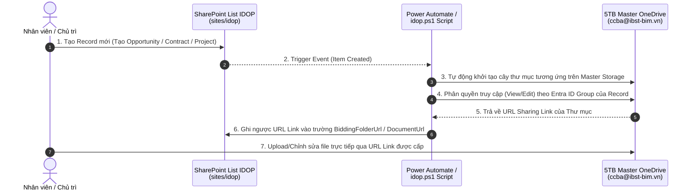
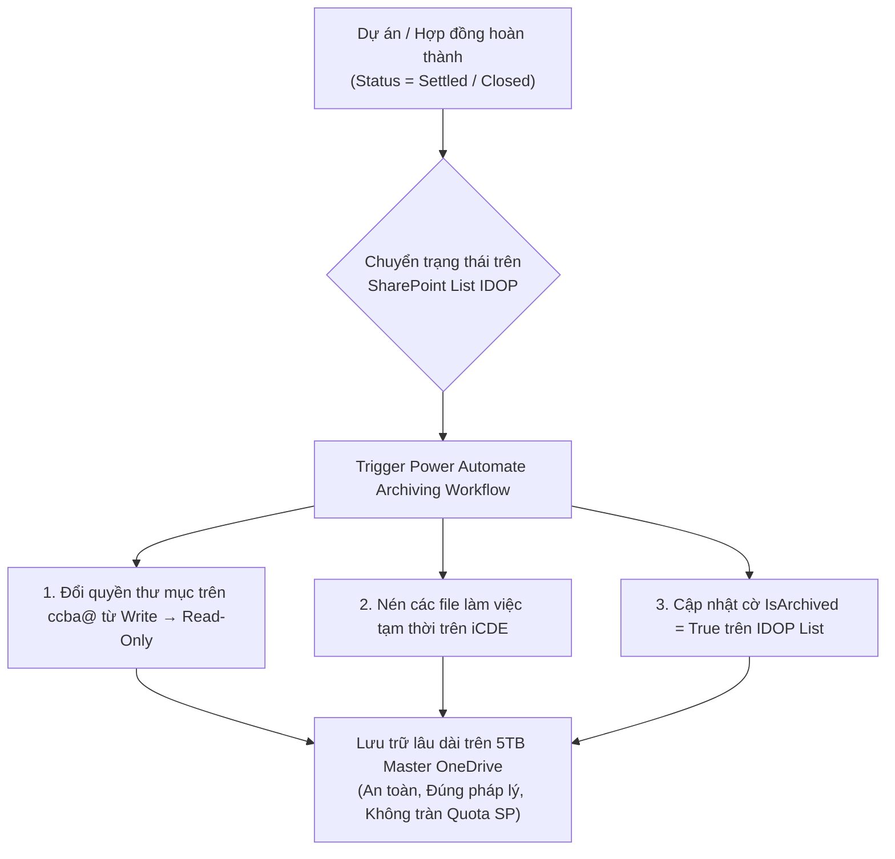

# 07 — Kiến trúc Lưu trữ Hạ tầng M365 & Chiến lược Phân luồng Dung lượng (M365 Storage & Offloading Architecture)

> **Phiên bản**: 2.0  
> **Ngày lập**: 2026-07-29  
> **Đơn vị**: CCBA — Trung tâm Tư vấn và Ứng dụng BIM trong Xây dựng (Viện IBST)  
> **Mục đích**: Giải quyết triệt để rào cản giới hạn dung lượng SharePoint Online (2TB Quota Constraint), tận dụng dung lượng 5TB Master OneDrive (`ccba@ibst-bim.vn`) và 1TB/user Personal OneDrive để phân luồng dữ liệu thông minh, duy trì IDOP nhẹ, mượt mà và mở rộng bền vững.

---

## 1. Bối cảnh & Nguyên tắc Tối ưu Dung lượng

### 1.1 Thách thức Hạ tầng SharePoint Online (2TB Tenant Limit)
- M365 cấp hạn mức SharePoint Tenant mặc định cho CCBA/IBST khoảng **2TB**.
- Nếu lưu trực tiếp file đính kèm dung lượng lớn (PDF Hồ sơ thầu, Hợp đồng scan, Bản vẽ CAD/BIM, Hóa đơn chứng từ, Ảnh kiểm định) vào SharePoint List Attachments hoặc Document Libraries trên `sites/idop`, dung lượng 2TB sẽ bị đầy nhanh chóng trong vòng 1-2 năm.

### 1.2 Nguyên tắc "Metadata-First & Master Storage Offloading"
1. **SharePoint `sites/idop` (Lightweight Engine)**:
   - CHỈ lưu trữ dữ liệu Metadata dạng văn bản (Text, Numbers, Dates, Choice, Lookup, Taxonomy) trên 57 SharePoint Lists.
   - **TÓC ĐỘ CẮT GIẢM**: Tuyệt đối không lưu đính kèm binary trực tiếp vào List Items. Dung lượng 57 lists dự kiến chỉ chiếm < 5GB cho hàng chục ngàn bản ghi.
2. **Master Storage Hub (`ccba@ibst-bim.vn` - 5TB OneDrive)**:
   - Tận dụng tài khoản OneDrive Master 5TB chính thức của Trung tâm (`ccba@ibst-bim.vn`) làm kho lưu trữ tệp tin binary chính thức tập trung.
   - Khi cần thêm dung lượng trong tương lai, có thể nâng cấp gói M365/OneDrive mà không ảnh hưởng tới cấu trúc IDOP.
3. **Personal User OneDrive (1TB/User Layer)**:
   - Nhân viên/Chủ trì dùng 1TB OneDrive cá nhân để phác thảo, làm việc tạm thời. Khi trình nộp chính thức, hệ thống tự động đồng bộ bản final về 5TB Master OneDrive.
4. **Lifecycle Archiving (Đóng băng & Nén Hồ sơ)**:
   - Khi Hợp đồng/Dự án chuyển sang trạng thái `Closed` hoặc `Settled`, tự động chuyển quyền sang Read-Only và thu hồi các file nháp tạm thời trên CDE.

---

## 2. Cấu trúc Cây Thư mục 5TB Master OneDrive (`ccba@ibst-bim.vn`)

Toàn bộ file binary chính thức được tự động tổ chức trên tài khoản `ccba@ibst-bim.vn` theo 5 phân hệ nghiệp vụ:

```
📁 IDOP_Master_Storage/
├── 📁 01_Bidding/
│   └── 📁 {ID}-{BiddingCode}-{OpportunityName}/
│       ├── 📁 01-Input/        (HSMT, CAD/BIM gốc, VB Phân công)
│       ├── 📁 02-Output/       (HSDT, Phương án BIM, Dự toán)
│       ├── 📁 03-Contracts/    (Thỏa thuận liên danh, Dự thảo HĐ, Bảo lãnh)
│       └── 📁 04-Admin/        (QĐ Tham gia thầu, Email chỉ đạo)
├── 📁 02_Contracts/
│   └── 📁 {ContractCode}-{CustomerName}/
│       ├── 📁 HopDongGoc/      (Scan HĐ chính thức có dấu)
│       ├── 📁 PhuLuc/          (Các phụ luật HĐ bổ sung)
│       └── 📁 PhapLy/          (Ủy quyền, Thẩm định pháp lý)
├── 📁 03_Finance/
│   └── 📁 {Year}/
│       └── 📁 {Month}/
│           ├── 📁 HoaDon_VAT/   (Scan hóa đơn đầu vào/đầu ra)
│           ├── 📁 ChungTu_Chi/  (Biên bản thanh toán, Phiếu chi)
│           └── 📁 GiaiNgan/     (Đề nghị giải ngân nộp TCKT Viện)
├── 📁 04_HR_Assets/
│   └── 📁 {EmployeeCode}-{FullName}/
│       ├── 📁 HopDongLaoDong/  (HĐLD, Quyết định tuyển dụng)
│       ├── 📁 BangCap_ChungChi/(Bằng đại học, Chứng chỉ BIM/XD)
│       └── 📁 PhucLoi_DanhGia/ (Đánh giá KPI, Hồ sơ BHXH)
└── 📁 05_Projects/
    └── 📁 {ProjectCode}-{ProjectName}/
        ├── 📁 HoSoNghiemThu/   (Biên bản nghiệm thu kỹ thuật/A-B)
        ├── 📁 QuyetToan/       (Tờ phân phối 3 tầng, Báo cáo QT)
        └── 📁 Deliverables/    (Hồ sơ bàn giao chính thức ISO 19650)
```

---

## 3. Sơ đồ Luồng Tự động hóa (Power Automate & PnP PowerShell)



---

## 4. Bảng Ánh xạ Entity SharePoint List ↔ Trường URL Master Storage

| Module | SharePoint List | Trường Lưu URL Link | Đường dẫn trên 5TB Master OneDrive (`ccba@`) |
|:---|:---|:---|:---|
| `strategy_crm` | `Opportunities` | `BiddingFolderUrl` | `IDOP_Master_Storage/01_Bidding/{ID}-{BiddingCode}-{OppName}/` |
| `process_execution` | `Contracts` | `DocumentUrl` | `IDOP_Master_Storage/02_Contracts/{ContractCode}-{CustomerName}/` |
| `cash_data` | `expenses` | `ReceiptUrl` | `IDOP_Master_Storage/03_Finance/{Year}/{Month}/ChungTu_Chi/` |
| `cash_data` | `finance` | `InvoiceUrl` | `IDOP_Master_Storage/03_Finance/{Year}/{Month}/HoaDon_VAT/` |
| `people_assets` | `employees` | `DocumentFolderUrl` | `IDOP_Master_Storage/04_HR_Assets/{EmployeeCode}-{FullName}/` |
| `process_execution` | `Projects` | `ProjectFolderUrl` | `IDOP_Master_Storage/05_Projects/{ProjectCode}-{ProjectName}/` |

---

## 5. Quy trình Đóng băng & Lưu trữ theo Vòng đời (Lifecycle Archiving)



---

## 6. Đánh giá Tối ưu & Kiểm soát Rủi ro

| Tiêu chí | Trước khi tối ưu | Sau khi tối ưu (Mô hình v2.0) |
|:---|:---|:---|
| **Dung lượng SharePoint (`sites/idop`)** | Nguy cơ tràn 2TB sau 1-2 năm | **Cực nhẹ (< 5GB)** — Chỉ lưu Metadata & Links |
| **Dung lượng File Storage** | Bị hạn chế bởi Tenant Quota | **Cực lớn (5TB+)** — Nằm trên Master OneDrive `ccba@` |
| **Tính Phụ thuộc Tài khoản** | Phụ thuộc cá nhân lẻ tóm tắt | **Tập trung 100%** vào Service Account pháp nhân `ccba@` |
| **Bảo mật & Phân quyền** | Khó quản lý đính kèm rải rác | **Đồng bộ tự động** theo 16 Entra ID Security Groups |
| **Chi phí Nâng cấp M365** | Phải Mua thêm SharePoint Storage Quota rất đắt | **Tiết kiệm tối đa** — Nâng cấp Add-on OneDrive License rẻ hơn nhiều |
