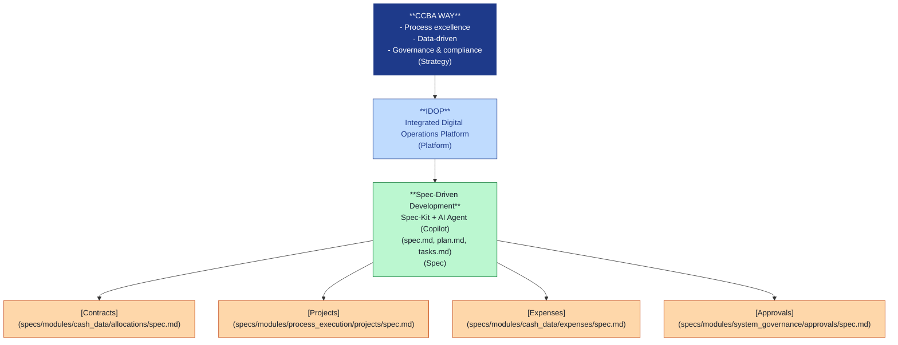
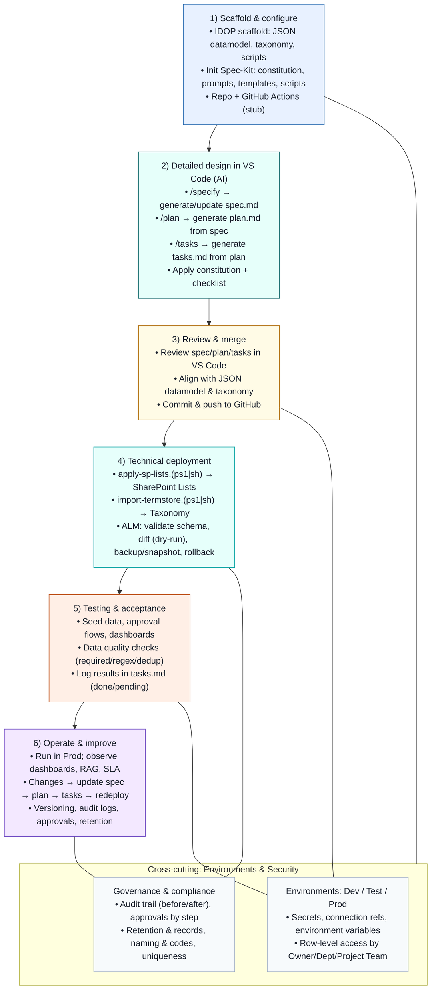

# IDOP‑CCBA‑WAY

---

## Định nghĩa và bối cảnh hoạt động của CCBA

- **Tên đầy đủ:** Trung tâm Tư vấn và Ứng dụng BIM trong xây dựng
- **Tư cách pháp nhân:** Đơn vị trực thuộc Viện Khoa học Công nghệ Xây dựng (IBST), có con dấu và tài khoản riêng
- **Tên tiếng Anh:** Center for Consulting Services and BIM Application in construction
- **Tên viết tắt:** CCBA
- **Địa chỉ:** Số 81 Trần Cung, phường Nghĩa Tân, Cầu Giấy, Hà Nội

---

## Bối cảnh hoạt động của CCBA

- **Chức năng:**
  - Tư vấn xây dựng: thiết kế, quản lý dự án, giám sát, thẩm tra, kiểm định...
  - Tư vấn, triển khai ứng dụng BIM xuyên suốt các giai đoạn dự án
  - Nghiên cứu khoa học, phát triển và chuyển giao công nghệ BIM
  - Đào tạo nhân lực BIM
  - Hợp tác trong nước và quốc tế
  - Thực hiện nhiệm vụ phục vụ quản lý nhà nước khi được giao

- **Nguyên tắc vận hành:**
  - Tuân thủ pháp luật, quy định Bộ Xây dựng và quy chế của Viện
  - Tự chủ, minh bạch, hiệu quả
  - Lấy ứng dụng BIM làm trục xuyên suốt
  - Số hóa và tự động hóa bằng nền tảng IDOP

- **Cơ cấu tổ chức:**
  - Ban Giám đốc
  - Phòng Tổng hợp
  - Phòng R&D và Hợp tác quốc tế
  - Phòng BIM Dự án
  - Phòng BIM Thiết kế
  - Các đơn vị trực thuộc khác khi cần thiết

---

## Định nghĩa và phạm vi của IDOP trong CCBA

- **IDOP (Integrated Digital Operation Platform):** Nền tảng hoạt động số tích hợp của CCBA trên Microsoft 365 (SharePoint Online, Power Automate, Power BI, Teams).
- **Mục đích:** Số hóa, tự động hóa quy trình, quản lý dữ liệu, hỗ trợ điều hành–ra quyết định.
- **Các thành phần trọng tâm:**
  - SharePoint Lists cho CRM–Hợp đồng–Dự án–Công việc–Chi phí–Hóa đơn–Tờ trình
  - Power Automate cho trình ký và phê duyệt động theo quy tắc
  - Power BI cho dashboards tiến độ, tài chính, chất lượng
  - Teams cho cộng tác và thực thi quy trình “Trình ký”

---

## Quy trình nghiệp vụ cốt lõi (CCBA WAY) gắn với IDOP

- **Chu trình CRM → Hợp đồng → Dự án → Thực thi → Nghiệm thu → Thanh/Quyết toán–Hoàn chứng từ.**
- **Ứng dụng “Trình ký”:** luồng phê duyệt tài liệu nội bộ theo nhiều tầng (Chủ trì → Trưởng phòng → Cố vấn Pháp lý/TC&QLCL → Phó Giám đốc → Giám đốc).
- **Quản lý tài liệu dự án:** CDE trên SharePoint; quy định chuyển lưu trữ sang OneDrive cho archive/dung lượng lớn; cấu trúc thư mục chuẩn.
- **Tài chính–kế toán:** Kế hoạch tài chính hợp đồng, Hóa đơn, Chi phí, quy trình tạm ứng–thanh toán–quyết toán–hoàn chứng từ được tự động hóa.

---

## Khóa neo cho mọi thảo luận và triển khai

- **CCBA = Trung tâm TV&UD BIM của IBST;** mọi “WAY”, “IDOP”, “quy trình” đều gắn với bối cảnh cơ quan nhà nước/đơn vị sự nghiệp thuộc Viện, không phải doanh nghiệp đồ uống.
- **IDOP là nền tảng nội bộ** phục vụ số hóa quy trình của Trung tâm (BIM thiết kế, BIM dự án, R&D, hành chính–tài chính), không phải sản phẩm thương mại đại trà (trừ khi được định hướng thương mại hóa từng phần sau).
- **Thuật ngữ và viết tắt chuẩn hóa:** dùng đúng các định nghĩa trong Quy chế (HĐKT, VCNLĐ, CDE, PMO, Trình ký…) để giữ tính nhất quán pháp lý–nghiệp vụ.
- **ALM và phân quyền:** phải phản ánh ma trận vai trò nội bộ (Giám đốc/Phó Giám đốc/Trưởng phòng/Chủ trì…), phân quyền theo dự án–phòng ban, và yêu cầu lưu vết/kiểm toán.

- **Tuân thủ tài chính:** quy trình chi–thu–hoàn chứng từ tuân thủ Quy chế chi tiêu nội bộ của Viện; tự động hóa chỉ là công cụ, không thay thế kiểm soát chuẩn tắc.

---

Hệ thống **IDOP** cho CCBA được scaffold sẵn với:

- **Datamodel SharePoint** (JSON Lists, Taxonomy)

- **Scripts** apply/export
- **Tích hợp Spec‑Kit** để làm việc theo phương pháp Spec‑Driven Development với AI Agent (GitHub Copilot) trong VS Code.

---

## 📐 IDOP in CCBA WAY

> Kiến trúc tổng quan của nền tảng IDOP trong mô hình vận hành CCBA WAY



---

## 📊 Pipeline tổng quan

> Quy trình từ ý tưởng → thiết kế → triển khai → kiểm thử → vận hành & cải tiến



---

## 🚦 Mẫu workflow CI/CD (GitHub Actions)

```yaml
# .github/workflows/validate.yml
name: Validate & Lint
on:
  push:
    branches: [main]
  pull_request:
    branches: [main]
jobs:
  validate:
    runs-on: ubuntu-latest
    steps:
      - uses: actions/checkout@v3
      - name: Validate JSON schemas
        run: |
          npm install -g ajv-cli
          ajv validate -s datamodel/sharepoint/schemas/sp-list.schema.json -d datamodel/sharepoint/lists/**/*.json
      - name: Lint markdown
        run: |
          npm install -g markdownlint-cli
          markdownlint '**/*.md' --ignore node_modules
```

---

## 🚀 Getting started

## 📂 Liên kết nhanh

- **Spec modules:** [`specs/modules/`](specs/modules/)
  - [Contracts](specs/modules/cash_data/allocations/spec.md)
  - [Projects](specs/modules/process_execution/projects/spec.md)
  - [Expenses](specs/modules/cash_data/expenses/spec.md)
  - [Approvals](specs/modules/system_governance/approvals/spec.md)

- **Datamodel:** [`datamodel/sharepoint/lists/`](datamodel/sharepoint/lists/)

- **Scripts:** [`tools/scripts/`](tools/scripts/) & [`specify/scripts/`](specify/scripts/)

- [Hướng dẫn sử dụng script deploy-sp-lists-enhanced.ps1](docs/deploy-sp-lists-enhanced.md)  
  (Tự động tạo/cập nhật SharePoint Lists từ JSON, hỗ trợ đầy đủ các loại trường, hướng dẫn chi tiết quyền hạn, TermStore, tham số script)

- [Kiểm thử schema SharePoint Lists (validate-sp-schemas.js)](docs/validate-sp-schemas.md)  
  (Hướng dẫn kiểm thử tự động schema JSON, tích hợp CI/CD)

- [Đề xuất bảo trì & mở rộng script](docs/script-maintenance-proposal.md)  
  (Hướng dẫn đóng gói module, bảo trì định kỳ, mở rộng automation, quản lý version)

- [Thư viện List Formatting (JSON) cho SharePoint Lists](list-formatting/README.md)
- [Hướng dẫn bảo trì & mở rộng List Formatting](docs/list-formatting-maintenance.md)

---

## Hướng dẫn cấu hình VS Code MCP client với Serena

1. Cài đặt Serena MCP server (xem serena/README.md).
2. Khởi động Serena MCP server bằng script:
   ```powershell
   .\tools\scripts\start-serena-mcp.ps1
   ```
3. Cài extension hỗ trợ MCP client cho VS Code (ví dụ: Cline, Roo Code, Cursor, Claude Desktop, hoặc OpenWebUI).
4. Trong VS Code, cấu hình extension/client để sử dụng endpoint MCP server (thường là http://localhost:5001 hoặc theo config của Serena).
5. Khi sử dụng Copilot Chat, Claude, Cursor... hãy inject prompt hướng dẫn sử dụng Serena MCP (xem docs/serena_on_chatgpt.md).
6. Đảm bảo agent luôn truy vấn MCP server để lấy context code trước khi trả lời.

> Tham khảo chi tiết: serena/README.md, docs/serena_on_chatgpt.md, docs/custom_agent.md
