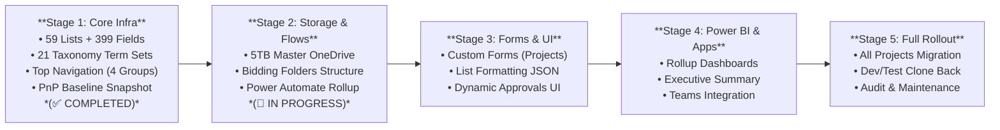

# 🚀 Chiến Lược & Lộ Trình Triển Khai IDOP PROD-First

> **Cập nhật mới nhất**: 2026-08-02 | **Môi trường PROD**: `https://ibstbim.sharepoint.com/sites/idop`  
> **Trạng thái**: **Stage 1 COMPLETED** (59/59 Lists, 21/21 Term Sets, Top Navigation, Baseline PnP Snapshot)

---

## 🎯 1. Tại Sao Chọn Chiến Lược PROD-First?

Hệ thống IDOP v2.0 được áp dụng chiến lược **PROD-First** thay cho lộ trình truyền thống (Dev → UAT → Prod) nhằm:
1. **Rút ngắn thời gian đưa vào vận hành (Time-to-Value)**: Đưa toàn bộ hạ tầng 59 Lists và 21 Bộ Từ khóa Taxonomy lên site chính thức `https://ibstbim.sharepoint.com/sites/idop` để triển khai Soft-Launch cho các dự án thí điểm lập tức.
2. **Đảm bảo tính nhất quán dữ liệu**: Tránh sai lệch metadata, GUID lookup giữa các môi trường thử nghiệm và chính thức.
3. **An toàn tuyệt đối bằng PnP Baseline Snapshot**: Trước khi thực hiện bất kỳ thay đổi nào, hệ thống tự động xuất bản sao lưu PnP Template Baseline (`backups/idop-prod-baseline-*.xml`) để sẵn sàng khôi phục khi cần.
4. **Cơ chế Copy-Back sau Soft-Launch**: Sau khi PROD vận hành ổn định, môi trường Dev/Test sẽ được tạo nhanh bằng cách clone PnP Template từ PROD về.

---

## 🗺️ 2. Lộ Trình Triển Khai 5 Giai Đoạn (5-Stage Roadmap)

---

## 📋 3. Bảng Trạng Thái 7 Bước Thực Thi (7-Step Runbook)

| # | Bước thực thi | Lệnh CLI (`idop.ps1`) | Trạng thái | Ghi chú kỹ thuật |
|:---:|:---|:---|:---:|:---|
| **1** | DryRun kiểm tra Schema | `.\idop.ps1 deploy lists -Environment IDOP -DryRun` | ✅ **DONE** | 59 Lists valid, 0 errors |
| **2** | Import Taxonomy Term Store | `.\idop.ps1 taxonomy import -Environment IDOP` | ✅ **DONE** | 21/21 Term Sets imported |
| **3** | Deploy 59 Lists (Full Mode) | `.\idop.ps1 deploy lists -Environment IDOP -Full` | ✅ **DONE** | 59 Lists, 399 Fields OK (15.96 min) |
| **4** | Deploy Global Navigation | `.\idop.ps1 deploy navigation -Environment IDOP` | ✅ **DONE** | 4 Nhóm menu & link phân hệ |
| **5** | Xuất PnP Baseline Snapshot | Export PnP Template Baseline | ✅ **DONE** | Template backup XML saved |
| **6** | Triển khai Bidding Folders | `.\idop.ps1 deploy folders -Environment IDOP` | ⏳ **TIẾP THEO** | OneDrive `ccba@ibst-bim.vn` |
| **7** | Power Automate & Soft-Launch | Thiết lập Cloud flows Rollup 3 cấp | ⏳ **CHỜ XỬ LÝ** | Thí điểm Phòng BIM + Tổng hợp |

---

## 🔐 4. Hạ Tầng & Quy Định Vận Hành Kỹ Thuật

- **Môi trường PROD**: `https://ibstbim.sharepoint.com/sites/idop`
- **Xác thực App-Only Certificate**: Dùng Certificate `CN=IDOP-SPO-Deploy` (Client App ID: `c055c7a4-9150-4bd5-bf01-445c65467feb`).
- **CLI Wrapper Bắt Buộc**: Luôn sử dụng lệnh CLI `idop.ps1` với tham số `-Environment IDOP`.
- **PowerShell 7 Requirement**: Yêu cầu môi trường PowerShell 7 (`pwsh`), không chạy trên Windows PowerShell 5.1.

---

## 📚 5. Tài Liệu Tham Chiếu

- [Hướng dẫn Vận hành Navigation](navigation-governance.md)
- [Checklist Bảo trì & Đồng bộ Hệ thống](maintenance-checklist.md)
- [Bản thiết kế Kiến trúc IDOP v2.0](../.md/system_blueprint/03_idop_v2_technical_implementation.md)
