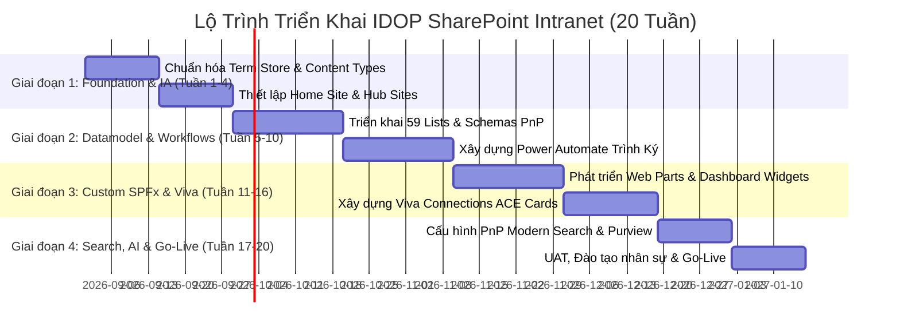

# 🏛️ Báo Cáo Nghiên Cứu Kỹ Thuật: Nền Tảng SharePoint Online Intranet & Microsoft 365 Hiện Đại

> **Tài liệu Kỹ thuật Dự án:** IDOP-CCBA-WAY  
> **Tenant Mục Tiêu:** `https://ibstbim.sharepoint.com/sites/idop`  
> **Cập nhật:** 2026-08-15  
> **Nguồn nghiên cứu:** Microsoft 365 Architecture Guidelines, PnP Community, SPFx v1.20+ Standards

---

## 1. KIẾN TRÚC INTRANET HIỆN ĐẠI (Modern SharePoint Architecture)

### 1.1 Phân Cấp Site & Topology (Flat Architecture)
* **Khai tử Subsites:** Không bao giờ tạo Subsites lồng nhau (Subsites gây ra các vấn đề nghiêm trọng: permission inheritance vỡ, URL dài vượt giới hạn 400 ký tự, hard-coded URLs gãy khi tái cấu trúc).
* **Flat Topology 100%:** Mỗi đơn vị/phòng ban/dự án là một Site Collection độc lập:
  * **Home Site / Root Hub (`/sites/idop`):** Cổng thông tin trung tâm của toàn Trung tâm CCBA, tích hợp tìm kiếm toàn cục, tin tức chính thống từ Ban Giám đốc và điểm truy cập Viva Connections.
  * **Communication Sites:** Dành cho các đơn vị phát hành thông tin 1 chiều cho toàn thể nhân viên (Phòng Tổng hợp, R&D, Đào tạo BIM, Cẩm nang Quy chế).
  * **Team Sites (M365 Group-connected):** Dành cho các nhóm làm việc 2 chiều nội bộ phòng ban hoặc dự án cụ thể (Phòng BIM Thiết kế, Ban Quản lý Dự án A, Tổ thẩm tra PCCC).
  * **Hub-to-Hub Association:** Liên kết Root Hub CCBA với các Hub chuyên biệt con (Hub Khối Dự án BIM, Hub Khối Nghiên cứu).

### 1.2 Trải Nghiệm Đa Kênh (Multi-Channel Experience)
* **Viva Connections:** Đóng vai trò là ứng dụng SharePoint app tích hợp sẵn ngay trong thanh điều hướng của **Microsoft Teams** (cả Desktop và Mobile). Nhân viên chỉ cần mở Teams là truy cập toàn bộ Intranet, nhận tin tức và thao tác trên Dashboard thẻ tác vụ.
* **Viva Engage:** Tích hợp mạng xã hội nội bộ, cộng đồng trao đổi kỹ thuật BIM, hỏi đáp và vinh danh nhân viên.

### 1.3 Cấu Trúc Thông Tin (Information Architecture)
* **Managed Metadata Service (MMS / Term Store):** Chuẩn hóa toàn bộ danh mục phân loại chung: *Danh mục Dự án*, *Bộ môn kỹ thuật (PCCC, MEP, Kết cấu, Kiến trúc)*, *Loại văn bản (HĐKT, Tờ trình, BBNT, Hồ sơ pháp lý)*, *Phòng ban ban hành*.
* **Content Type Hub:** Phổ biến tự động các Content Types chuẩn (ví dụ: `Hợp Đồng Kinh Tế`, `Tờ Trình Phê Duyệt`, `Báo Cáo Thẩm Tra`) kèm siêu dữ liệu bắt buộc đến toàn bộ các Site trong Tenant.
* **Global Navigation:** Sử dụng Hub Navigation kế thừa đồng bộ từ Home Site xuống tất cả các Associated Sites.

---

## 2. CÔNG NGHỆ PHÁT TRIỂN & MỞ RỘNG (Custom Development & Extensibility)

### 2.1 SPFx (SharePoint Framework) v1.20+
* **Tech Stack Chuẩn:** TypeScript, React 18, Fluent UI React v9 (tokens-based design system).
* **Các Loại Thành Phần SPFx:**
  * **Web Parts:** Các widget chức năng nhúng trên trang (ví dụ: Widget Tra cứu Hợp đồng, Bảng theo dõi tiến độ Dự án BIM, Dashboard Trình ký cá nhân).
  * **Application Customizers:** Chèn Header/Footer toàn cục, thanh cảnh báo khẩn cấp, mã theo dõi telemetry hoặc CSS tokens doanh nghiệp.
  * **Field Customizers:** Render siêu dữ liệu động trong SharePoint Lists (tiến độ % dạng thanh màu, avatar nhân sự, badge trạng thái phê duyệt).
  * **Adaptive Card Extensions (ACEs):** Xây dựng các thẻ tương tác nhanh trên Viva Connections Dashboard (hỗ trợ cả Card View tóm tắt và Quick View mở form chi tiết).

### 2.2 Giao Tiếp Dữ Liệu & Backend
* **PnPjs (Patterns and Practices SDK v4):** Thư viện chuẩn mực để giao tiếp với SharePoint REST API, hỗ trợ tự động:
  * Caching cục bộ (LocalStorage/SessionStorage) giảm 70% số lượng request.
  * Batching API requests (gom nhiều thao tác CRUD vào 1 HTTP call).
* **Microsoft Graph API (v1.0 & beta):** Truy vấn dữ liệu chéo M365 (lịch họp Outlook, thành viên Teams, file OneDrive, danh bạ nhân sự Entra ID).
* **Serverless Backend (Azure Functions + Managed Identity):** Đối với các tác vụ xử lý nặng hoặc cần quyền bảo mật cấp cao (service-to-service), SPFx gọi qua Azure Functions bảo vệ bởi Azure AD App Registration (OAuth 2.0 / MSAL).

---

## 3. TỰ ĐỘNG HÓA & QUẢN TRỊ DỮ LIỆU (Automation & Data Layer)

### 3.1 Power Platform Tích Hợp
* **Power Automate:**
  * Xử lý luồng **"Trình ký Đa Cấp"** với **Teams Adaptive Cards**: Người duyệt nhận thẻ phê duyệt ngay trong tin nhắn Teams, bấm Duyệt/Từ chối trực tiếp kèm lý do mà không cần mở SharePoint.
  * Đồng bộ tự động trạng thái giữa SharePoint Lists, Dataverse và email thông báo.
* **Power Apps:** Tùy biến form nhập liệu nâng cao cho các danh sách phức tạp (Custom Forms cho List Hợp đồng, Đề nghị Tạm ứng).
* **Power BI:** Nhúng trực tiếp các Dashboard phân tích tài chính dự án, chi phí và hiệu suất OKR vào trang SharePoint có phân quyền bảo mật cấp dòng (Row-Level Security - RLS).

### 3.2 Quản Lý List Threshold & Lưu Trữ
* **List View Threshold (5,000 items):** Khi danh sách vượt quá 5,000 dòng, SharePoint chặn các truy vấn quét toàn bộ bảng. Giải pháp:
  * Tạo **Indexed Columns** trên các cột hay lọc (`ProjectID`, `Status`, `Department`, `CreatedDate`).
  * Sử dụng Search REST API (`_api/search`) hoặc Graph API thay vì GetItems khi dữ liệu lên tới hàng chục nghìn dòng.
* **SharePoint Archive Tier:** Chuyển các site dự án đã quyết toán hoặc tài liệu lưu trữ lâu năm sang kho Archive lạnh để giảm chi phí dung lượng lưu trữ M365.

---

## 4. TÌM KIẾM DOANH NGHIỆP & AI (Enterprise Search & Copilot)

### 4.1 Microsoft Search & PnP Modern Search v4
* **Microsoft Search Verticals & Filters:** Tạo các tab tìm kiếm chuyên biệt: *Tab Hợp Đồng*, *Tab Bản Vẽ BIM*, *Tab Quy Chế Pháp Lý*.
* **PnP Modern Search Web Parts v4:** Bộ công cụ mã nguồn mở mạnh mẽ nhất giúp tạo giao diện tìm kiếm tùy biến cao với Handlebars templates, Refiners (bộ lọc đa chiều) và Search Box thông minh.

### 4.2 Microsoft 365 Copilot & SharePoint Custom Agents
* **Semantic Index for Copilot:** Tự động đánh chỉ mục ngữ nghĩa toàn bộ tài liệu Word, Excel, PDF và List items trong SharePoint.
* **SharePoint Custom AI Agents (Copilot Studio):** Tạo các Agent chuyên biệt theo từng bộ môn/phòng ban (Agent Tra cứu Quy chuẩn PCCC, Agent Tư vấn Hợp đồng kinh tế) với nguồn dữ liệu (Grounding) chính là các thư viện tài liệu đã được kiểm duyệt của IDOP.

---

## 5. BẢO MẬT, PHÂN QUYỀN & QUẢN TRỊ (Governance & Security)

### 5.1 Mô Hình Phân Quyền 3 Lớp
1. **Lớp 1 - Entra ID Dynamic Groups:** Tự động gán nhân sự vào các nhóm quyền dựa trên thuộc tính phòng ban (`department eq 'BIM-Design'`) và chức danh trong tài khoản M365.
2. **Lớp 2 - SharePoint Group Roles:** Giữ nguyên tắc phân quyền theo Site: *Owners (Toàn quyền quản trị)*, *Members (Chỉnh sửa/Thực thi)*, *Visitors (Chỉ đọc tin tức)*. Không ngắt quyền đơn lẻ trên từng file trừ trường hợp tối mật.
3. **Lớp 3 - Microsoft Purview Information Protection:** Gán nhãn nhạy cảm (**Sensitivity Labels**) tự động:
   * `Nội bộ`: Nhân viên xem và tải bình thường.
   * `Bảo mật`: Mã hóa file, chặn sao chép, cấm chia sẻ ngoài tổ chức (External Sharing Disabled).
   * `Tối mật - Ban Giám đốc`: Chỉ nhóm Giám đốc/Kế toán trưởng mở được file.

### 5.2 Tự Động Hóa Cấp Phát Site (Site Provisioning)
* Sử dụng **PnP Provisioning Engine** (PowerShell / GitHub Actions) để khi có dự án mới, hệ thống tự động sinh ra một Site Collection chuẩn hóa 100% về cấu trúc thư mục CDE, các List schema, mẫu phân quyền và giao diện trong 60 giây.

---

## 6. MA TRẬN SO SÁNH CHIẾN LƯỢC & LỘ TRÌNH TRIỂN KHAI

### 6.1 Ma Trận So Sánh Các Phương Án Triển Khai

| Tiêu Chí | Out-of-the-Box (OOTB) + Viva | Intranet-in-a-box Thương Mại | Custom SPFx + IDOP Platform (Lựa Chọn Của CCBA) |
| :--- | :--- | :--- | :--- |
| **Chi phí bản quyền định kỳ** | $0 (Bao gồm trong M365) | Rất cao ($3 - $10/user/tháng) | **$0 (Tối ưu hóa tối đa TCO)** |
| **Tốc độ triển khai ban đầu** | Siêu nhanh (1-2 tuần) | Nhanh (3-4 tuần) | **Trung bình (theo từng Sprint)** |
| **Khả năng may đo nghiệp vụ BIM/CCBA**| Thấp (bị giới hạn tính năng gốc)| Trung bình (phụ thuộc nhà cung cấp) | **100% May đo hoàn hảo theo quy chế** |
| **Vendor Lock-in** | Không | Rất cao (khó dỡ bỏ khi hủy hợp đồng)| **Không (Hoàn toàn làm chủ mã nguồn)** |
| **Tích hợp sâu AI & Copilot** | Tự nhiên với M365 | Phụ thuộc bản nâng cấp của Vendor | **Tự nhiên, mở rộng linh hoạt qua AI Gateway** |

---

### 6.2 Lộ Trình Triển Khai Đề Xuất (20 Tuần)

