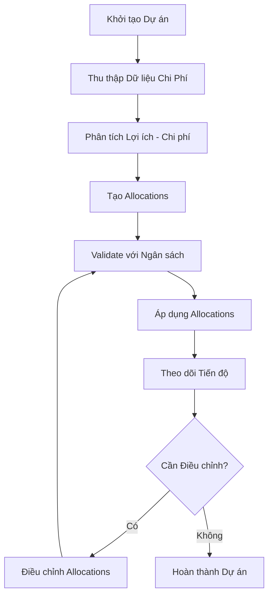

# Module: Allocations

## Bối cảnh & thuật ngữ CCBA

-  **CCBA (Construction Cost Benefit Analysis)**: Phân tích chi phí - lợi ích trong xây dựng,
  tập trung vào việc tối ưu hóa phân bổ tài nguyên và chi phí cho các dự án xây dựng.
-  **Allocations**: Phân bổ chi phí, ngân sách, và tài nguyên cho các hạng mục, giai đoạn,
  hoặc dự án cụ thể trong CCBA.
-  **Hạng mục (Items)**: Các thành phần chi phí như vật liệu, lao động, thiết bị trong dự án xây dựng.
-  **Giai đoạn (Phases)**: Các giai đoạn của dự án như lập kế hoạch, thi công, hoàn thiện.

## Mục tiêu

Quản lý và tối ưu hóa việc phân bổ chi phí và tài nguyên trong các dự án CCBA,
đảm bảo hiệu quả kinh tế và tuân thủ ngân sách.

## Phạm vi

-  Phân bổ chi phí cho các hạng mục xây dựng.
-  Theo dõi và điều chỉnh allocations dựa trên tiến độ dự án.
-  Tích hợp với hệ thống kế toán và báo cáo tài chính.
-  Hỗ trợ quyết định dựa trên phân tích lợi ích - chi phí.

## User stories

-  Là một Project Manager, tôi muốn phân bổ ngân sách cho các hạng mục để đảm bảo dự án
  không vượt quá ngân sách.
-  Là một Accountant, tôi muốn theo dõi allocations để báo cáo tài chính chính xác.
-  Là một Analyst, tôi muốn điều chỉnh allocations dựa trên phân tích lợi ích để tối ưu hóa lợi nhuận.

## Acceptance criteria

-  [ ] Hệ thống cho phép tạo và chỉnh sửa allocations cho mỗi dự án.
-  [ ] Allocations được validate để không vượt quá tổng ngân sách.
-  [ ] Báo cáo allocations được tạo tự động và tích hợp với Power BI.
-  [ ] Thay đổi allocations được log và audit trail.

## Quy trình & BPMN

## Ràng buộc & chỉ dẫn đặc thù

-  Trigger: Khi tạo mới dự án hoặc khi có thay đổi trong ngân sách.
-  Phân quyền: Chỉ Project Manager và Accountant có quyền chỉnh sửa allocations.
-  Tích hợp: Đồng bộ với SharePoint Lists và Power Automate cho workflows.
-  Lookup: Sử dụng taxonomy cho hạng mục và giai đoạn.
-  Validation: Tổng allocations không được vượt quá 100% ngân sách.
