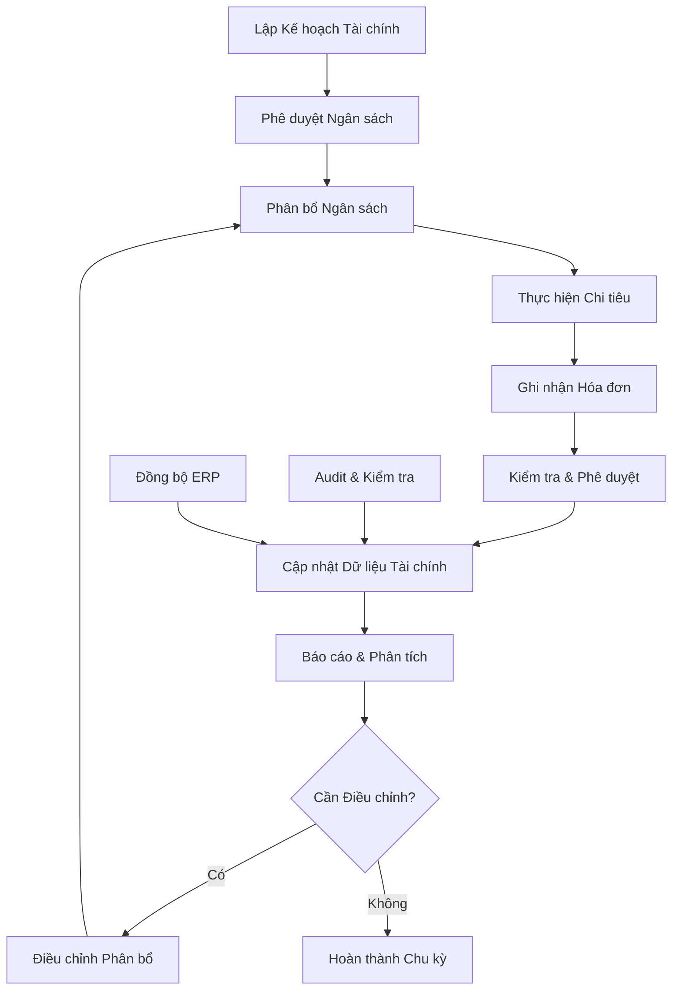

# Module: Cash Data

## Bối cảnh & thuật ngữ CCBA

- **Cash Data**: Hệ thống quản lý dữ liệu tài chính và tiền mặt trong các dự án CCBA, bao gồm quản lý chi phí, phân bổ ngân sách, và báo cáo tài chính.
- **CCBA (Construction Cost Benefit Analysis)**: Phân tích chi phí - lợi ích trong xây dựng, tập trung vào việc tối ưu hóa tài chính và quản lý dòng tiền.
- **Finance Management**: Quản lý tài chính tổng thể cho các dự án và hoạt động kinh doanh.
- **Expense Tracking**: Theo dõi và kiểm soát các khoản chi phí phát sinh trong dự án.
- **Budget Allocations**: Phân bổ ngân sách và tài nguyên cho các hạng mục và giai đoạn dự án.

## Mục tiêu

Xây dựng hệ thống quản lý dữ liệu tài chính toàn diện cho CCBA, đảm bảo:
- Quản lý hiệu quả dòng tiền và ngân sách dự án
- Theo dõi chi phí chính xác và kịp thời
- Phân bổ tài nguyên tối ưu
- Báo cáo tài chính minh bạch và tuân thủ quy định

## Phạm vi

- **Finance Module**: Quản lý kế hoạch tài chính, tài khoản ngân hàng, và báo cáo tài chính tổng thể
- **Expenses Module**: Theo dõi và kiểm soát các khoản chi phí, hóa đơn đầu vào, và quy trình phê duyệt
- **Allocations Module**: Phân bổ ngân sách và chi phí cho các hạng mục, giai đoạn dự án
- Tích hợp với SharePoint Lists để lưu trữ dữ liệu
- Kết nối với Power BI cho báo cáo và phân tích
- Đồng bộ với hệ thống kế toán và ERP

## User stories

- Là một CFO, tôi muốn có cái nhìn tổng quan về tình hình tài chính để đưa ra quyết định chiến lược.
- Là một Project Manager, tôi muốn theo dõi ngân sách và chi phí dự án để đảm bảo không vượt quá dự toán.
- Là một Accountant, tôi muốn ghi nhận và phân loại các khoản chi phí để báo cáo tài chính chính xác.
- Là một Finance Manager, tôi muốn phân bổ ngân sách hiệu quả để tối ưu hóa lợi nhuận dự án.
- Là một Auditor, tôi muốn truy xuất được lịch sử các giao dịch để kiểm toán và tuân thủ.

## Acceptance criteria

- [ ] Hệ thống cho phép quản lý tài khoản ngân hàng và dòng tiền
- [ ] Các khoản chi phí được ghi nhận đầy đủ với thông tin hóa đơn và phê duyệt
- [ ] Ngân sách được phân bổ chính xác và không vượt quá giới hạn đã duyệt
- [ ] Báo cáo tài chính được tạo tự động và cập nhật real-time
- [ ] Tích hợp với Power BI để tạo dashboard và phân tích
- [ ] Audit trail đầy đủ cho mọi giao dịch tài chính
- [ ] Phân quyền rõ ràng theo vai trò và bộ phận

## Quy trình & BPMN

## Ràng buộc & chỉ dẫn đặc thù

### Triggers nghiệp vụ
- Khi tạo mới dự án: Tự động tạo budget allocation
- Khi có hóa đơn mới: Trigger quy trình phê duyệt
- Khi vượt ngưỡng chi tiêu: Cảnh báo và yêu cầu phê duyệt bổ sung

### Phân quyền
- **CFO/Finance Director**: Toàn quyền truy cập và phê duyệt
- **Finance Manager**: Quản lý budget allocations và financial plans
- **Accountant**: Ghi nhận expenses và input invoices
- **Project Manager**: Xem budget và submit expense requests
- **Auditor**: Read-only access với audit trail

### Tích hợp đặc biệt
- SharePoint Lists: Lưu trữ dữ liệu master và transactions
- Power Automate: Workflows phê duyệt và notifications
- Power BI: Real-time dashboards và financial reporting
- Managed Metadata: Taxonomy cho expense types, departments, currencies

### Lookup & Managed Metadata
- **CCBA_LoaiChiPhiPhanBo**: Phân loại chi phí (Material, Labor, Equipment, Overhead)
- **CCBA_DonViPhongBan**: Đơn vị phòng ban chịu trách nhiệm
- **CCBA_TrangThaiChung**: Trạng thái phê duyệt (Draft, Pending, Approved, Rejected)
- **CCBA_DongTien**: Loại tiền tệ (VND, USD, EUR)

### Validation rules
- Tổng allocations không được vượt quá 100% ngân sách dự án
- Expense amount phải > 0 và có supporting documents
- Invoice date phải trong khoảng thời gian dự án
- Currency phải consistent trong cùng một dự án