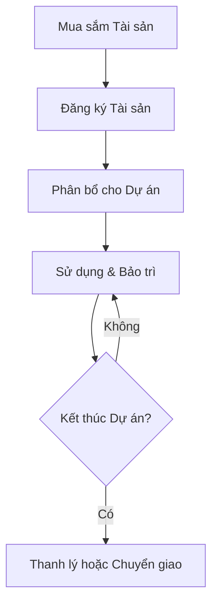

# Module: Assets

## Mục tiêu

Quản lý và theo dõi tài sản (assets) của công ty trong bối cảnh CCBA, bao gồm thiết bị,
máy móc, và tài sản cố định liên quan đến các dự án xây dựng.

## Phạm vi

Quản lý vòng đời tài sản từ mua sắm, phân bổ cho dự án, bảo trì, đến thanh lý.

## User stories

-  Là một Asset Manager, tôi muốn theo dõi vị trí và trạng thái của tất cả tài sản.
-  Là một Project Manager, tôi muốn phân bổ tài sản cho các dự án cụ thể.
-  Là một Accountant, tôi muốn tính toán khấu hao và giá trị tài sản cho báo cáo tài chính.

## Acceptance criteria

-  [ ] Hệ thống cho phép đăng ký và cập nhật thông tin tài sản.
-  [ ] Phân bổ tài sản cho dự án được theo dõi và báo cáo.
-  [ ] Bảo trì định kỳ được lên lịch và ghi nhận.
-  [ ] Báo cáo khấu hao và giá trị tài sản được tạo tự động.

## Quy trình & BPMN

## Ràng buộc & chỉ dẫn đặc thù

*(Ghi rõ các quy tắc nghiệp vụ riêng, trigger, phân quyền, tích hợp đặc biệt của module này.
Nếu chưa có, để trống và bổ sung khi phát sinh.)*
