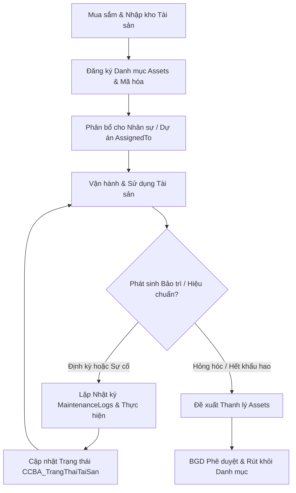

# Module: People & Assets - Assets (Quản lý Tài sản, Thiết bị BIM & Nhật ký Bảo trì)

## 1. Mục tiêu & Phạm vi (Goal & Scope)
- **Mục tiêu**: Quản lý toàn bộ vòng đời tài sản cố định, máy móc, trang thiết bị chuyên ngành (thiết bị kiểm định, máy đo đạc, trạm máy quét 3D, máy tính cấu hình cao cho BIM) và bản quyền phần mềm kỹ thuật của CCBA. Đảm bảo theo dõi vị trí, phân bổ cho dự án/nhân sự, theo dõi khấu hao và lập lịch bảo trì/hiệu chuẩn định kỳ nhằm duy trì năng lực kỹ thuật của Trung tâm.
- **Phạm vi**:
  - Đăng ký và phân loại danh mục tài sản, máy móc kỹ thuật (`Assets`).
  - Quản lý phân bổ tài sản cho nhân sự (`AssignedTo`) hoặc bàn giao cho các Dự án/công trường.
  - Quản lý lịch sử bảo trì, sửa chữa, hiệu chuẩn thiết bị kiểm định (`MaintenanceLogs`).
  - Theo dõi trạng thái tài sản qua Taxonomy chuẩn (`CCBA_TrangThaiTaiSan`).
  - Kiểm kê định kỳ, tính khấu hao tài sản phối hợp với phòng KHTC và đề xuất thanh lý.

## 2. User Stories & Ma trận Vai trò (Role Matrix)

### 2.1. User Stories theo 5 Phòng Ban & 3 Chức danh CCBA
- **Tổ chức - Hành chính (TCHC)**:
  - Là Chuyên viên Quản lý Tài sản, tôi muốn đăng ký mới, gán mã tài sản, bàn giao thiết bị cho nhân sự để quản lý hiện vật toàn Trung tâm.
  - Là Trưởng phòng TCHC, tôi muốn theo dõi tổng quan tài sản, phê duyệt đề xuất điều chuyển hoặc bàn giao máy móc giữa các bộ phận.
- **Kế hoạch - Tài chính (KHTC)**:
  - Là Kế toán Tài sản, tôi muốn ghi nhận giá trị tài sản, theo dõi khấu hao hàng tháng và chi phí bảo trì để phản ánh chính xác vào sổ sách kế toán.
- **Kỹ thuật - Đào tạo (KTDT)**:
  - Là Chuyên viên Thiết bị Kỹ thuật, tôi muốn kiểm tra thông số kỹ thuật máy kiểm định, theo dõi hạn hiệu chuẩn/bảo dưỡng các thiết bị đo đạc và phần mềm BIM.
- **Phòng Chuyên môn / Tư vấn**:
  - Là Kỹ sư công trường / Trưởng nhóm BIM, tôi muốn nhận bàn giao thiết bị chuyên dùng và gửi yêu cầu bảo trì/sửa chữa khi thiết bị gặp sự cố.
- **Ban Giám đốc (BGD)**:
  - Là Giám đốc Trung tâm, tôi muốn xem báo cáo tổng quan tài sản, phê duyệt kế hoạch mua sắm thiết bị công nghệ cao và quyết định thanh lý tài sản.
- **Chủ nhiệm Dự án (PM)**:
  - Là PM, tôi muốn đề xuất mượn/phân bổ trạm làm việc BIM và máy đo đạc kiểm định cho dự án mình phụ trách, quản lý tài sản tại công trường.
- **Trưởng phòng Chuyên môn**:
  - Là Trưởng phòng Chuyên môn, tôi muốn duyệt đề xuất trang bị máy móc cho nhân viên phòng và xác nhận lịch bảo dưỡng thiết bị kỹ thuật của phòng.
- **Giám đốc / BGD**:
  - Là Giám đốc, tôi muốn ký duyệt các tờ trình mua sắm máy móc thiết bị có giá trị lớn và quyết định thanh lý tài sản hỏng hóc.

### 2.2. Ma trận Phân quyền & Vai trò (Role Matrix)
| Chức danh / Phòng ban | Assets (Create/Update) | Assets (Read) | MaintenanceLogs (Create) | MaintenanceLogs (Read) | Approval / Liquidation |
| --- | --- | --- | --- | --- | --- |
| **Tổ chức - Hành chính** | Create / Update | Read All | Create / Update | Read All | Review |
| **Kế hoạch - Tài chính** | Read Only | Read All | Read Only | Read All | Financial Review |
| **Kỹ thuật - Đào tạo** | Update (Technical) | Read All | Create / Update | Read All | Technical Audit |
| **Phòng Chuyên môn** | Read (Assigned) | Read (Assigned) | Create (Request) | Read (Dept) | N/A |
| **Ban Giám đốc** | Read All | Read All | Read All | Read All | Full Approve |
| **Chủ nhiệm Dự án (PM)** | Request Assignment | Read (Project) | Create (Request) | Read (Project) | N/A |
| **Trưởng phòng Chuyên môn**| Request Assignment | Read (Dept) | Create / Review | Read (Dept) | N/A |

## 3. Cơ sở Pháp lý & Quy chế Áp dụng
- **QCTK 2815/QĐ-VKH (Quy chế Triển khai)**:
  - *Điều 4 (Quản lý thiết bị & Cơ sở vật chất)*: Quy định các thiết bị đo đạc, kiểm định, máy tính công nghệ cao thuộc tài sản quản lý tập trung của Trung tâm.
  - *Điều 8 (Quản lý thực hiện Hợp đồng)*: Bắt buộc trang bị thiết bị đạt chuẩn kiểm định và phần mềm bản quyền phục vụ công tác giám sát, thẩm tra, tư vấn BIM.
- **QCCTNB 3209/QĐ-VKH (Quy chế Chi tiêu Nội bộ)**:
  - *Điều 15 & Phụ lục Chi phí Bảo dưỡng*: Quy định hạn mức chi phí sửa chữa, bảo trì máy móc, định mức trang bị máy tính làm việc và chi phí kiểm định định kỳ.
- **Quy chế CCBA 2026**:
  - *Điều 18 (Quản lý Tài sản số & Trang thiết bị)*: Quy định quy trình bàn giao, bảo quản tài sản công, đăng ký thiết bị BIM và nhật ký bảo trì số trên IDOP.

## 4. Quy trình Nghiệp vụ Chi tiết (Operational Flow & BPMN)

### 4.1. Sơ đồ Quy trình Quản lý & Bảo trì Tài sản (Mermaid BPMN)

### 4.2. Diễn giải Quy trình Nghiệp vụ & Tích hợp Cơ chế Tài chính
1. **Bước 1: Tiếp nhận & Đăng ký**: TCHC tiếp nhận tài sản mới, ghi nhận thông tin vào `Assets` bao gồm tên, mã tài sản, ngày mua (`PurchaseDate`) và gán trạng thái ban đầu (`CCBA_TrangThaiTaiSan`).
2. **Bước 2: Phân bổ & Bàn giao**: Tài sản được gán cho nhân sự (`AssignedTo`) hoặc giao PM quản lý tại dự án. KHTC cập nhật giá trị tài sản và khấu hao.
3. **Bước 3: Bảo trì & Hiệu chuẩn**: Định kỳ hoặc khi hư hỏng, KTDT/TCHC lập bản ghi trong `MaintenanceLogs` ghi nhận ngày bảo trì (`MaintenanceDate`), nội dung công việc (`Description`) và người thực hiện (`PerformedBy`).
4. **Bước 4: Cập nhật Trạng thái & Quyết toán**: Sau bảo trì, tài sản được cập nhật trạng thái trong Taxonomy (`Đang sử dụng`, `Đang sửa chữa`, `Đã thanh lý`). Chi phí bảo trì được KHTC hạch toán vào Hợp đồng/Dự án tương ứng.

## 5. Acceptance Criteria & List Mapping (Mapping 1-1 Schema JSON)

### 5.1. Tiêu chí Chấp nhận (Acceptance Criteria)
- [ ] 100% tài sản cố định và thiết bị kỹ thuật được đăng ký mã duy nhất trong `Assets` và phân loại đúng Taxonomy `CCBA_TrangThaiTaiSan`.
- [ ] Mọi hoạt động bảo trì, kiểm định, hiệu chuẩn phải có ghi vết trong `MaintenanceLogs` liên kết chính xác với `AssetId`.
- [ ] Hệ thống hỗ trợ tra cứu lịch sử bàn giao (`AssignedTo`) và lịch sử bảo trì của từng thiết bị.
- [ ] Phân quyền truy cập đảm bảo chỉ TCHC, KTDT và Admin mới có quyền cập nhật danh mục tài sản và nhật ký bảo trì.

### 5.2. Bảng Mapping 1-to-1 Chi tiết với SharePoint List JSON

#### 1. Danh sách `Assets` (`lists/people_assets/assets.json`)
| Internal Field Name | Display Name | Field Type | Required | Lookup / Taxonomy Mapping | Business Rules & Validation |
| --- | --- | --- | --- | --- | --- |
| `AssetName` | Tên tài sản | Text | Yes | N/A | Tên đầy đủ của tài sản / thiết bị |
| `AssetCode` | Mã tài sản | Text | No | N/A | Mã quản lý duy nhất (VD: TS-BIM-2026-01) |
| `AssignedTo` | Nhân sự tiếp nhận | Lookup | No | List: `Employees`, Field: `ID`, Behavior: `restrict` | Nhân viên hoặc cán bộ chịu trách nhiệm sử dụng |
| `PurchaseDate` | Ngày mua | DateTime | No | N/A | Ngày mua sắm / đưa vào sử dụng |
| `OriginalValue` | Nguyên giá | Number | No | N/A | Nguyên giá tài sản theo sổ sách kế toán (VNĐ) |
| `DepreciationRate` | Tỷ lệ khấu hao | Number | No | N/A | Tỷ lệ trích khấu hao hàng năm (%) |
| `AccumulatedDepreciation` | Khấu hao lũy kế | Number | No | N/A | Giá trị trích khấu hao lũy kế đến hiện tại (VNĐ) |
| `SerialNumber` | Số sê-ri | Text | No | N/A | Số sê-ri thiết bị / phần cứng kỹ thuật |
| `Location` | Vị trí lưu giữ | Text | No | N/A | Vị trí đặt thiết bị hoặc phòng ban quản lý |
| `Status` | Trạng thái tài sản | ManagedMetadata | No | Group: `CCBA Taxonomy`, TermSet: `CCBA_TrangThaiTaiSan` | Phân loại trạng thái (Sẵn sàng, Đang sử dụng, Bảo trì, Thanh lý) |

#### 2. Danh sách `MaintenanceLogs` (`lists/people_assets/maintenance_logs.json`)
| Internal Field Name | Display Name | Field Type | Required | Lookup / Taxonomy Mapping | Business Rules & Validation |
| --- | --- | --- | --- | --- | --- |
| `AssetId` | Tài sản | Lookup | No | List: `Assets`, Field: `ID`, Behavior: `restrict` | Tài sản được bảo trì / sửa chữa |
| `MaintenanceDate` | Ngày bảo trì | DateTime | No | N/A | Ngày thực hiện bảo trì / hiệu chuẩn |
| `Description` | Nội dung bảo trì | Text | No | N/A | Chi tiết công việc bảo dưỡng / thay thế linh kiện |
| `PerformedBy` | Người thực hiện | User | No | N/A | Cán bộ kỹ thuật hoặc đơn vị bảo trì thực hiện |

## 6. Bảo mật, Phân quyền & Audit Trail
### 6.1. Nguyên tắc Phân quyền & Truy cập
- **TCHC & KTDT**: Được cấp quyền Edit/Update trên `Assets` và `MaintenanceLogs`.
- **KHTC**: Quyền Read All để trích xuất số liệu khấu hao và hạch toán chi phí bảo dưỡng.
- **Nhân viên / Kỹ sư**: Quyền Read các tài sản được giao trực tiếp cho cá nhân.

### 6.2. Cấu trúc Audit Trail & Lưu vết Kiểm toán Nội bộ
- Mọi sự thay đổi về người sử dụng (`AssignedTo`), trạng thái tài sản (`Status`) và lịch sử bảo trì đều được lưu vết đầy đủ với thời gian (`Created`, `Modified`) và người thực hiện (`CreatedBy`, `ModifiedBy`).
- Báo cáo kiểm kê tài sản hàng năm được đối chiếu trực tiếp giữa danh mục `Assets` trên IDOP và thực tế kiểm kê tại công trường.
