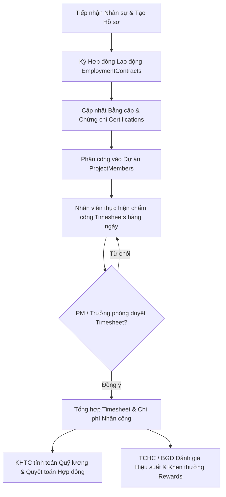

# Module: People & Assets - HR (Quản lý Nhân sự & Bảng chấm công)

## 1. Mục tiêu & Phạm vi (Goal & Scope)
- **Mục tiêu**: Quản lý toàn diện vòng đời nhân sự CCBA, từ tiếp nhận, ký hợp đồng lao động, phân công dự án, chấm công theo thời gian thực (Timesheets), quản lý lịch sử công tác, chứng chỉ hành nghề, gói phúc lợi đến khen thưởng/kỷ luật. Hệ thống đảm bảo tối ưu hóa sử dụng nguồn lực và cung cấp dữ liệu nhân công chính xác cho việc tính toán chi phí Hợp đồng và trích lập Quỹ lương/Quỹ thưởng.
- **Phạm vi**: 
  - Quản lý cơ cấu tổ chức phòng ban và danh mục hồ sơ nhân viên.
  - Quản lý hợp đồng lao động, loại hình hợp đồng, quá trình công tác và lịch sử điều chuyển.
  - Theo dõi và xác thực chứng chỉ hành nghề, bằng cấp chuyên môn, định kỳ gia hạn.
  - Quản lý phân công thành viên vào từng dự án/hợp đồng kỹ thuật (`ProjectMembers`).
  - Ghi nhận và phê duyệt bảng chấm công hàng ngày/hàng tuần (`Timesheets`) liên kết trực tiếp với các Dự án/Work Packages.
  - Quản lý gói phúc lợi nhân viên (`BenefitPackages`, `EmployeeBenefits`) và danh mục khen thưởng (`Rewards`).

## 2. User Stories & Ma trận Vai trò (Role Matrix)

### 2.1. User Stories theo 5 Phòng Ban & 3 Chức danh CCBA
- **Tổ chức - Hành chính (TCHC)**:
  - Là Chuyên viên TCHC, tôi muốn tạo mới, cập nhật hồ sơ nhân sự, lưu trữ hợp đồng lao động và theo dõi chứng chỉ chuyên môn để đảm bảo tuân thủ định biên nhân sự.
  - Là Trưởng phòng TCHC, tôi muốn theo dõi biến động nhân sự, duyệt đăng ký phúc lợi và khen thưởng toàn Trung tâm.
- **Kế hoạch - Tài chính (KHTC)**:
  - Là Chuyên viên KHTC, tôi muốn trích xuất dữ liệu chấm công (`Timesheets`) đã duyệt để tính toán chi phí nhân công thực tế theo từng Hợp đồng và quyết toán tài chính.
- **Kỹ thuật - Đào tạo (KTDT)**:
  - Là Chuyên viên KTDT, tôi muốn kiểm tra và thẩm định chứng chỉ hành nghề (BIM, Giám sát, Thẩm tra) của nhân viên trước khi đăng ký phân công dự án.
- **Phòng Chuyên môn / Tư vấn**:
  - Là Nhân viên/Kỹ sư, tôi muốn thực hiện chấm công hàng ngày cho các dự án/công việc được giao và xem thông tin hợp đồng, phúc lợi cá nhân.
- **Ban Giám đốc (BGD)**:
  - Là Giám đốc Trung tâm, tôi muốn xem báo cáo phân bổ nguồn lực, duyệt kế hoạch tuyển dụng, khen thưởng và phê duyệt hợp đồng lao động cấp quản lý.
- **Chủ nhiệm Dự án (PM)**:
  - Là PM, tôi muốn xem danh sách nhân sự thuộc dự án, thực hiện phê duyệt bảng chấm công (`Timesheets`) của các thành viên trong dự án mình quản lý.
- **Trưởng phòng Chuyên môn**:
  - Là Trưởng phòng Chuyên môn, tôi muốn phân công nhân viên vào dự án (`ProjectMembers`), đánh giá quá trình làm việc và duyệt chấm công cấp phòng.
- **Giám đốc / BGD**:
  - Là Giám đốc, tôi muốn ký duyệt quyết định tuyển dụng, nâng lương, khen thưởng và khung chế độ phúc lợi chung.

### 2.2. Ma trận Phân quyền & Vai trò (Role Matrix)
| Chức danh / Phòng ban | Employees | Departments | EmploymentContracts | Timesheets | ProjectMembers | Certifications & Rewards |
| --- | --- | --- | --- | --- | --- | --- |
| **Tổ chức - Hành chính** | Create / Read / Update | Read / Update | Create / Read / Update | Read | Read | Create / Read / Update |
| **Kế hoạch - Tài chính** | Read | Read | Read | Read (Approve Payroll) | Read | Read |
| **Kỹ thuật - Đào tạo** | Read | Read | Read | Read | Read | Verify / Update |
| **Phòng Chuyên môn** | Read (Self/Dept) | Read | Read (Self) | Create / Update (Self) | Read | Read (Self) |
| **Ban Giám đốc** | Read / Approve | Read / Approve | Read / Approve | Read / Overview | Read / Overview | Read / Approve |
| **Chủ nhiệm Dự án (PM)** | Read (Team) | Read | Read | Read / Approve (Project) | Read / Request | Read (Team) |
| **Trưởng phòng Chuyên môn**| Read (Dept) | Read | Read (Dept) | Read / Approve (Dept) | Create / Update (Dept) | Read (Dept) |

## 3. Cơ sở Pháp lý & Quy chế Áp dụng
- **QCTK 2815/QĐ-VKH (Quy chế Triển khai)**:
  - *Điều 4 (Nguyên tắc thực hiện & Quản lý tập trung)*: Quy định nhân sự thực hiện hợp đồng thuộc quản lý tập trung của Trung tâm, không giao khoán trắng cho cá nhân.
  - *Điều 7 (Giao việc & Phân công nhiệm vụ)*: Căn cứ quyết định giao việc, PM và Trưởng phòng phân công nhân sự chính thức qua `ProjectMembers`.
  - *Điều 14 (Thưởng và Xử lý vi phạm)*: Quy định kỷ luật, hạ bậc thi đua nhân sự vi phạm tiến độ hoặc quy trình làm việc.
- **QCCTNB 3209/QĐ-VKH (Quy chế Chi tiêu Nội bộ)**:
  - *Điều 8 & Điều 12*: Định mức chi trả tiền lương, công tác phí, thù lao nhân công và cơ chế trích lập chi phí nhân sự từ Hợp đồng dịch vụ kỹ thuật.
- **Quy chế CCBA 2026**:
  - *Điều 2 (Cơ cấu tổ chức)*: Quy định chức năng, nhiệm vụ của 5 phòng ban và ma trận phối hợp nhân sự.
  - *Điều 10 (Chức danh Chủ nhiệm Dự án)*: Trao quyền cho PM điều phối nhân sự, kiểm duyệt timesheet và đề xuất khen thưởng/kỷ luật thành viên dự án.
  - *Phụ lục Thu nhập & Phúc lợi*: Định mức phúc lợi (`BenefitPackages`) và quy chế khen thưởng (`Rewards`).

## 4. Quy trình Nghiệp vụ Chi tiết (Operational Flow & BPMN)

### 4.1. Sơ đồ Quy trình Chấm công & Quản lý Nhân sự (Mermaid BPMN)

### 4.2. Diễn giải Quy trình Nghiệp vụ & Tích hợp Cơ chế Tài chính
1. **Bước 1: Tuyển dụng & Hồ sơ**: Phòng TCHC nhập thông tin nhân viên vào `Employees` và cơ cấu phòng ban `Departments`.
2. **Bước 2: Hợp đồng & Chứng chỉ**: TCHC lập `EmploymentContracts` và KTDT xác minh thông tin chứng chỉ hành nghề trong `Certifications`.
3. **Bước 3: Phân công Dự án**: Trưởng phòng chuyên môn và PM thêm nhân sự vào dự án qua `ProjectMembers` ứng với vai trò (Architect, BIM Specialist, QA/QC Inspector).
4. **Bước 4: Chấm công & Phê duyệt**:
   - Nhân viên nhập số giờ làm việc (`HoursWorked`), dự án (`ProjectId`) và ghi chú công việc (`Notes`) vào `Timesheets`.
   - PM duyệt số giờ làm việc theo dự án; Trưởng phòng duyệt tổng thể.
5. **Bước 5: Tích hợp Tài chính**: Dữ liệu `Timesheets` được chuyển sang module Cash & Data để KHTC tính chi phí nhân công thực tế vào Hợp đồng theo định mức QCCTNB 3209.

## 5. Acceptance Criteria & List Mapping (Mapping 1-1 Schema JSON)

### 5.1. Tiêu chí Chấp nhận (Acceptance Criteria)
- [ ] 100% hồ sơ nhân viên được lưu trữ đầy đủ các trường bắt buộc, có liên kết chính xác với `Departments` và Taxonomy trạng thái nhân sự.
- [ ] Chấm công (`Timesheets`) phải được liên kết đúng `ProjectId` và `EmployeeId`, hỗ trợ PM duyệt theo từng dự án.
- [ ] Hợp đồng lao động (`EmploymentContracts`) không được trùng lặp mã hợp đồng và có cảnh báo khi sắp hết hạn.
- [ ] Phân công dự án (`ProjectMembers`) phải ghi nhận đầy đủ vai trò của nhân sự trong dự án.
- [ ] Hệ thống tự động lưu lịch sử công tác (`EmployeeHistory`) khi có sự thay đổi về phòng ban hoặc trạng thái nhân sự.

### 5.2. Bảng Mapping 1-to-1 Chi tiết với SharePoint List JSON

#### 1. Danh sách `Employees` (`lists/people_assets/employees.json`)
| Internal Field Name | Display Name | Field Type | Required | Lookup / Taxonomy Mapping | Business Rules & Validation |
| --- | --- | --- | --- | --- | --- |
| `FullName` | Họ và tên | Text | Yes | N/A | Họ tên đầy đủ của nhân sự |
| `EmployeeCode` | Mã nhân viên | Text | No | N/A | Mã định danh duy nhất (VD: NV-2026-001) |
| `DepartmentId` | Phòng ban | Lookup | No | List: `Departments`, Field: `ID`, Behavior: `restrict` | Ràng buộc phòng ban trực thuộc |
| `Position` | Chức danh / Vị trí | Text | No | N/A | Vị trí công tác (Kỹ sư, Trưởng phòng, Chuyên viên) |
| `HireDate` | Ngày vào làm | DateTime | No | N/A | Ngày bắt đầu làm việc tại CCBA |
| `Status` | Trạng thái nhân sự | ManagedMetadata | No | Group: `CCBA Taxonomy`, TermSet: `CCBA_TrangThaiNhanSu` | Phân loại trạng thái (Thử việc, Chính thức, Nghỉ việc) |

#### 2. Danh sách `Departments` (`lists/people_assets/departments.json`)
| Internal Field Name | Display Name | Field Type | Required | Lookup / Taxonomy Mapping | Business Rules & Validation |
| --- | --- | --- | --- | --- | --- |
| `DepartmentName` | Tên phòng ban | Text | Yes | N/A | Tên phòng ban chuyên môn / hành chính |
| `DepartmentCode` | Mã phòng ban | Text | No | N/A | Mã phòng ban duy nhất (VD: TCHC, KHTC, KTDT) |
| `ParentDepartmentId` | Phòng ban cấp cha | Lookup | No | List: `Departments`, Field: `ID`, Behavior: `restrict` | Phòng ban / đơn vị cấp trên trực tiếp |
| `Manager` | Trưởng phòng | User | No | N/A | Tài khoản Trưởng phòng phụ trách |

#### 3. Danh sách `EmploymentContracts` (`lists/people_assets/employment_contracts.json`)
| Internal Field Name | Display Name | Field Type | Required | Lookup / Taxonomy Mapping | Business Rules & Validation |
| --- | --- | --- | --- | --- | --- |
| `EmployeeId` | Nhân viên | Lookup | No | List: `Employees`, Field: `ID`, Behavior: `restrict` | Nhân viên ký hợp đồng |
| `ContractNumber` | Số hợp đồng | Text | Yes | N/A | Số hợp đồng lao động |
| `StartDate` | Ngày hiệu lực | DateTime | No | N/A | Ngày bắt đầu hợp đồng |
| `EndDate` | Ngày hết hạn | DateTime | No | N/A | Ngày kết thúc hợp đồng |
| `ContractType` | Loại hợp đồng | Choice | No | Choices: `Full-time`, `Part-time`, `Internship`, `Freelance` | Loại hình hợp đồng lao động |

#### 4. Danh sách `Timesheets` (`lists/people_assets/timesheets.json`)
| Internal Field Name | Display Name | Field Type | Required | Lookup / Taxonomy Mapping | Business Rules & Validation |
| --- | --- | --- | --- | --- | --- |
| `EmployeeId` | Nhân viên | Lookup | No | List: `Employees`, Field: `ID`, Behavior: `restrict` | Nhân viên chấm công |
| `ProjectId` | Dự án | Lookup | No | List: `Projects`, Field: `ID`, Behavior: `restrict` | Dự án được phân công chấm công |
| `Date` | Ngày chấm công | DateTime | No | N/A | Ngày ghi nhận công việc |
| `HoursWorked` | Số giờ làm việc | Number | No | N/A | Số giờ đóng góp cho dự án (0.5 - 24) |
| `Notes` | Ghi chú công việc | Text | No | N/A | Chi tiết nội dung công việc đã thực hiện |

#### 5. Danh sách `ProjectMembers` (`lists/people_assets/project_members.json`)
| Internal Field Name | Display Name | Field Type | Required | Lookup / Taxonomy Mapping | Business Rules & Validation |
| --- | --- | --- | --- | --- | --- |
| `ProjectId` | Dự án | Lookup | No | List: `Projects`, Field: `ID`, Behavior: `restrict` | Dự án tham gia |
| `EmployeeId` | Nhân viên | Lookup | No | List: `Employees`, Field: `ID`, Behavior: `restrict` | Thành viên dự án |
| `Role` | Vai trò trong dự án | Text | No | N/A | Vai trò (Chủ nhiệm, Kỹ sư chính, Chuyên viên BIM) |

#### 6. Danh sách `EmployeeHistory` (`lists/people_assets/employee_history.json`)
| Internal Field Name | Display Name | Field Type | Required | Lookup / Taxonomy Mapping | Business Rules & Validation |
| --- | --- | --- | --- | --- | --- |
| `EmployeeId` | Nhân viên | Lookup | No | List: `Employees`, Field: `ID`, Behavior: `restrict` | Nhân viên liên quan |
| `StartDate` | Ngày bắt đầu | DateTime | No | N/A | Ngày bắt đầu giai đoạn công tác |
| `EndDate` | Ngày kết thúc | DateTime | No | N/A | Ngày kết thúc giai đoạn |
| `IsCurrent` | Đang công tác | YesNo | No | N/A | Đánh dấu giai đoạn hiện tại |

#### 7. Danh sách `Certifications` (`lists/people_assets/certifications.json`)
| Internal Field Name | Display Name | Field Type | Required | Lookup / Taxonomy Mapping | Business Rules & Validation |
| --- | --- | --- | --- | --- | --- |
| `EmployeeId` | Nhân viên | Lookup | No | List: `Employees`, Field: `ID`, Behavior: `restrict` | Nhân viên sở hữu chứng chỉ |
| `CertificationName` | Tên chứng chỉ | Text | Yes | N/A | Tên chứng chỉ chuyên môn / hành nghề |
| `IssuedBy` | Đơn vị cấp | Text | No | N/A | Cơ quan/tổ chức cấp chứng chỉ |
| `IssueDate` | Ngày cấp | DateTime | No | N/A | Ngày hiệu lực chứng chỉ |
| `ExpiryDate` | Ngày hết hạn | DateTime | No | N/A | Ngày hết hạn chứng chỉ |

#### 8. Danh sách `BenefitPackages` (`lists/people_assets/benefit_packages.json`)
| Internal Field Name | Display Name | Field Type | Required | Lookup / Taxonomy Mapping | Business Rules & Validation |
| --- | --- | --- | --- | --- | --- |
| `PackageName` | Tên gói phúc lợi | Text | Yes | N/A | Tên chương trình phúc lợi |
| `Description` | Mô tả gói | Text | No | N/A | Chi tiết quyền lợi của gói |

#### 9. Danh sách `EmployeeBenefits` (`lists/people_assets/employee_benefits.json`)
| Internal Field Name | Display Name | Field Type | Required | Lookup / Taxonomy Mapping | Business Rules & Validation |
| --- | --- | --- | --- | --- | --- |
| `EmployeeId` | Nhân viên | Lookup | No | List: `Employees`, Field: `ID`, Behavior: `restrict` | Nhân viên hưởng phúc lợi |
| `BenefitPackageId` | Gói phúc lợi | Lookup | No | List: `BenefitPackages`, Field: `ID`, Behavior: `restrict` | Gói phúc lợi áp dụng |
| `StartDate` | Ngày bắt đầu | DateTime | No | N/A | Ngày áp dụng phúc lợi |
| `EndDate` | Ngày kết thúc | DateTime | No | N/A | Ngày kết thúc phúc lợi |

#### 10. Danh sách `Rewards` (`lists/people_assets/rewards.json`)
| Internal Field Name | Display Name | Field Type | Required | Lookup / Taxonomy Mapping | Business Rules & Validation |
| --- | --- | --- | --- | --- | --- |
| `EmployeeId` | Nhân viên | Lookup | No | List: `Employees`, Field: `ID`, Behavior: `restrict` | Nhân viên được khen thưởng |
| `RewardTitle` | Danh hiệu / Tiêu đề | Text | Yes | N/A | Tên quyết định/danh hiệu khen thưởng |
| `RewardDate` | Ngày khen thưởng | DateTime | No | N/A | Ngày ban hành quyết định khen thưởng |
| `Description` | Chi tiết thành tích | Text | No | N/A | Nội dung mô tả thành tích đóng góp |

## 6. Bảo mật, Phân quyền & Audit Trail
### 6.1. Nguyên tắc Phân quyền & Truy cập
- **TCHC & BGD**: Có quyền Full Control / Edit trên tất cả danh sách HR.
- **PM & Trưởng phòng**: Có quyền Read/Approve trên `Timesheets` và `ProjectMembers` thuộc phạm vi quản lý.
- **KHTC**: Có quyền Read toàn bộ dữ liệu nhân sự và chấm công để kiểm soát chi phí.
- **Nhân viên**: Chỉ có quyền Read hồ sơ cá nhân và Create/Update chấm công (`Timesheets`) của bản thân.

### 6.2. Cấu trúc Audit Trail & Lưu vết Kiểm toán Nội bộ
- Mọi thao tác thêm/sửa/xóa hồ sơ nhân sự, hợp đồng và chấm công đều ghi vết tự động thông qua các trường hệ thống SharePoint (`Created`, `CreatedBy`, `Modified`, `ModifiedBy`).
- Bảng chấm công sau khi đã được PM/Trưởng phòng phê duyệt sẽ bị khóa chỉnh sửa (Read-Only) để đảm bảo tính chính xác cho dữ liệu kiểm toán tài chính.
