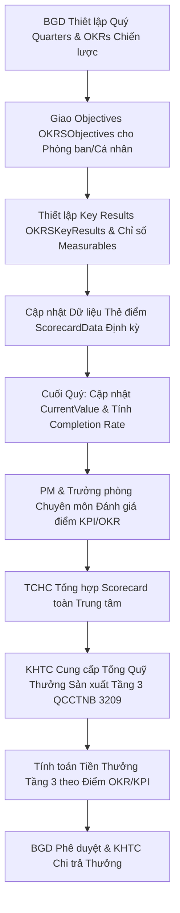

# Module: Performance & OKRs - Performance (Đánh giá Hiệu suất OKR/KPI & Quỹ thưởng Tầng 3)

## 1. Mục tiêu & Phạm vi (Goal & Scope)
- **Mục tiêu**: Quản lý và theo dõi mục tiêu chiến lược (Objectives) và kết quả then chốt (Key Results) cấp Trung tâm, Phòng ban và Cá nhân theo từng Quý (`Quarters`). Kết nối trực tiếp kết quả đánh giá OKRs/Scorecard với cơ chế phân phối Quỹ thưởng sản xuất Tầng 3 (Tier 3 Production Bonus Fund) theo Quy chế Chi tiêu Nội bộ QCCTNB 3209 và Quy chế CCBA 2026.
- **Phạm vi**:
  - Thiêt lập danh mục Quý (`Quarters`) và bộ chỉ số đo lường hiệu suất (`Measurables`).
  - Quản lý mục tiêu OKR (`OKRSObjectives`) và kết quả then chốt (`OKRSKeyResults`).
  - Ghi nhận dữ liệu thẻ điểm Scorecard định kỳ (`ScorecardData`) theo tuần, tháng, quý.
  - Tính toán tỷ lệ hoàn thành OKR (Completion Rate %) và điểm KPI tổng hợp.
  - Phụ thuộc dữ liệu để trích lập và phân phối Quỹ thưởng sản xuất Tầng 3 cho nhân sự và phòng ban.

## 2. User Stories & Ma trận Vai trò (Role Matrix)

### 2.1. User Stories theo 5 Phòng Ban & 3 Chức danh CCBA
- **Tổ chức - Hành chính (TCHC)**:
  - Là Chuyên viên TCHC, tôi muốn tổng hợp điểm OKR/KPI của toàn bộ nhân viên hàng quý để lập danh sách xếp loại thi đua.
  - Là Trưởng phòng TCHC, tôi muốn xem ma trận hiệu suất toàn Trung tâm và đề xuất mức khen thưởng/kỷ luật dựa trên kết quả đánh giá.
- **Kế hoạch - Tài chính (KHTC)**:
  - Là Kế toán Tài chính, tôi muốn căn cứ vào điểm đánh giá KPI/OKR và tổng giá trị Quỹ thưởng sản xuất Tầng 3 được duyệt để tính số tiền thưởng thực nhận cho từng phòng ban và cá nhân.
- **Kỹ thuật - Đào tạo (KTDT)**:
  - Là Chuyên viên KTDT, tôi muốn theo dõi các chỉ số đo lường kỹ thuật (`Measurables`) liên quan đến tỷ lệ đạt QA/QC, việc tuân thủ quy chuẩn BIM và ISO.
- **Phòng Chuyên môn / Tư vấn**:
  - Là Kỹ sư / Chuyên viên, tôi muốn cập nhật tiến độ thực hiện Key Results (`CurrentValue`) và xem thẻ điểm Scorecard cá nhân hàng tuần/tháng.
- **Ban Giám đốc (BGD)**:
  - Là Giám đốc Trung tâm, tôi muốn phê duyệt OKRs chiến lược cấp Trung tâm đầu mỗi quý và phê duyệt bảng chia Quỹ thưởng sản xuất Tầng 3 cuối quý.
- **Chủ nhiệm Dự án (PM)**:
  - Là PM, tôi muốn đánh giá mức độ hoàn thành KPI đóng góp dự án của các thành viên để cung cấp dữ liệu cho Trưởng phòng chuyên môn xếp loại.
- **Trưởng phòng Chuyên môn**:
  - Là Trưởng phòng Chuyên môn, tôi muốn giao OKRs cho nhân viên trong phòng (`Owner`), duyệt điểm đánh giá OKR/KPI cuối quý của phòng.
- **Giám đốc / BGD**:
  - Là Giám đốc, tôi muốn chốt điểm đánh giá OKR/KPI và quyết định hệ số thưởng Tầng 3 cho từng đơn vị trực thuộc.

### 2.2. Ma trận Phân quyền & Vai trò (Role Matrix)
| Chức danh / Phòng ban | OKRSObjectives | OKRSKeyResults | Measurables | ScorecardData | Quarters | Bonus Fund Allocation |
| --- | --- | --- | --- | --- | --- | --- |
| **Tổ chức - Hành chính** | Read All | Read All | Read / Manage | Read All | Manage | Review / Synthesize |
| **Kế hoạch - Tài chính** | Read All | Read All | Read All | Read All | Read | Calculate & Execute |
| **Kỹ thuật - Đào tạo** | Read All | Read All | Create / Update | Read / Update | Read | Review Technical KPIs |
| **Phòng Chuyên môn** | Create/Update (Dept)| Update (Current) | Read | Create / Update (Self) | Read | Read Self |
| **Ban Giám đốc** | Approve All | Approve All | Read / Approve | Read All | Manage | Final Approve |
| **Chủ nhiệm Dự án (PM)** | Read | Read / Evaluate | Read | Read / Evaluate Team | Read | Input Performance |
| **Trưởng phòng Chuyên môn**| Create/Update (Dept)| Create/Update (Dept)| Read | Review / Approve Dept | Read | Approve Dept Allocation |

## 3. Cơ sở Pháp lý & Quy chế Áp dụng
- **QCTK 2815/QĐ-VKH (Quy chế Triển khai)**:
  - *Điều 13 (Thưởng)*: Quy định việc trích thưởng cho các tập thể, cá nhân hoàn thành xuất sắc nhiệm vụ và vượt tiến độ hợp đồng.
  - *Điều 14 (Phạt & Hạ bậc thi đua)*: Quy định xử lý hạ bậc thi đua, giảm điểm KPI khi để xảy ra sai sót kỹ thuật hoặc chậm trễ tiến độ.
- **QCCTNB 3209/QĐ-VKH (Quy chế Chi tiêu Nội bộ)**:
  - *Điều 10 & Phụ lục Quỹ Thưởng*: Quy định cơ chế tài chính 3 tầng, trong đó Tầng 3 là **Quỹ thưởng sản xuất** (Production Bonus Fund) được trích lập từ lợi nhuận các Hợp đồng Dịch vụ Kỹ thuật sau khi trừ chi phí quản lý và chi phí trực tiếp.
  - *Cơ chế Phân phối Tầng 3*: Thưởng Tầng 3 được phân phối căn cứ 100% vào hệ số hoàn thành công việc (KPIs/OKRs) hàng quý của nhân sự.
- **Quy chế CCBA 2026**:
  - *Điều 12 (Đánh giá Hiệu suất & Quản trị Theo Mục tiêu)*: Bắt buộc áp dụng phương pháp OKRs kết hợp KPI Scorecard trên nền tảng IDOP.
  - *Phụ lục Tài chính - Điều 8*: Công thức tính thưởng Tầng 3: `Tiền thưởng Cá nhân = (Tổng Quỹ Thưởng Tầng 3 Quý) x (Điểm OKR/KPI cá nhân / Tổng điểm toàn Trung tâm) x Hệ số Chức danh`.

## 4. Quy trình Nghiệp vụ Chi tiết (Operational Flow & BPMN)

### 4.1. Sơ đồ Quy trình Đánh giá OKR & Phân bổ Quỹ Thưởng Tầng 3 (Mermaid BPMN)

### 4.2. Diễn giải Quy trình Nghiệp vụ & Tích hợp Cơ chế Tài chính
1. **Bước 1: Khởi tạo Quý & Mục tiêu**: Đầu quý (`Quarters`), BGD ban hành các mục tiêu chiến lược (`OKRSObjectives`). Các Trưởng phòng cụ thể hóa thành mục tiêu cấp phòng và gán nhân sự chịu trách nhiệm (`Owner`).
2. **Bước 2: Giao Chỉ số & Thẻ điểm**: Đơn vị thiết lập kết quả then chốt (`OKRSKeyResults`) với chỉ tiêu định lượng (`TargetValue`) và liên kết với bộ đo lường `Measurables`.
3. **Bước 3: Cập nhật Tiến độ**: Định kỳ tuần/tháng, nhân sự cập nhật chỉ số thực tế trong `ScorecardData` và điều chỉnh `CurrentValue` của Key Results.
4. **Bước 4: Đánh giá Cuối Quý & Tính Thưởng Tầng 3**:
   - Cuối quý, hệ thống tự động tính tỷ lệ hoàn thành OKR = `(CurrentValue / TargetValue) * 100%`.
   - Trưởng phòng và PM chốt điểm KPI/OKR cho từng cá nhân.
   - KHTC xác định tổng giá trị Quỹ thưởng sản xuất Tầng 3 trích lập từ kết quả kinh doanh quý theo QCCTNB 3209.
   - Hệ thống tự động phân bổ quỹ thưởng Tầng 3 theo công thức quy định và trình BGD phê duyệt.

## 5. Acceptance Criteria & List Mapping (Mapping 1-1 Schema JSON)

### 5.1. Tiêu chí Chấp nhận (Acceptance Criteria)
- [ ] 100% Mục tiêu (`OKRSObjectives`) được gắn đúng Quý (`QuarterId`) và người chịu trách nhiệm (`Owner`).
- [ ] Key Results (`OKRSKeyResults`) ghi nhận đầy đủ giá trị mục tiêu (`TargetValue`) và giá trị thực hiện (`CurrentValue`).
- [ ] Thẻ điểm Scorecard (`ScorecardData`) liên kết chính xác chỉ số `MetricId` và hỗ trợ các chu kỳ Week, Month, Quarter, Year.
- [ ] Kết quả đánh giá OKR/KPI liên thông trực tiếp với thuật toán phân bổ Quỹ thưởng sản xuất Tầng 3 theo QCCTNB 3209.

### 5.2. Bảng Mapping 1-to-1 Chi tiết với SharePoint List JSON

#### 1. Danh sách `OKRSObjectives` (`lists/performance_okrs/okrs_objectives.json`)
| Internal Field Name | Display Name | Field Type | Required | Lookup / Taxonomy Mapping | Business Rules & Validation |
| --- | --- | --- | --- | --- | --- |
| `ObjectiveTitle` | Tiêu đề Mục tiêu | Text | Yes | N/A | Tên mục tiêu OKR |
| `Owner` | Người phụ trách | User | No | N/A | Tài khoản nhân sự phụ trách mục tiêu |
| `QuarterId` | Quý thực hiện | Lookup | No | List: `Quarters`, Field: `ID`, Behavior: `restrict` | Quý áp dụng OKR |
| `ParentObjectiveId` | Mục tiêu cấp cha | Lookup | No | List: `OKRSObjectives`, Field: `ID`, Behavior: `restrict` | Mục tiêu OKR cấp cao hơn liên kết (VD: OKR Cấp Trung tâm) |
| `DepartmentId` | Phòng ban | Lookup | No | List: `Departments`, Field: `ID`, Behavior: `restrict` | Phòng ban chủ trì thực hiện mục tiêu |
| `Description` | Mô tả chi tiết | Text | No | N/A | Chi tiết nội dung và định hướng của mục tiêu |

#### 2. Danh sách `OKRSKeyResults` (`lists/performance_okrs/okrs_key_results.json`)
| Internal Field Name | Display Name | Field Type | Required | Lookup / Taxonomy Mapping | Business Rules & Validation |
| --- | --- | --- | --- | --- | --- |
| `ObjectiveId` | Mục tiêu OKR | Lookup | No | List: `OKRSObjectives`, Field: `ID`, Behavior: `restrict` | Liên kết mục tiêu cha |
| `KeyResultTitle` | Tiêu đề Ket quả | Text | Yes | N/A | Tên kết quả then chốt định lượng |
| `TargetValue` | Chỉ tiêu hướng tới | Number | No | N/A | Giá trị mục tiêu cần đạt |
| `CurrentValue` | Giá trị hiện tại | Number | No | N/A | Giá trị đã đạt được thực tế |

#### 3. Danh sách `Measurables` (`lists/performance_okrs/measurables.json`)
| Internal Field Name | Display Name | Field Type | Required | Lookup / Taxonomy Mapping | Business Rules & Validation |
| --- | --- | --- | --- | --- | --- |
| `MetricName` | Tên chỉ số đo lường | Text | Yes | N/A | Tên thước đo (VD: Doanh thu, Tỷ lệ lỗi BIM, Số hợp đồng) |
| `Unit` | Đơn vị tính | Text | No | N/A | Đơn vị đo (VND, phần trăm, Hợp đồng, Mô hình) |
| `Description` | Mô tả chỉ số | Text | No | N/A | Phương pháp tính toán chỉ số |

#### 4. Danh sách `Quarters` (`lists/performance_okrs/quarters.json`)
| Internal Field Name | Display Name | Field Type | Required | Lookup / Taxonomy Mapping | Business Rules & Validation |
| --- | --- | --- | --- | --- | --- |
| `Year` | Năm | Number | Yes | N/A | Năm đánh giá (VD: 2026) |
| `Quarter` | Quý | Choice | No | Choices: `Q1`, `Q2`, `Q3`, `Q4` | Danh mục 4 quý trong năm |
| `StartDate` | Ngày bắt đầu | DateTime | No | N/A | Ngày đầu tiên của quý |
| `EndDate` | Ngày kết thúc | DateTime | No | N/A | Ngày cuối cùng của quý |

#### 5. Danh sách `ScorecardData` (`lists/performance_okrs/scorecard_data.json`)
| Internal Field Name | Display Name | Field Type | Required | Lookup / Taxonomy Mapping | Business Rules & Validation |
| --- | --- | --- | --- | --- | --- |
| `MetricId` | Chỉ số đo lường | Lookup | No | List: `Measurables`, Field: `ID`, Behavior: `restrict` | Thước đo liên quan |
| `PeriodType` | Loại kỳ đo lường | Choice | No | Choices: `Week`, `Month`, `Quarter`, `Year` | Tần suất ghi nhận dữ liệu |
| `PeriodKey` | Mã kỳ | Text | No | N/A | Định danh kỳ (VD: 2026-W12, 2026-Q1) |
| `Value` | Giá trị thực hiện | Number | No | N/A | Con số đo lường thực tế ghi nhận |

## 6. Bảo mật, Phân quyền & Audit Trail
### 6.1. Nguyên tắc Phân quyền & Truy cập
- **Ban Giám đốc & TCHC**: Full access trên toàn bộ danh mục OKRs, Quarters và kết quả tính thưởng.
- **Trưởng phòng Chuyên môn**: Create/Update OKRs và Scorecard thuộc phòng ban phụ trách.
- **KHTC**: Read all OKR scorecards và có quyền duy nhất nhập tổng Quỹ thưởng Tầng 3 từ kế toán.
- **Nhân viên**: Read OKRs toàn công ty, Update `CurrentValue` và `ScorecardData` do mình làm Owner.

### 6.2. Cấu trúc Audit Trail & Lưu vết Kiểm toán Nội bộ
- Điểm đánh giá OKR/KPI sau khi chốt cuối quý sẽ bị đóng băng (Freeze Mode).
- Mọi lịch sử thay đổi `TargetValue` hoặc `CurrentValue` đều được lưu vết chi tiết ghi nhận tài khoản thực hiện và thời gian cập nhật.
