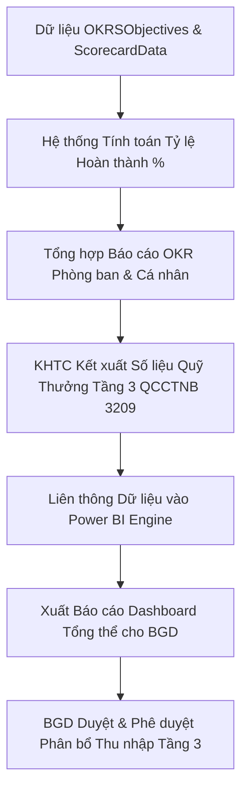

# Module: Performance & OKRs - Reports (Báo cáo Hiệu suất & Phân tích OKR/KPI)

## 1. Mục tiêu & Phạm vi (Goal & Scope)
- **Mục tiêu**: Cung cấp hệ thống báo cáo tổng hợp, báo cáo phân tích đa chiều và Dashboard theo dõi hiệu suất công việc (Executive Scorecards & OKR Dashboards). Giúp Ban Giám đốc, Trưởng phòng và Chủ nhiệm dự án đánh giá chính xác năng lực thực thi, tiến độ đạt mục tiêu OKR, hiệu quả sử dụng nguồn lực và căn cứ phân phối Quỹ thưởng sản xuất Tầng 3.
- **Phạm vi**:
  - Báo cáo tiến độ hoàn thành OKR cấp Trung tâm, Phòng ban và Cá nhân theo từng Quý.
  - Báo cáo phân tích thẻ điểm Scorecard định kỳ (tuần/tháng/quý) đối với các chỉ số đo lường `Measurables`.
  - Báo cáo tổng hợp xếp loại thi đua, hiệu suất đóng góp nhân sự và phân bổ Quỹ thưởng sản xuất Tầng 3 theo QCCTNB 3209.
  - Báo cáo hiệu quả Hợp đồng/Dự án liên thông giữa tiến độ công việc và điểm KPI dự án.
  - Tích hợp Power BI Dashboard hiển thị trực quan cho Ban Giám đốc.

## 2. User Stories & Ma trận Vai trò (Role Matrix)

### 2.1. User Stories theo 5 Phòng Ban & 3 Chức danh CCBA
- **Tổ chức - Hành chính (TCHC)**:
  - Là Chuyên viên TCHC, tôi muốn trích xuất báo cáo tổng hợp kết quả OKR/KPI toàn Trung tâm để phục vụ xét thi đua khen thưởng năm và quý.
- **Kế hoạch - Tài chính (KHTC)**:
  - Là Kế toán Trưởng, tôi muốn xem báo cáo tương quan giữa điểm hiệu suất OKR/KPI và chi tiết phân bổ Quỹ thưởng Tầng 3 để lập kế hoạch chi trả tài chính.
- **Kỹ thuật - Đào tạo (KTDT)**:
  - Là Chuyên viên KTDT, tôi muốn xem báo cáo thống kê các chỉ số chất lượng kỹ thuật, tỷ lệ hoàn thành hồ sơ CDE và tuân thủ tiêu chuẩn BIM.
- **Phòng Chuyên môn / Tư vấn**:
  - Là Kỹ sư / Chuyên viên, tôi muốn xuất báo cáo cá nhân ghi nhận kết quả OKR và điểm KPI đạt được trong quý.
- **Ban Giám đốc (BGD)**:
  - Là Giám đốc, tôi muốn xem Dashboard trực quan Power BI phản ánh bức tranh toàn cảnh về hiệu suất Trung tâm, tiến độ OKRs và dự báo Quỹ thưởng Tầng 3.
- **Chủ nhiệm Dự án (PM)**:
  - Là PM, tôi muốn xem báo cáo hiệu suất các thành viên trong dự án để đánh giá mức độ đóng góp vào tiến độ Hợp đồng.
- **Trưởng phòng Chuyên môn**:
  - Là Trưởng phòng Chuyên môn, tôi muốn truy xuất báo cáo OKR/KPI cấp phòng, so sánh hiệu suất giữa các nhóm công tác.
- **Giám đốc / BGD**:
  - Là Giám đốc, tôi muốn xem báo cáo tổng hợp trước khi chốt phê duyệt điểm đánh giá và danh sách phân bổ thu nhập Tầng 3.

### 2.2. Ma trận Phân quyền & Vai trò (Role Matrix)
| Chức danh / Phòng ban | Báo cáo OKR Cá nhân | Báo cáo OKR Phòng ban | Báo cáo OKR Toàn Trung tâm | Dashboard Power BI | Báo cáo Phân bổ Quỹ Thưởng Tầng 3 |
| --- | --- | --- | --- | --- | --- |
| **Tổ chức - Hành chính** | Read All | Read All | Read All / Export | Full Access | Read / Export |
| **Kế hoạch - Tài chính** | Read All | Read All | Read All | Full Access | Read / Financial Verification |
| **Kỹ thuật - Đào tạo** | Read | Read Technical | Read Technical | Read Technical | Read |
| **Phòng Chuyên môn** | Read Self | Read Dept | N/A | N/A | Read Self |
| **Ban Giám đốc** | Read All | Read All | Read All / Executive | Full Executive | Approve / Executive |
| **Chủ nhiệm Dự án (PM)** | Read Team | Read Project | N/A | Read Project | Read Project Team |
| **Trưởng phòng Chuyên môn**| Read Dept | Read / Export Dept| Read Overview | Read Dept | Read Dept |

## 3. Cơ sở Pháp lý & Quy chế Áp dụng
- **QCTK 2815/QĐ-VKH (Quy chế Triển khai)**:
  - *Điều 10 (Kiểm tra nội bộ)*: Quy định báo cáo đánh giá định kỳ về chất lượng và hiệu quả triển khai nhiệm vụ dịch vụ kỹ thuật.
  - *Điều 14 (Đánh giá thi đua)*: Báo cáo hiệu suất là căn cứ pháp lý để thực hiện đánh giá xếp loại thi đua, thưởng phạt cán bộ.
- **QCCTNB 3209/QĐ-VKH (Quy chế Chi tiêu Nội bộ)**:
  - *Điều 10 & Phụ lục 3-Tier Fund*: Quy định minh bạch số liệu trích lập và công khai báo cáo phân phối Quỹ thưởng sản xuất Tầng 3 theo kết quả KPI/OKR.
- **Quy chế CCBA 2026**:
  - *Điều 12 & Điều 24 (Hệ thống Báo cáo Quản trị IDOP)*: Bắt buộc chuẩn hóa hệ thống báo cáo hiệu suất tự động, không sử dụng báo cáo thủ công qua file rải rác.

## 4. Quy trình Nghiệp vụ Chi tiết (Operational Flow & BPMN)

### 4.1. Sơ đồ Quy trình Tổng hợp Báo cáo Hiệu suất (Mermaid BPMN)

### 4.2. Diễn giải Quy trình Nghiệp vụ & Tích hợp Cơ chế Tài chính
1. **Bước 1: Trích xuất Dữ liệu Gốc**: Hệ thống tự động thu thập dữ liệu từ các danh mục `OKRSObjectives`, `OKRSKeyResults`, `Measurables`, `Quarters`, `ScorecardData` và `Employees`.
2. **Bước 2: Tính toán Chỉ số Phân tích**:
   - Tỷ lệ hoàn thành OKR Cá nhân/Phòng ban = `(Sum(CurrentValue / TargetValue) / Count(KeyResults)) * 100%`.
   - Điểm KPI Tổng hợp = `(Điểm OKR * 60%) + (Điểm Thẻ điểm Scorecard * 40%)`.
   - Hệ số Phân bổ Thưởng Tầng 3 = `(Điểm KPI Cá nhân / Điểm KPI Trung bình Trung tâm) * Hệ số Chức danh`.
3. **Bước 3: Tổng hợp Báo cáo & Đẩy lên Power BI**: Dữ liệu sau khi xử lý được đưa vào các mẫu báo cáo tiêu chuẩn và đẩy trực tiếp lên dashboard Power BI.
4. **Bước 4: Xem xét & Duyệt**: Trưởng phòng xem xét báo cáo cấp phòng, BGD phê duyệt báo cáo tổng thể toàn Trung tâm để thực hiện chi trả tiền thưởng Tầng 3.

## 5. Acceptance Criteria & List Mapping (Mapping 1-1 Schema JSON)

### 5.1. Tiêu chí Chấp nhận (Acceptance Criteria)
- [ ] Báo cáo tổng hợp OKR/KPI hiển thị 100% chính xác tỷ lệ hoàn thành theo đúng công thức chuẩn.
- [ ] Báo cáo phân bổ Quỹ thưởng sản xuất Tầng 3 liên thông chính xác với số liệu tài chính trích lập từ QCCTNB 3209.
- [ ] Hỗ trợ bộ lọc linh hoạt theo Quý (`QuarterId`), Phòng ban (`DepartmentId`), Dự án (`ProjectId`) và Nhân sự (`EmployeeId`).
- [ ] Dashboard Power BI cập nhật dữ liệu tự động định kỳ (real-time hoặc theo lịch đặt sẵn).

### 5.2. Bảng Aggregated List Mapping cho Báo cáo Hiệu suất
Báo cáo Performance & OKRs tích hợp dữ liệu từ các SharePoint List JSON sau:

| Tên Danh sách JSON | File Path Schema | Các Trường Dữ liệu Khai thác | Mục đích Sử dụng trong Báo cáo |
| --- | --- | --- | --- |
| `OKRSObjectives` | `performance_okrs/okrs_objectives.json` | `ObjectiveTitle`, `Owner`, `QuarterId`, `ParentObjectiveId`, `DepartmentId` | Thống kê danh mục mục tiêu OKR |
| `OKRSKeyResults` | `performance_okrs/okrs_key_results.json` | `ObjectiveId`, `TargetValue`, `CurrentValue` | Tính tỷ lệ hoàn thành % Key Results |
| `Measurables` | `performance_okrs/measurables.json` | `MetricName`, `Unit` | Phân loại chỉ số đo lường kỹ thuật/kinh doanh |
| `Quarters` | `performance_okrs/quarters.json` | `Year`, `Quarter`, `StartDate`, `EndDate` | Phân vùng báo cáo theo chu kỳ thời gian |
| `ScorecardData` | `performance_okrs/scorecard_data.json` | `MetricId`, `PeriodType`, `PeriodKey`, `Value` | Phân tích biến động chỉ số thẻ điểm định kỳ |
| `Employees` | `people_assets/employees.json` | `FullName`, `EmployeeCode`, `DepartmentId` | Phân nhóm báo cáo theo nhân sự và phòng ban |
| `Projects` | `process_execution/projects.json` | `ProjectCode`, `ProjectName` | Liên kết hiệu suất nhân sự với từng Dự án |
| `SharedCostAllocations` | `cash_data/shared_cost_allocations.json`| `Amount`, `AllocationType` | Xử lý số liệu trích lập Quỹ thưởng Tầng 3 |

## 6. Bảo mật, Phân quyền & Audit Trail
### 6.1. Nguyên tắc Phân quyền & Truy cập
- Trưởng phòng chỉ được xem và xuất báo cáo thuộc phạm vi phòng ban mình quản lý.
- PM chỉ xem được báo cáo KPI thành viên trong dự án được giao phụ trách.
- BGD, TCHC và KHTC được quyền xem báo cáo toàn bộ Trung tâm.

### 6.2. Cấu trúc Audit Trail & Lưu vết Kiểm toán Nội bộ
- Mọi lượt trích xuất báo cáo (Export Excel/PDF) hoặc xem báo cáo Quỹ thưởng Tầng 3 đều được lưu log hệ thống ghi nhận User ID, Timestamp và IP Address để bảo mật thông tin thu nhập.
