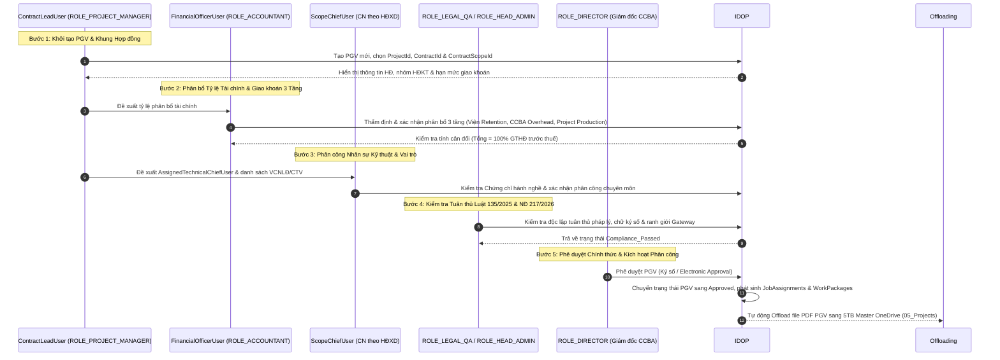
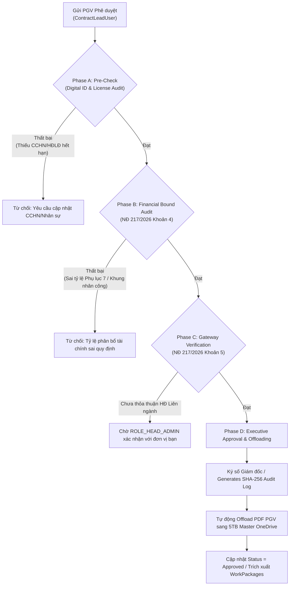

# Đặc Tả Kỹ Thuật Module: PMO (Quản lý Phân công Công việc & Phiếu Giao việc PGV) - Phiên bản R2

> **Mã Module**: `process_execution/pmo`  
> **Phiên bản Đặc tả**: R2 (Revision 2)  
> **Căn cứ Pháp lý**: QCTK 2815/QĐ-VKH (Điều 7), QCCTNB 3209/QĐ-VKH (Điều 8, Phụ lục 7 & 8), Quy chế CCBA 2026 (Điều 9, 11), Luật 135/2025/QH15, Nghị định 217/2026/NĐ-CP (Khoản 4 & Khoản 5 Điều 26).  
> **Kiến trúc Dẫn chiếu**: [05_ccba_ibst_boundary_map.md](../../../../.md/system_blueprint/05_ccba_ibst_boundary_map.md) (Bước 3), [06_ccba_org_role_matrix.md](../../../../.md/system_blueprint/06_ccba_org_role_matrix.md).

---

## 1. Mục tiêu & Phạm vi (Goal & Scope)

### 1.1 Mục tiêu
- Số hóa toàn bộ quy trình Giao việc, Phân công nhân sự và Lập Phiếu giao việc (PGV) nội bộ CCBA trên nền tảng IDOP v2.0.
- Thực thi chuẩn hóa Step 3 Giao việc (`giao_viec_pgv`) trong Chuỗi 7 bước nghiệp vụ IDOP theo 4 luồng PGV (Điều 7 QCTK 2815).
- Thiết lập quy trình 5 bước nhập liệu PGV chặt chẽ, hỗ trợ phân bổ tài chính đa hạng mục (Multi-Scope) và hợp đồng liên ngành đa đơn vị (Multi-Department).
- Tích hợp hệ thống 3 cấp phân công kỹ thuật theo Điều 3.2 QCTK 2815: `ContractLeadUser` (Cấp HĐ), `ScopeChiefUser` (Cấp Hoạt động XD), `AssignedTechnicalChiefUser` (Cấp Bộ môn), cùng `FinancialOfficerUser` (Phụ trách tài chính (nếu có)).
- Tuân thủ nghiêm ngặt các quy định pháp lý về Hợp đồng điện tử (Luật 135/2025/QH15) và cơ chế kiểm soát minh bạch tài chính (NĐ 217/2026/NĐ-CP Khoản 4 & 5 Điều 26).

### 1.2 Phạm vi (Scope)
- **Bao gồm (In-Scope)**:
  - Trình tự 5 bước nhập liệu và phê duyệt PGV trên IDOP.
  - Phân định thẩm quyền phê duyệt nội bộ của Giám đốc CCBA và phân bổ tài chính 3 tầng (Viện Retention, CCBA Overhead, Project Production Budget).
  - Tích hợp dữ liệu giữa `JobAssignments`, `AssignmentDetails`, `ContractScopes`, `SharedCostAllocations` và `WorkPackages`.
  - Cơ chế Offloading file PDF PGV đã phê duyệt sang 5TB Master OneDrive (`05_Projects`).
- **Không bao gồm (Out-of-Scope)**:
  - Quản lý quy trình nội bộ của các đơn vị Viện IBST bên ngoài CCBA (IDOP chỉ ghi nhận vai trò Gateway của Phòng Tổng Hợp `ROLE_HEAD_ADMIN`).
  - Nộp tài liệu CDE kỹ thuật chi tiết (đã thuộc module `cde_documents`).
  - Thực chi lương và hoàn ứng thực tế (đã thuộc module `cash_data/expenses`).

---

## 2. Ma trận Ngôn ngữ Thống nhất & Hệ thống Vai trò (Ubiquitous Language & Role System)

### 2.1 Ma trận Từ điển Ngôn ngữ Thống nhất (Ubiquitous Language Matrix)

| Thuật ngữ Nghiệp vụ CCBA / IBST | Thự thể / SharePoint List IDOP | Vai trò / Entra ID Group | Quy chế / Căn cứ Pháp lý Dẫn chiếu |
|:---|:---|:---|:---|
| **Phiếu Giao Việc (PGV)** | `JobAssignments`, `AssignmentDetails` | `ROLE_PROJECT_MANAGER`, `ROLE_DIRECTOR` | QCTK 2815 Điều 7; Quy chế CCBA Điều 11 |
| **Chủ trì Hợp đồng (Contract Lead)** | `JobAssignments` (`ContractLeadUser`) | `ROLE_PROJECT_MANAGER` (`CCBA_ChuTri_All`) | QCTK 2815 Điều 3.2a & Điều 9.4 |
| **Chủ nhiệm theo hoạt động XD (Scope Chief)** | `ContractScopes` (`ScopeChiefUser`) | `ROLE_HEAD_BIM_DESIGN` / `ROLE_HEAD_BIM_PROJECT` (polymorphic) | QCTK 2815 Điều 3.2b & Điều 7.5 |
| **Phụ trách tài chính (nếu có)** | `JobAssignments` (`FinancialOfficerUser`) | `ROLE_ACCOUNTANT` (`CCBA_KeToan`) | QCCTNB 3209 Điều 8.2; Quy chế CCBA Điều 9 |
| **Chủ trì Kỹ thuật Phụ trách (Assigned Tech Chief)** | `JobAssignments` (`AssignedTechnicalChiefUser`) | `ROLE_STAFF` / `ROLE_HEAD_BIM_PROJECT` | QCTK 2815 Điều 3.2c & Điều 7.5 |
| **Hạng mục Hợp đồng (Contract Scope)** | `ContractScopes` (`ContractScopeId`) | `ROLE_PROJECT_MANAGER`, `ROLE_ACCOUNTANT` | QCCTNB 3209 Phụ lục 7 & Phụ lục 8 |
| **Phân bổ Doanh thu 3 Tầng** | `allocations` (`SharedCostAllocations`) | `ROLE_ACCOUNTANT`, `ROLE_DIRECTOR` | QCCTNB 3209 Phụ lục 7 & QCTK Bảng 1 |
| **Hợp đồng Điện tử & Chữ ký Số** | `cde_documents`, `approvals` | `ROLE_LEGAL_QA`, `ROLE_HEAD_ADMIN` | Luật 135/2025/QH15; NĐ 217/2026 Khoản 4, 5 Điều 26 |

### 2.2 Hệ thống Vai trò 3 Tầng (3-Tier Role Hierarchy) trong PMO

```
┌────────────────────────────────────────────────────────────────────────────────────────┐
│ TẦNG 1: QUẢN TRỊ & PHÊ DUYỆT CHIẾN LƯỢC (STRATEGIC & EXECUTIVE CONTROL)               │
│ - ROLE_DIRECTOR (Giám đốc Trung tâm): Phê duyệt PGV cuối cùng, ban hành QĐ phân công    │
│ - ROLE_DEPUTY_DIRECTOR (Phó Giám đốc): Phê duyệt PGV thuộc khối quản lý được ủy quyền  │
│ - ROLE_LEGAL_QA (Cố vấn Pháp lý & QLCL): Thẩm định tính tuân thủ Luật 135/2025 & NĐ 217│
└────────────────────────────────────────────────────────────────────────────────────────┘
                                           │
                                           ▼
┌────────────────────────────────────────────────────────────────────────────────────────┐
│ TẦNG 2: QUẢN LÝ VẬN HÀNH & KẾ TOÁN (OPERATIONAL MANAGEMENT & GATEWAY)                   │
│ - ROLE_HEAD_ADMIN (Trưởng phòng TH): Gateway thẩm tra luồng 4 HĐ Viện ký / HĐ liên ngành│
│ - FinancialOfficerUser / ROLE_ACCOUNTANT: Thẩm tra định mức tài chính 3 tầng          │
│ - ScopeChiefUser / ROLE_HEAD_BIM_*: Kiểm duyệt giải pháp KT theo hoạt động XD (Scope)  │
│ - ROLE_HEAD_BIM_PROJECT: Kiểm duyệt năng lực thực thi & kế hoạch hiện trường          │
└────────────────────────────────────────────────────────────────────────────────────────┘
                                           │
                                           ▼
┌────────────────────────────────────────────────────────────────────────────────────────┐
│ TẦNG 3: THỰC THI & SẢN XUẤT NỘI BỘ (EXECUTION & PRODUCTION)                             │
│ - ContractLeadUser / ROLE_PROJECT_MANAGER: Khởi tạo PGV, chịu trách nhiệm P&L        │
│ - AssignedTechnicalChiefUser: Trực tiếp điều hành kỹ thuật gói việc/hiện trường        │
│ - ROLE_STAFF (Viên chức NLĐ): Thực thi nhiệm vụ, ghi nhận Timesheet                   │
│ - ROLE_EXTERNAL_PARTNER (Cộng tác viên/CTV): Thực hiện HĐ giao khoán chuyên môn        │
└────────────────────────────────────────────────────────────────────────────────────────┘
```

---

## 3. User Stories & Ma trận Vai trò (Role Matrix)

### 3.1 User Stories (Theo Tiêu chuẩn 15 ROLE_ID SSOT)

| Mã US | Vai trò (`ROLE_ID`) | Nội dung User Story | Căn cứ Quy chế |
|:---|:---|:---|:---|
| **US-PMO-01** | `ROLE_PROJECT_MANAGER`<br/>(`ContractLeadUser`) | Với tư cách Chủ trì Hợp đồng, tôi muốn khởi tạo Phiếu giao việc (PGV) trên IDOP, gắn `ContractScopeId` và đề xuất phân bổ nhân sự/tài chính để triển khai sản xuất. | Điều 7 & 9.4 QCTK 2815; Điều 11 Quy chế CCBA |
| **US-PMO-02** | `ROLE_ACCOUNTANT`<br/>(`FinancialOfficerUser`) | Với tư cách Phụ trách Kế toán Đơn vị, tôi muốn thẩm định tỷ lệ trích nộp 3 tầng trên PGV theo đúng Phụ lục 7 QCCTNB 3209 để đảm bảo an toàn tài chính. | Điều 8.2 QCCTNB 3209; Khoản 4 Điều 26 NĐ 217/2026 |
| **US-PMO-03** | `ROLE_HEAD_BIM_DESIGN` / `ROLE_HEAD_BIM_PROJECT`<br/>(`ScopeChiefUser`) | Với tư cách Chủ nhiệm theo hoạt động XD (CN Thiết kế / CN Khảo sát / CN Thẩm tra), tôi muốn kiểm duyệt giải pháp kỹ thuật và phân công Chủ trì bộ môn trong Scope mình phụ trách. | Điều 3.2b & 7.5 QCTK 2815 |
| **US-PMO-04** | `ROLE_HEAD_ADMIN`<br/>(`Gateway Admin`) | Với tư cách Trưởng phòng Tổng Hợp, tôi muốn thẩm tra các PGV thuộc luồng HĐ Viện ký hoặc HĐ Liên ngành để thống nhất tỷ lệ phân chia với đơn vị bạn trước khi trình duyệt. | Điều 7.1c & 7.3 QCTK 2815 |
| **US-PMO-05** | `ROLE_LEGAL_QA`<br/>(`Compliance Auditor`) | Với tư cách Cố vấn Pháp lý & QLCL, tôi muốn kiểm tra tính tuân thủ Luật 135/2025 và NĐ 217/2026 của PGV để đảm bảo tính độc lập của kiểm tra nội bộ. | Điều 4.8 QCTK 2815; Khoản 4, 5 Điều 26 NĐ 217/2026 |
| **US-PMO-06** | `ROLE_DIRECTOR`<br/>(`Executive Approver`) | Với tư cách Giám đốc CCBA, tôi muốn phê duyệt điện tử / ký số PGV trên IDOP để ban hành Quyết định phân công và khóa cứng tỷ lệ tài chính. | Điều 7.1 QCTK 2815; Luật 135/2025/QH15 |
| **US-PMO-07** | `ROLE_STAFF`<br/>(`AssignedTechChief`) | Với tư cách Chủ trì Kỹ thuật / VCNLĐ được giao việc, tôi muốn xem PGV và phạm vi công việc của mình trên IDOP để thực hiện nhiệm vụ và ghi nhận Timesheet. | Điều 7.5 QCTK 2815 |
| **US-PMO-08** | `ROLE_EXTERNAL_PARTNER`<br/>(`Collaborator`) | Với tư cách Cộng tác viên (CTV), tôi muốn xem nội dung giao khoán chuyên môn trên PGV để tuân thủ Hợp đồng giao khoán đã ký. | Điều 7.6 QCTK 2815 |

### 3.2 Ma trận Vai trò (Role Matrix)

> Tham chiếu SSOT: [06_ccba_org_role_matrix.md](../../../../.md/system_blueprint/06_ccba_org_role_matrix.md)  
> Ký hiệu: **C** = Create, **R** = Read, **U** = Update, **A** = Approve, **Admin** = System Management, `*` = Phạm vi dự án/phòng ban được phân công.

| Vai trò Kỹ thuật / Hệ thống | `ROLE_ID` chuẩn | Quyền hạn PGV | Ghi chú Trách nhiệm |
|:---|:---|:---:|:---|
| Ban Giám đốc | `ROLE_DIRECTOR` | R, A | Phê duyệt PGV chính thức (Ký số) |
| Ban Giám đốc (Ủy quyền) | `ROLE_DEPUTY_DIRECTOR` | R, A* | Phê duyệt PGV thuộc khối quản lý được giao |
| Cố vấn Pháp lý & QLCL | `ROLE_LEGAL_QA` | R, A* | Audit tuân thủ Luật 135 & NĐ 217 (Độc lập) |
| Trưởng phòng Tổng Hợp | `ROLE_HEAD_ADMIN` | R, U*, A* | Gateway thẩm tra HĐ Viện ký & HĐ Liên ngành |
| Phụ trách Kế toán | `ROLE_ACCOUNTANT` (`FinancialOfficerUser`) | C*, R, U, A* | Thẩm định & duyệt phân bổ tài chính 3 tầng |
| Chủ nhiệm theo hoạt động XD | `ROLE_HEAD_BIM_DESIGN` / `ROLE_HEAD_BIM_PROJECT` (`ScopeChiefUser`) | C*, R, U, A* | Duyệt giải pháp kỹ thuật & nhân sự theo Scope |
| Trưởng phòng BIM Dự án | `ROLE_HEAD_BIM_PROJECT` | C*, R, U, A* | Duyệt năng lực thi công & kế hoạch hiện trường |
| Chủ trì Hợp đồng | `ROLE_PROJECT_MANAGER` (`ContractLeadUser`) | C, R, U | Khởi tạo PGV, quản lý P&L dự án |
| Chủ trì Kỹ thuật / VCNLĐ | `ROLE_STAFF` (`AssignedTechnicalChiefUser`) | R* | Thực thi công việc theo PGV, báo cáo tiến độ |
| Cộng tác viên ngoài | `ROLE_EXTERNAL_PARTNER` | R* | Thực hiện phần việc theo HĐ giao khoán |

---

## 4. Phân định Rõ ràng Hệ thống 3 Cấp Phân công Kỹ thuật & Quản lý PGV

> **Nguyên tắc SSOT**: Mỗi cấp phân công kỹ thuật gắn với 1 entity duy nhất trong data model, ánh xạ chính xác 3 khoản của Điều 3.2 QCTK 2815.

### 4.1 Cấp Hợp đồng / PGV Header (`JobAssignments`)

1. **`ContractLeadUser` — Chủ trì Hợp đồng (Điều 3.2a)**:
   - Gắn với `ROLE_PROJECT_MANAGER` (hoặc Giám đốc chỉ định).
   - Chịu trách nhiệm **toàn diện** về tiến độ, chất lượng và P&L của hợp đồng (Điều 3.2a & 9.4 QCTK 2815).
   - Chủ trì khởi tạo PGV trên IDOP, chọn `ContractScopeId`, phân bổ sản lượng dự kiến cho từng thành viên.
2. **`FinancialOfficerUser` — Phụ trách tài chính (nếu có)**:
   - Gắn với `ROLE_ACCOUNTANT` (Ghế ⑤ thuộc Phòng Tổng Hợp).
   - Kiểm tra tính chính xác của tỷ lệ trích nộp Viện (CPQL + KHTS) theo Phụ lục 7 QCCTNB 3209 và trích quỹ điều hành CCBA.
   - Thẩm định hạn mức giao khoán sản xuất trước khi trình Giám đốc duyệt.
3. **`ScopeChiefsSummary` — Tổng hợp Chủ nhiệm KT theo Scope (Rollup)**:
   - Trường `Note` tự động bởi Power Automate, tổng hợp danh sách Chủ nhiệm từ `ContractScopes.ScopeChiefUser`.
   - Format: `"TVTK: Nguyễn A (TK-I-xxx) | KSXD: Lê C (KS-I-zzz)"`.
   - Mục đích: Cung cấp overview tổng hợp cho Giám đốc CCBA mà không cần drill-down.
4. **`DisciplineTeamSummary` — Tổng hợp Đội ngũ theo Bộ môn (Rollup)**:
   - Trường `Note` rollup trên `JobAssignments`, tổng hợp đội ngũ theo bộ môn từ `AssignmentDetails`.
   - Format: `'[ARC] CT: Trần B | Nhóm: Hà E, Minh F (3 người, 400h)'`.
   - Mục đích: Giúp Lãnh đạo và Chủ trì Hợp đồng nắm nhanh cơ cấu nhân sự thực hiện theo từng bộ môn trên PGV mà không cần mở chi tiết `AssignmentDetails`.

### 4.2 Cấp Hoạt động Xây dựng / Scope (`ContractScopes`)

4. **`ScopeChiefUser` — Chủ nhiệm theo hoạt động XD (Điều 3.2b)**:
   - Vai trò polymorphic: CN Thiết kế XD / CN Khảo sát XD / CN Thẩm tra TKXD / GĐ QLDA — xác định bởi `NhomHopDongKT` của Scope.
   - Quản lý, điều phối **toàn bộ công việc tư vấn** có nhiều chuyên môn khác nhau — chịu trách nhiệm **về kỹ thuật** (Điều 3.2b QCTK 2815).
   - Phải có CCHN phù hợp loại hoạt động XD (lưu tại `ScopeChiefCertNo`).
   - Kiểm duyệt phần phân công Chủ trì bộ môn (`AssignmentDetails`) thuộc Scope mình phụ trách.

### 4.3 Cấp Bộ môn Chuyên ngành / Discipline (`AssignmentDetails`)

5. **`AssignedTechnicalChiefUser` — Chủ trì bộ môn / Chủ trì kỹ thuật (Điều 3.2c)**:
   - Gắn với `ROLE_STAFF` hoặc `ROLE_HEAD_BIM_PROJECT` có Chứng chỉ hành nghề phù hợp.
   - Phụ trách thực hiện công việc theo **lĩnh vực chuyên môn cụ thể** (`DisciplineCode`: KTS, KST, ĐKT, Điện, Nước, PCCC, HTKT...).
   - Chịu trách nhiệm trực tiếp về sản phẩm kỹ thuật và nhật ký công việc (Điều 3.2c & 7.5 QCTK 2815).
   - CCHN lưu tại `TechnicalChiefCertNo`.

---

## 5. Quy trình Nghiệp vụ 5 Bước Nhập liệu PGV (5-Step PGV Data Entry Sequence)

### 5.1 Sơ đồ Trình tự 5 Bước (Sequence Diagram)



### 5.2 Chi tiết Kỹ thuật từng Bước

1. **Bước 1: Khởi tạo PGV & Khung Hợp đồng (`PGV Initiation & Scope Binding`)**:
   - *Thực hiện*: `ContractLeadUser` (`ROLE_PROJECT_MANAGER`).
   - *Thao tác*: Tạo mới bản ghi `JobAssignments` (PGV Header), chọn `ProjectId`, `ContractId` và chọn 1 hoặc nhiều `ContractScopeId` từ danh sách `ContractScopes`.
   - *Ràng buộc*: `ContractId` phải ở trạng thái `IBST_Approved` (HĐ Viện ký) hoặc `Approved` (HĐ CCBA ký).

2. **Bước 2: Phân bổ Tỷ lệ Tài chính & Giao khoán 3 Tầng (`Financial Allocation & Tier 1/2/3 Split`)**:
   - *Thực hiện*: `FinancialOfficerUser` (`ROLE_ACCOUNTANT`) phối hợp với `ContractLeadUser`.
   - *Thao tác*: Nhập tỷ lệ/giá trị trích nộp:
     - **Tầng 1 (Trích nộp Viện)**: Lấy tự động theo `TyLeVienCPQL` + `TyLeVienKHTS` của `ContractScopeId` (Phụ lục 7 QCCTNB 3209).
     - **Tầng 2 (Kinh phí Đơn vị CCBA)**: Trích quỹ điều hành nội bộ CCBA (theo Quy chế CCBA 2026 Điều 11).
     - **Tầng 3 (Kinh phí Giao khoán Sản xuất)**: Phần kinh phí còn lại giao cho Chủ trì HĐ và nhóm thực hiện dự án.
   - *Ràng buộc*: Hệ thống tự động validation formula:  
     $$\text{Tier 1} + \text{Tier 2} + \text{Tier 3} = \text{Giá trị Hạng mục trước thuế (VND)}$$

3. **Bước 3: Phân công Nhân sự Kỹ thuật & Vai trò (`Technical Personnel & Role Assignment`)**:
   - *Thực hiện*: `ScopeChiefUser` trên `ContractScopes` (`ROLE_HEAD_BIM_DESIGN` / `ROLE_HEAD_BIM_PROJECT` tùy theo hoạt động XD) và `ContractLeadUser`.
   - *Thao tác*: Gán `AssignedTechnicalChiefUser` cho từng hạng mục công việc. Thêm các `ROLE_STAFF` và `ROLE_EXTERNAL_PARTNER` (CTV).
   - *Ràng buộc*:
     - Kiểm tra Chứng chỉ hành nghề phù hợp với loại công trình/gói thầu (Điều 7.4 & 7.5 QCTK 2815).
     - CTV phải có Hợp đồng giao khoán công việc được Giám đốc CCBA phê duyệt (Điều 7.6 QCTK 2815).

4. **Bước 4: Kiểm tra Tuân thủ Luật 135/2025 & NĐ 217/2026 (`Compliance Audit & Verification`)**:
   - *Thực hiện*: `ROLE_LEGAL_QA` (Cố vấn Pháp lý) & `ROLE_HEAD_ADMIN` (Gateway).
   - *Thao tác*: Kiểm tra tính độc lập của bộ phận kiểm soát nội bộ (Điều 4.8 QCTK 2815 & Khoản 4 Điều 26 NĐ 217/2026). Xác nhận tính hợp lệ của chữ ký số/thông điệp dữ liệu theo Luật 135/2025/QH15.
   - *Ràng buộc*: Nếu PGV thuộc HĐ Liên ngành (nhiều đơn vị thuộc Viện), `ROLE_HEAD_ADMIN` phải xác nhận tỷ lệ thỏa thuận với đơn vị bạn trước khi chuyển Giám đốc duyệt.

5. **Bước 5: Phê duyệt Chính thức & Kích hoạt Phân công (`Executive Approval & Offloading`)**:
   - *Thực hiện*: `ROLE_DIRECTOR` (Giám đốc CCBA) hoặc `ROLE_DEPUTY_DIRECTOR` (Phó Giám đốc được ủy quyền).
   - *Thao tác*: Phê duyệt điện tử / Ký số PGV.
   - *Kết quả System*:
     - Khóa cứng (Lock) dữ liệu tài chính PGV, không cho chỉnh sửa trực tiếp.
     - Phát sinh tự động các bản ghi `WorkPackages` và `Activities` tương ứng.
     - Xuất bản bản in PDF chính thức của PGV và đẩy về **5TB Master OneDrive (`ccba@ibst-bim.vn/05_Projects/<ProjectCode>/PGV/`)**.

---

## 6. Quy tắc Nghiệp vụ Phân bổ Multi-Scope & Multi-Department

### 6.1 Quy tắc Multi-Scope (Đa Hạng mục Hợp đồng)
1. Bắt buộc phân rã `ContractScopes`: Mỗi hạng mục trong hợp đồng phải được khai báo thành 1 bản ghi trong list `ContractScopes` kèm theo `NhomHopDongKT` tương ứng.
2. Áp dụng tỷ lệ trích nộp Viện riêng biệt cho từng Scope:
   - Scope A (N2a): Trích nộp Viện 9.0% (7% CPQL + 2% KHTS), giao đơn vị 91.0%.
   - Scope B (N2f): Trích nộp Viện 26.0% (16% CPQL + 10% KHTS), giao đơn vị 74.0%.
3. Công thức tính Trích nộp Viện tổng hợp của Hợp đồng:
   $$\text{Total\_Vien\_Retention} = \sum_{i=1}^{n} \left( \text{AmountBeforeVAT}_i \times (\text{TyLeVienCPQL}_i + \text{TyLeVienKHTS}_i) \right)$$
4. Quản lý Khung Chi phí Nhân công: Chi phí nhân công cho từng Scope không được vượt quá khoảng $[\text{KhungNhanCongMin}_i, \text{KhungNhanCongMax}_i]$ quy định tại Phụ lục 8 QCCTNB 3209.

### 6.2 Quy tắc Multi-Department (Đa Phòng ban / HĐ Liên ngành)
1. Đơn vị Chủ trì & Đơn vị Phối hợp: Chỉ có 01 Đơn vị chủ trì giữ vai trò đầu mối. Đơn vị chủ trì cử `ContractLeadUser` quản lý toàn bộ PGV.
2. Thỏa thuận Tỷ lệ Sản lượng (PGV Ratio Agreement): Tỷ lệ giá trị phân chia giữa CCBA và các đơn vị phối hợp phải được ghi rõ trong PGV dưới dạng % sản lượng và số tiền tuyệt đối.
3. Gateway Trưởng phòng Tổng Hợp (`ROLE_HEAD_ADMIN`):
   - Đối với đơn vị ngoài CCBA (thuộc Viện): `ROLE_HEAD_ADMIN` làm gateway thống nhất biên bản thỏa thuận tỷ lệ phân chia với Trưởng đơn vị bạn (Điều 7.1c QCTK 2815) trước khi trình Lãnh đạo Viện / Giám đốc CCBA phê duyệt.
   - Trạng thái trên IDOP: `Pending_InterDept_Agreement` $\rightarrow$ `InterDept_Approved`.
4. Hạch toán Kinh phí Quản lý Phối hợp: Trưởng đơn vị chủ trì thực hiện việc phân bổ kinh phí quản lý chung cho các đơn vị phối hợp theo đúng tỷ lệ đã ký kết trên PGV (Điều 9.1i QCTK 2815).

---

## 7. Tuân thủ Pháp lý: Luật 135/2025/QH15 & NĐ 217/2026/NĐ-CP (Khoản 4 & Khoản 5 Điều 26)

1. **Luật 135/2025/QH15 (Giao dịch Số & Hợp đồng Điện tử)**:
   - **Giá trị Pháp lý tương đương Văn bản Giấy**: Mọi PGV, Quyết định phân công và Bản thỏa thuận giao khoán được khởi tạo, ký số và phê duyệt trên IDOP có giá trị pháp lý ràng buộc toàn bộ VCNLĐ CCBA (QCTK 2815 Điều 3.2n).
   - **Tính Không thể Chối bỏ (Non-Repudiation)**: Khi `ROLE_DIRECTOR` hoặc `ContractLeadUser` xác thực phê duyệt PGV, hệ thống tự động ghi lại SHA-256 Digest, Timestamp ISO 8601 và User Certificate Identity vào `ApprovalAuditLogs`.
2. **NĐ 217/2026/NĐ-CP (Khoản 4 Điều 26 - Trách nhiệm Giải trình Tài chính & Độc lập Kiểm soát)**:
   - Giám đốc CCBA và `ContractLeadUser` chịu trách nhiệm liên đới toàn diện về tính chính xác của dự toán và chứng từ tài chính (QCTK 2815 Điều 4.9 & Điều 9.1c).
   - Bộ phận kiểm soát nội bộ (`ROLE_LEGAL_QA`) phải hoạt động độc lập với nhóm trực tiếp thực hiện dự án (QCTK 2815 Điều 4.8).
3. **NĐ 217/2026/NĐ-CP (Khoản 5 Điều 26 - Minh bạch & Offloading Lưu trữ)**:
   - Cấm sửa đổi trực tiếp dữ liệu PGV sau khi đã duyệt (`Immutable PGV Status`). Mọi thay đổi về Chủ trì HĐ, Chủ trì Kỹ thuật hoặc Tỷ lệ phân bổ phải lập PGV Điều chỉnh theo đúng trình tự 5 bước (QCTK 2815 Điều 7.1c).
   - Tuân thủ rào cản kiến trúc Metadata-First: File PDF scan/Ký số PGV chính thức được offload hoàn toàn sang 5TB Master OneDrive (`ccba@ibst-bim.vn`), chỉ lưu URL link và metadata trên SharePoint List `JobAssignments` để bảo vệ tenant quota.

---

## 8. Luồng Phê duyệt Verification Luật 135/2025 (4-Phase Automated Integrity Audit)

### 8.1 Sơ đồ Tiến trình Verification (Audit Flowchart)



### 8.2 Chi tiết 4 Phase Automated Integrity Audit

- **Phase A (Pre-Check - License & ID Audit)**: Kiểm tra Chứng chỉ hành nghề còn hiệu lực của `AssignedTechnicalChiefUser` & HĐLĐ đang hoạt động.
- **Phase B (Financial Bound Audit - NĐ 217 Khoản 4)**: Kiểm tra công thức cân đối tài chính 3 tầng và định mức Phụ lục 7 QCCTNB 3209.
- **Phase C (Gateway Verification - NĐ 217 Khoản 5)**: Kiểm tra trạng thái thỏa thuận HĐ Liên ngành của `ROLE_HEAD_ADMIN` (nếu có).
- **Phase D (Executive Sign-Off & Offloading)**: Ký số Giám đốc, tạo log audit chống chối bỏ (SHA-256), offload file PDF PGV sang 5TB Master OneDrive.

---

## 9. Acceptance Criteria & List Mapping

### 9.1 Data Mapping Table (Danh mục List Liên quan)
- `JobAssignments`: Lưu trữ thông tin Header PGV (`ProjectId`, `ContractId`, `ContractLeadUser`, `FinancialOfficerUser`, `ScopeChiefsSummary`, `DisciplineTeamSummary`, `Status`).
  - `DisciplineTeamSummary`: Trường Note rollup trên `JobAssignments`, tổng hợp đội ngũ theo bộ môn từ `AssignmentDetails`. Format: `'[ARC] CT: Trần B | Nhóm: Hà E, Minh F (3 người, 400h)'`.
- `AssignmentDetails`: Lưu trữ chi tiết nhân sự (`EmployeeId`, `AssignedTechnicalChiefUser`, `TaskDescription`, `AllocatedRatio`).
- `ContractScopes`: Lưu trữ chi tiết hạng mục HĐ (`NhomHopDongKT`, `AmountBeforeVAT`, `TyLeGiaoDonVi`, `TyLeVienCPQL`, `TyLeVienKHTS`).
- `SharedCostAllocations`: Lưu trữ kết quả phân bổ tài chính 3 tầng.

### 9.2 Tiêu chí Chấp nhận (Acceptance Criteria)
- **AC-PMO-01**: `JobAssignment` bắt buộc phải chứa `ContractId`, `ContractScopeId`, `ContractLeadUser` và `FinancialOfficerUser`. Mỗi `ContractScope` liên quan bắt buộc phải có `ScopeChiefUser` (Chủ nhiệm theo hoạt động XD).
- **AC-PMO-02**: Hệ thống từ chối duyệt PGV nếu tổng tỷ lệ phân bổ tài chính 3 tầng khác 100% giá trị hạng mục trước thuế.
- **AC-PMO-03**: Hệ thống báo lỗi nếu `AssignedTechnicalChiefUser` không có Chứng chỉ hành nghề phù hợp hoặc CTV không có HĐ giao khoán.
- **AC-PMO-04**: File PDF PGV sau khi Giám đốc phê duyệt được tự động offload về thư mục OneDrive `05_Projects/<ProjectCode>/PGV/` và cập nhật link vào `JobAssignments`.
