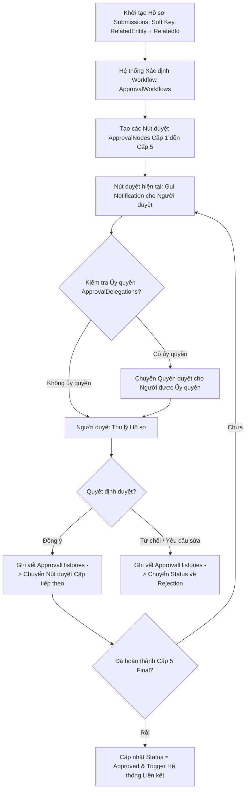

# Module: System Governance - Approvals (Engine Trình ký, Phê duyệt Đa cấp & Polymorphic Soft Key)

## 1. Mục tiêu & Phạm vi (Goal & Scope)
- **Mục tiêu**: Xây dựng Engine trình ký và phê duyệt đa cấp dùng chung cho toàn bộ hệ thống IDOP-CCBA-WAY. Áp dụng mô hình **Polymorphic Soft Key** thông qua danh sách `Submissions` để liên kết linh hoạt với mọi thực thể nghiệp vụ (Hợp đồng `Contract`, Hóa đơn `Invoice`, Chi phí `Expense`, Dự án `Project`, Phiếu giao việc, Chấm công và các hồ sơ khác). Đảm bảo tuân thủ nghiêm ngặt quy trình kiểm soát nội bộ **05 cấp phê duyệt** theo QCTK 2815 và Quy chế CCBA 2026.
- **Phạm vi**:
  - Quản lý hồ sơ nộp trình ký (`Submissions`) sử dụng Soft Key (`RelatedEntity`, `RelatedId`).
  - Đăng ký và quản lý quy trình phê duyệt (`ApprovalWorkflows`) với số bước phê duyệt linh hoạt (`Steps`).
  - Định nghĩa các nút phê duyệt trong quy trình (`ApprovalNodes` / Nút duyệt từng cấp).
  - Ghi nhận nhật ký phê duyệt chi tiết (`ApprovalHistories`) bảo đảm tính chống chối bỏ.
  - Quản lý ủy quyền phê duyệt (`ApprovalDelegations`) khi cán bộ vắng mặt.
  - Tích hợp Taxonomy `CCBA_TrangThaiPheDuyet` để quản lý trạng thái hồ sơ (Chờ duyệt, Đã duyệt, Từ chối, Yêu cầu bổ sung).

## 2. User Stories & Ma trận Vai trò (Role Matrix)

### 2.1. User Stories theo 5 Phòng Ban & 3 Chức danh CCBA
- **Tổ chức - Hành chính (TCHC)**:
  - Là Chuyên viên TCHC, tôi muốn trình ký các hồ sơ nhân sự, hợp đồng lao động và văn bản hành chính qua hệ thống duyệt 5 cấp.
- **Kế hoạch - Tài chính (KHTC)**:
  - Là Kế toán Trưởng, tôi muốn nhận thông báo trình ký các phiếu đề nghị thanh toán, hóa đơn (`Invoice`) và phê duyệt theo hạn mức quy định tại QCCTNB 3209.
- **Kỹ thuật - Đào tạo (KTDT)**:
  - Là Trưởng phòng KTDT, tôi muốn kiểm duyệt kỹ thuật (QA/QC CDE, Thẩm tra thiết kế) ở Nút duyệt Cấp 3 trước khi chuyển Ban Giám đốc.
- **Phòng Chuyên môn / Tư vấn**:
  - Là Chủ trì Hợp đồng / Kỹ sư, tôi muốn khởi tạo hồ sơ trình ký (`Submissions`), tải tài liệu đính kèm và theo dõi tiến độ phê duyệt qua các cấp.
- **Ban Giám đốc (BGD)**:
  - Là Giám đốc, tôi muốn nhận thông báo phê duyệt trên điện thoại/PC, thực hiện ký số/duệt hồ sơ cấp 5 và xem lịch sử trình ký (`ApprovalHistories`).
- **Chủ nhiệm Dự án (PM)**:
  - Là PM, tôi muốn duyệt sơ bộ (Cấp 1/Cấp 2) đối với các hồ sơ phát sinh trong dự án trước khi trình lên Phòng chuyên môn và BGD.
- **Trưởng phòng Chuyên môn**:
  - Là Trưởng phòng Chuyên môn, tôi muốn duyệt Cấp 3/Cấp 4 đối với hồ sơ thuộc lĩnh vực phòng quản lý và thực hiện ủy quyền (`ApprovalDelegations`) khi đi công tác.
- **Giám đốc / BGD**:
  - Là Giám đốc, tôi muốn đưa ra quyết định phê duyệt cuối cùng (Final Approval) hoặc trả lại hồ sơ kèm lý do từ chối.

### 2.2. Ma trận Phân quyền & Vai trò (Role Matrix)
| Chức danh / Vai trò | Submissions (Create) | Submissions (Read) | Approval Step Action | Workflow Config | Delegations |
| --- | --- | --- | --- | --- | --- |
| **Người khởi tạo (Staff/Kỹ sư)**| Create (Self) | Read (Self) | N/A | Read | N/A |
| **Chủ nhiệm Dự án (PM)** | Create / Resubmit | Read (Project Team)| Approve / Reject (Step 1-2) | Read | Create Delegation |
| **Trưởng phòng Chuyên môn**| Resubmit | Read (Dept) | Approve / Reject (Step 3-4) | Read | Create Delegation |
| **Phòng KHTC / KTDT** | Create / Resubmit | Read (Dept) | Review / Approve (Step 3-4) | Read | Create Delegation |
| **Ban Giám đốc** | Resubmit | Read All | Final Approve (Step 5) | Read / Approve Workflow | Create Delegation |
| **System Administrator** | Read All | Read All | Administrative Override | Create / Update Workflows| Manage All Delegations|

## 3. Cơ sở Pháp lý & Quy chế Áp dụng
- **QCTK 2815/QĐ-VKH (Quy chế Triển khai)**:
  - *Điều 5, 6, 7, 8 & 10 (Hệ thống Kiểm soát Nội bộ 05 Cấp)*: Bắt buộc mọi hồ sơ dịch vụ kỹ thuật (Dự toán, Hợp đồng, Phiếu giao việc, Hồ sơ nghiệm thu, Thanh quyết toán) phải trải qua 05 cấp kiểm soát số trên IDOP:
    - *Cấp 1*: Chủ trì/Kỹ sư thực hiện.
    - *Cấp 2*: Chủ nhiệm Dự án (PM) / Chủ trì Hợp đồng.
    - *Cấp 3*: Trưởng phòng Chuyên môn / Trưởng phòng KHTC / KTDT.
    - *Cấp 4*: Phó Giám đốc phụ trách khối.
    - *Cấp 5*: Giám đốc Trung tâm phê duyệt cuối cùng.
- **QCCTNB 3209/QĐ-VKH (Quy chế Chi tiêu Nội bộ)**:
  - *Điều 16 (Hạn mức Phê duyệt Tài chính)*: Quy định thẩm quyền phê duyệt chi tiêu theo các hạn mức tài chính (Dưới 20 triệu, từ 20-100 triệu, trên 100 triệu) tự động kích hoạt luồng phê duyệt tương ứng.
- **Quy chế CCBA 2026**:
  - *Điều 15 (Trình ký Số & Ủy quyền Phê duyệt)*: Quy định giá trị pháp lý của chữ ký số/luồng phê duyệt IDOP và điều kiện ủy quyền công tác (`ApprovalDelegations`).

## 4. Quy trình Nghiệp vụ Chi tiết (Operational Flow & BPMN)

### 4.1. Sơ đồ Quy trình Engine Phê duyệt Đa cấp (Mermaid BPMN)

### 4.2. Diễn giải Quy trình Nghiệp vụ & Tích hợp Cơ chế Tài chính
1. **Bước 1: Khởi tạo Hồ sơ (Polymorphic Soft Key)**:
   - Người khởi tạo chọn loại thực thể (`RelatedEntity` = Contract / Invoice / Expense / Project) và nhập `RelatedId` của bản ghi gốc.
   - Hệ thống tạo bản ghi trong `Submissions` với trạng thái `Chờ phê duyệt`.
2. **Bước 2: Phân luồng & Kiểm tra Ủy quyền**:
   - Engine tra cứu `ApprovalWorkflows` tương ứng với loại thực thể và giá trị giao dịch.
   - Kiểm tra bảng `ApprovalDelegations`: Nếu người duyệt chính vắng mặt trong khoảng thời gian hiệu lực, hệ thống tự động gán nút duyệt cho người được ủy quyền.
3. **Bước 3: Thực thi Duyệt 5 Cấp & Ghi Nhật ký**:
   - Người duyệt tại từng cấp tiến hành xem xét hồ sơ, bấm `Approve` hoặc `Reject`.
   - Hệ thống lập tức tạo bản ghi trong `ApprovalHistories` lưu giữ lý do, thời gian chính xác, IP và chữ ký số.
4. **Bước 4: Hoàn tất & Đồng bộ Trạng thái**:
   - Khi hoàn tất bước phê duyệt cuối cùng (Cấp 5), trạng thái `Submissions` chuyển sang `Đã phê duyệt` trong Taxonomy `CCBA_TrangThaiPheDuyet`.
   - Engine tự động trigger cập nhật trạng thái bản ghi gốc (VD: Hợp đồng chuyển sang trạng thái `Hiệu lực`, Hóa đơn chuyển sang `Đã duyệt thanh toán`).

## 5. Acceptance Criteria & List Mapping (Mapping 1-1 Schema JSON)

### 5.1. Tiêu chí Chấp nhận (Acceptance Criteria)
- [ ] 100% Hồ sơ trình ký liên kết chính xác bản ghi gốc qua Soft Key (`RelatedEntity` và `RelatedId`).
- [ ] Quy trình phê duyệt hỗ trợ linh hoạt 05 cấp duyệt theo chuẩn QCTK 2815.
- [ ] Nhật ký phê duyệt (`ApprovalHistories`) ghi nhận 100% lịch sử tác động, không cho phép chỉnh sửa hoặc xóa log.
- [ ] Cơ chế ủy quyền (`ApprovalDelegations`) tự động kích hoạt và hết hạn chính xác theo khoảng thời gian đăng ký.

### 5.2. Bảng Mapping 1-to-1 Chi tiết với SharePoint List JSON

#### 1. Danh sách `Submissions` (`lists/system_governance/submissions.json`)
| Internal Field Name | Display Name | Field Type | Required | Lookup / Taxonomy Mapping | Business Rules & Validation |
| --- | --- | --- | --- | --- | --- |
| `SubmissionTitle` | Tiêu đề hồ sơ | Text | Yes | N/A | Tên hồ sơ trình ký |
| `RelatedEntity` | Thực thể liên quan | Choice | No | Choices: `Contract`, `Invoice`, `Expense`, `Project` | Polymorphic Soft Key phân loại bản ghi gốc |
| `RelatedId` | ID thực thể | Number | No | N/A | Soft Key ID trích xuất từ List thực thể gốc |
| `SubmittedBy` | Người nộp | User | No | N/A | Tài khoản nhân sự khởi tạo trình ký |
| `SubmissionDate` | Ngày nộp | DateTime | No | N/A | Ngày giờ nộp hồ sơ |
| `Status` | Trạng thái phê duyệt | ManagedMetadata | No | Group: `CCBA Taxonomy`, TermSet: `CCBA_TrangThaiPheDuyet` | Trạng thái hồ sơ (Chờ duyệt, Đã duyệt, Từ chối) |

#### 2. Danh sách `ApprovalWorkflows` (`lists/system_governance/approval_workflows.json`)
| Internal Field Name | Display Name | Field Type | Required | Lookup / Taxonomy Mapping | Business Rules & Validation |
| --- | --- | --- | --- | --- | --- |
| `WorkflowName` | Tên quy trình | Text | Yes | N/A | Tên luồng phê duyệt (VD: `Quy trình Phê duyệt Hợp đồng > 100tr`) |
| `Description` | Mô tả quy trình | Text | No | N/A | Chi tiết phạm vi áp dụng của luồng phê duyệt |
| `Steps` | Số cấp phê duyệt | Number | No | N/A | Tổng số bước duyệt (VD: 5 cho luồng 5 cấp QCTK 2815) |

#### 3. Danh sách `ApprovalNodes` (`lists/system_governance/approval_nodes.json`)
| Internal Field Name | Display Name | Field Type | Required | Lookup / Taxonomy Mapping | Business Rules & Validation |
| --- | --- | --- | --- | --- | --- |
| `WorkflowId` | Quy trình phê duyệt | Lookup | No | List: `ApprovalWorkflows`, Field: `ID`, Behavior: `restrict` | Quy trình phê duyệt liên quan |
| `StepOrder` | Thứ tự cấp duyệt | Number | No | N/A | Thứ tự nút duyệt (1-5) |
| `ApproverRole` | Vai trò người duyệt | Text | No | N/A | Chức danh / Vai trò người duyệt tại cấp này |
| `RequiredThreshold` | Hạn mức tài chính | Number | No | N/A | Hạn mức chi tiêu yêu cầu duyệt cấp này (VNĐ) |

#### 4. Danh sách `ApprovalHistories` (`lists/system_governance/approval_histories.json`)
| Internal Field Name | Display Name | Field Type | Required | Lookup / Taxonomy Mapping | Business Rules & Validation |
| --- | --- | --- | --- | --- | --- |
| `SubmissionId` | Hồ sơ trình ký | Lookup | No | List: `Submissions`, Field: `ID`, Behavior: `restrict` | Hồ sơ trình ký liên quan |
| `StepNumber` | Cấp duyệt | Number | No | N/A | Thứ tự cấp duyệt ghi nhận thao tác |
| `Approver` | Người thực hiện | User | No | N/A | Tài khoản người duyệt thực hiện hành động |
| `Action` | Hành động | Choice | No | Choices: `Approve`, `Reject`, `Delegate`, `RequestInfo` | Quyết định phê duyệt / từ chối |
| `Comment` | Ý kiến / Lý do | Text | No | N/A | Ghi chú ý kiến phê duyệt hoặc lý do trả lại |
| `Timestamp` | Thời điểm | DateTime | No | N/A | Ngày giờ chính xác ghi nhận thao tác |

#### 5. Danh sách `ApprovalDelegations` (`lists/system_governance/approval_delegations.json`)
| Internal Field Name | Display Name | Field Type | Required | Lookup / Taxonomy Mapping | Business Rules & Validation |
| --- | --- | --- | --- | --- | --- |
| `Delegator` | Người ủy quyền | User | No | N/A | Cán bộ ủy quyền phê duyệt |
| `Delegatee` | Người được ủy quyền | User | No | N/A | Cán bộ nhận ủy quyền phê duyệt |
| `FromDate` | Ngày bắt đầu | DateTime | No | N/A | Thời điểm bắt đầu hiệu lực ủy quyền |
| `ToDate` | Ngày kết thúc | DateTime | No | N/A | Thời điểm hết hiệu lực ủy quyền |
| `IsActive` | Kích hoạt | YesNo | No | N/A | Trạng thái kích hoạt hiệu lực ủy quyền |

## 6. Bảo mật, Phân quyền & Audit Trail
### 6.1. Nguyên tắc Phân quyền & Truy cập
- Người duyệt chỉ được thao tác Approve/Reject khi hồ sơ đang dừng đúng Nút duyệt mà mình phụ trách.
- Hồ sơ sau khi đã hoàn tất phê duyệt sẽ chuyển sang chế độ Read-Only đối với tất cả các bên, kể cả người khởi tạo.

### 6.2. Cấu trúc Audit Trail & Lưu vết Kiểm toán Nội bộ
- Bảng `ApprovalHistories` là danh sách append-only (chỉ cho phép ghi mới, nghiêm cấm sửa/xóa).
- Mọi quyết định phê duyệt đều lưu kèm SHA-256 Checksum hash của tài liệu trình ký để đảm bảo tính toàn vẹn tài liệu kiểm toán theo QCTK 2815.
