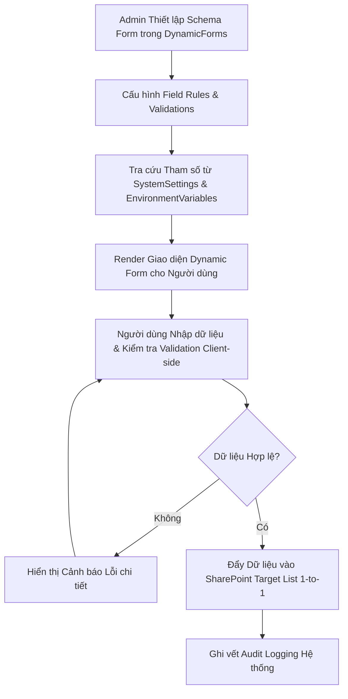

# Module: System Governance - Forms (Biểu mẫu Động & Cấu hình Hệ thống)

## 1. Mục tiêu & Phạm vi (Goal & Scope)
- **Mục tiêu**: Quản lý engine biểu mẫu động (Dynamic Forms) và cấu hình hệ thống (System Settings) phục vụ nhập liệu chuẩn hóa trên nền tảng IDOP-CCBA-WAY. Cho phép định nghĩa linh hoạt giao diện form, các trường dữ liệu tùy biến, quy tắc validate dữ liệu, ẩn/hiện trường theo điều kiện và tự động liên kết với các SharePoint Lists tương ứng mà không cần biên dịch lại ứng dụng.
- **Phạm vi**:
  - Quản lý danh mục cấu hình biểu mẫu động (`DynamicForms` / `DynamicFormConfigs`).
  - Cấu hình các thiết lập toàn hệ thống (`SystemSettings`).
  - Quản lý biến môi trường hỗ trợ cấu hình biểu mẫu (`EnvironmentVariables`).
  - Định nghĩa quy tắc validation, định dạng hiển thị và ánh xạ dữ liệu 1-1 với SharePoint JSON schemas.
  - Phân quyền hiển thị form theo vai trò người dùng (5 phòng ban + 3 chức danh CCBA).

## 2. User Stories & Ma trận Vai trò (Role Matrix)

### 2.1. User Stories theo 5 Phòng Ban & 3 Chức danh CCBA
- **Tổ chức - Hành chính (TCHC)**:
  - Là Admin TCHC, tôi muốn cấu hình biểu mẫu cập nhật hồ sơ nhân sự, đăng ký phúc lợi và cấp phát tài sản mà không cần can thiệp code.
- **Kế hoạch - Tài chính (KHTC)**:
  - Là Kế toán Trưởng, tôi muốn tùy chỉnh biểu mẫu đề nghị thanh toán, phiếu thu/chi và kiểm soát các trường bắt buộc nhập theo đúng định mức QCCTNB 3209.
- **Kỹ thuật - Đào tạo (KTDT)**:
  - Là Admin Kỹ thuật, tôi muốn định nghĩa biểu mẫu kiểm tra chất lượng CDE, đăng ký mô hình BIM và nhật ký bảo trì thiết bị.
- **Phòng Chuyên môn / Tư vấn**:
  - Là Kỹ sư / Chuyên viên, tôi muốn trải nghiệm giao diện biểu mẫu nhập liệu thân thiện, tự động gợi ý dữ liệu (auto-complete) và hiển thị thông báo lỗi rõ ràng.
- **Ban Giám đốc (BGD)**:
  - Là Giám đốc, tôi muốn biểu mẫu trình ký phê duyệt hiển thị đầy đủ thông tin tóm tắt và các nút thao tác phê duyệt nhanh.
- **Chủ nhiệm Dự án (PM)**:
  - Là PM, tôi muốn sử dụng biểu mẫu khởi tạo dự án và giao việc chuẩn hóa theo đúng mẫu quy định tại QCTK 2815.
- **Trưởng phòng Chuyên môn**:
  - Là Trưởng phòng Chuyên môn, tôi muốn được cấu hình các trường thông tin bổ sung cho biểu mẫu đánh giá nhân sự cấp phòng.
- **Giám đốc / BGD**:
  - Là Giám đốc, tôi muốn phê duyệt các thay đổi lớn đối với biểu mẫu giao dịch tài chính hoặc biểu mẫu trình ký cấp Trung tâm.

### 2.2. Ma trận Phân quyền & Vai trò (Role Matrix)
| Chức danh / Vai trò | DynamicForms Config | SystemSettings | EnvironmentVariables | Render Form (Use) | Form Audit |
| --- | --- | --- | --- | --- | --- |
| **System Administrator** | Full Control (Create/Update)| Full Control | Manage | Render & Test | Read / Export |
| **TCHC / KHTC / KTDT** | Create / Update (Dept) | Read / Request | Read (Dept Envs) | Full Render | Read Dept Audit |
| **Phòng Chuyên môn** | Read Only | Read Only | Read Public Envs | Full Render | N/A |
| **Ban Giám đốc** | Read All / Approve | Read All / Approve | Read All / Approve | Full Render | Read All Audit |
| **Chủ nhiệm Dự án (PM)** | Request Form Edit | Read Only | Read | Full Render | N/A |
| **Trưởng phòng Chuyên môn**| Request Form Edit | Read Only | Read | Full Render | N/A |

## 3. Cơ sở Pháp lý & Quy chế Áp dụng
- **QCTK 2815/QĐ-VKH (Quy chế Triển khai)**:
  - *Điều 4 & Điều 8 (Chuẩn hóa Biểu mẫu Kỹ thuật số)*: Bắt buộc 100% hồ sơ, chứng từ, phiếu giao việc và báo cáo phải sử dụng đúng định dạng biểu mẫu điện tử đã được chuẩn hóa trên IDOP.
- **QCCTNB 3209/QĐ-VKH (Quy chế Chi tiêu Nội bộ)**:
  - *Điều 15 & Các Phụ lục Biểu mẫu Chi tiêu*: Bắt buộc các biểu mẫu tài chính (Thanh toán, Tạm ứng, Quyết toán) phải hiển thị đầy đủ các trường thông tin theo đúng mẫu quy định của Viện.
- **Quy chế CCBA 2026**:
  - *Điều 24 (Quản trị Giao diện & Trải nghiệm Số)*: Quy định thẩm quyền quản lý engine biểu mẫu động, đảm bảo tính đồng nhất về nhận diện thương hiệu và tính chính xác của dữ liệu đầu vào.

## 4. Quy trình Nghiệp vụ Chi tiết (Operational Flow & BPMN)

### 4.1. Sơ đồ Quy trình Định nghĩa & Hiển thị Biểu mẫu Động (Mermaid BPMN)

### 4.2. Diễn giải Quy trình Nghiệp vụ & Tích hợp Cơ chế Tài chính
1. **Bước 1: Khởi tạo Structure Form**: Admin đăng ký mã form và định nghĩa cấu trúc JSON layout (Gồm các Group, Section, Column layout) trong `DynamicForms`.
2. **Bước 2: Cấu hình Rules & Biến**:
   - Gán các quy tắc validate (Required, Min/Max, Regex check, Conditional visibility).
   - Nạp các tham số định mức chi tiêu hoặc cấu hình hệ thống từ `SystemSettings` và `EnvironmentVariables`.
3. **Bước 3: Hiển thị (Rendering)**: Engine tự động render giao diện HTML/React theo đúng JSON Schema khi người dùng truy cập.
4. **Bước 4: Submit & Ánh xạ Dữ liệu**: Dữ liệu sau khi kiểm tra hợp lệ được ghi trực tiếp vào SharePoint List tương ứng (VD: Form Hợp đồng ghi vào `Contracts`, Form Chấm công ghi vào `Timesheets`).

## 5. Acceptance Criteria & List Mapping (Mapping 1-1 Schema JSON)

### 5.1. Tiêu chí Chấp nhận (Acceptance Criteria)
- [ ] Biểu mẫu động render chính xác 100% các trường dữ liệu theo đúng JSON Schema đã khai báo.
- [ ] Ánh xạ dữ liệu 1-1 không xảy ra lỗi sai lệch kiểu dữ liệu (Text, Number, Lookup, ManagedMetadata).
- [ ] Các tham số cấu hình từ `EnvironmentVariables` và `SystemSettings` được nạp đúng vào các quy tắc validation của Form.
- [ ] Phân quyền truy cập Form đảm bảo người dùng chỉ xem/nhập các biểu mẫu thuộc phạm vi phân quyền.

### 5.2. Bảng Mapping 1-to-1 Chi tiết với SharePoint List JSON

#### 1. Danh sách `EnvironmentVariables` (`lists/system_governance/environment_variables.json`)
| Internal Field Name | Display Name | Field Type | Required | Lookup / Taxonomy Mapping | Business Rules & Validation |
| --- | --- | --- | --- | --- | --- |
| `VariableName` | Tên biến môi trường | Text | Yes | N/A | Mã biến định cấu hình form (VD: `FORM_VALIDATION_MAX_EXPENSE`) |
| `Value` | Giá trị cấu hình | Text | No | N/A | Giá trị áp dụng cho quy tắc form |
| `Description` | Mô tả ý nghĩa | Text | No | N/A | Giải thích chi tiết mục đích cấu hình |

#### 2. Danh sách `DynamicForms` (`lists/system_governance/dynamic_forms.json`)
| Internal Field Name | Display Name | Field Type | Required | Lookup / Taxonomy Mapping | Business Rules & Validation |
| --- | --- | --- | --- | --- | --- |
| `FormCode` | Mã biểu mẫu | Text | Yes | N/A | Mã biểu mẫu định danh duy nhất (VD: `FORM_CONTRACT_CREATE`) |
| `FormTitle` | Tiêu đề biểu mẫu | Text | No | N/A | Tiêu đề hiển thị của biểu mẫu trên giao diện |
| `TargetList` | Danh sách mục tiêu | Text | No | N/A | Tên danh sách SharePoint mục tiêu ánh xạ dữ liệu |
| `JsonSchema` | Cấu trúc Schema | Note | No | N/A | Cấu trúc định nghĩa JSON layout, sections và field controls |

#### 3. Danh sách `SystemSettings` (`lists/system_governance/system_settings.json`)
| Internal Field Name | Display Name | Field Type | Required | Lookup / Taxonomy Mapping | Business Rules & Validation |
| --- | --- | --- | --- | --- | --- |
| `SettingKey` | Khoá tham số | Text | Yes | N/A | Khoá tham số cấu hình hệ thống (VD: `SYS_MAX_UPLOAD_SIZE_MB`) |
| `SettingValue` | Giá trị tham số | Text | No | N/A | Giá trị cấu hình tương ứng |
| `Category` | Nhóm phân loại | Choice | No | Choices: `UI`, `Finance`, `Workflow`, `Security` | Phân loại nhóm tham số cấu hình hệ thống |
| `IsEncrypted` | Mã hóa | YesNo | No | N/A | Cờ đánh dấu giá trị tham số cần mã hóa |

## 6. Bảo mật, Phân quyền & Audit Trail
### 6.1. Nguyên tắc Phân quyền & Truy cập
- Chỉ System Administrator và Cán bộ Quản trị được cấp quyền truy cập chỉnh sửa `DynamicForms` và `SystemSettings`.
- Mọi script hoặc biểu thức logic trong Dynamic Form phải được sanitize để phòng chống lỗ hổng Cross-Site Scripting (XSS) hoặc Injection.

### 6.2. Cấu trúc Audit Trail & Lưu vết Kiểm toán Nội bộ
- Mọi thay đổi về cấu hình Form, thêm trường mới hoặc sửa đổi quy tắc Validation đều được ghi phiên bản (Versioning) và lưu log chi tiết `ModifiedBy`, `Modified` để phục vụ kiểm toán nội bộ.
