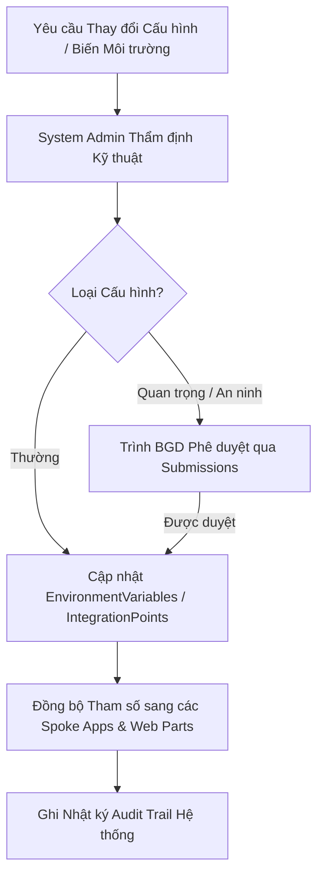

# Module: System Governance - Governance (Quản trị Hệ thống, Tham số & Phân quyền)

## 1. Mục tiêu & Phạm vi (Goal & Scope)
- **Mục tiêu**: Đảm bảo toàn bộ hệ thống IDOP-CCBA-WAY vận hành ổn định, an toàn, tuân thủ kiến trúc Hub & Spoke và các quy định bảo mật thông tin. Quản lý tập trung các tham số cấu hình hệ thống, biến môi trường (`EnvironmentVariables`), tích hợp hệ thống ngoài (`IntegrationPoints`), ma trận phân quyền vai trò (RBAC) và quản trị bộ từ điển phân loại chuẩn (Taxonomy TermStore).
- **Phạm vi**:
  - Quản lý và thiết lập biến môi trường (`EnvironmentVariables`) cho toàn bộ 6 module của IDOP.
  - Quản lý các điểm kết nối tích hợp API ngoài (`IntegrationPoints`) với phương thức xác thực an toàn.
  - Quản trị ma trận phân quyền bảo mật 5 phòng ban + 3 chức danh CCBA trên SharePoint Online & Power Platform.
  - Quản trị bộ từ khóa Taxonomy tập trung (CCBA Taxonomy: Trạng thái Hợp đồng, Trạng thái Trình ký, Trạng thái Nhân sự, Trạng thái Tài sản).
  - Giám sát nhật ký hoạt động hệ thống, kiểm soát tuân thủ và bảo trì nền tảng số.

## 2. User Stories & Ma trận Vai trò (Role Matrix)

### 2.1. User Stories theo 5 Phòng Ban & 3 Chức danh CCBA
- **Tổ chức - Hành chính (TCHC)**:
  - Là Chuyên viên Quản trị Hệ thống TCHC, tôi muốn cấp phát và điều chỉnh quyền truy cập của nhân sự mới/điều chuyển để đảm bảo đúng ma trận phân quyền.
- **Kế hoạch - Tài chính (KHTC)**:
  - Là Chuyên viên KHTC, tôi muốn quản lý các tham số tài chính (tỷ lệ phân bổ tài sản, định mức chi phí) lưu trong biến môi trường hệ thống.
- **Kỹ thuật - Đào tạo (KTDT)**:
  - Là Admin Kỹ thuật, tôi muốn cấu hình các tham số tích hợp CDE, máy chủ lưu trữ mô hình BIM và tích hợp API kiểm định.
- **Phòng Chuyên môn / Tư vấn**:
  - Là Người dùng hệ thống, tôi muốn được truy cập đúng các tài nguyên, biểu mẫu và danh sách được phân quyền theo đúng vị trí công tác.
- **Ban Giám đốc (BGD)**:
  - Là Giám đốc, tôi muốn phê duyệt các thay đổi lớn về chính sách phân quyền và biến cấu hình quan trọng của Trung tâm.
- **Chủ nhiệm Dự án (PM)**:
  - Là PM, tôi muốn được phân quyền tự động quản lý dự án (Project Site/Lists) ngay khi có quyết định giao việc.
- **Trưởng phòng Chuyên môn**:
  - Là Trưởng phòng Chuyên môn, tôi muốn được cấp quyền phê duyệt và duyệt phân công nhân sự thuộc phòng mình.
- **Giám đốc / BGD**:
  - Là Giám đốc, tôi muốn phê duyệt các thay đổi quyền System Admin hoặc mở rộng kết nối tích hợp hệ thống ngoài.

### 2.2. Ma trận Phân quyền & Vai trò (Role Matrix)
| Chức danh / Vai trò | EnvironmentVariables | IntegrationPoints | CCBA Taxonomy | System Permissions | Audit Logging |
| --- | --- | --- | --- | --- | --- |
| **System Admin (TCHC/KTDT)**| Create / Read / Update | Create / Read / Update | Manage TermStore | Manage Roles | Read / Export Logs |
| **Kế hoạch - Tài chính** | Read (Financial Envs) | Read | Read | Read Roles | Read Audit |
| **Kỹ thuật - Đào tạo** | Read / Technical Envs | Update (API Specs) | Read | Read Roles | Read Audit |
| **Phòng Chuyên môn** | Read (Public Envs) | N/A | Read | Read Self | N/A |
| **Ban Giám đốc** | Read All / Approve | Read All / Approve | Read All | Read All / Approve | Read All Audit |
| **Chủ nhiệm Dự án (PM)** | Read | N/A | Read | Project Level Admin | N/A |
| **Trưởng phòng Chuyên môn**| Read | N/A | Read | Dept Level Admin | N/A |

## 3. Cơ sở Pháp lý & Quy chế Áp dụng
- **QCTK 2815/QĐ-VKH (Quy chế Triển khai)**:
  - *Điều 4 (Nguyên tắc Thực hiện số hóa)*: Yêu cầu chuẩn hóa hệ thống quản trị dữ liệu, phân quyền bảo mật chặt chẽ và nhất quán trên toàn bộ hạ tầng phần mềm.
- **QCCTNB 3209/QĐ-VKH (Quy chế Chi tiêu Nội bộ)**:
  - *Điều 18 (Bảo mật số liệu tài chính)*: Phân cấp quyền truy cập dữ liệu doanh thu, chi phí, lương và thưởng; nghiêm cấm truy cập trái phép.
- **Quy chế CCBA 2026**:
  - *Điều 1 & Điều 24 (Quản trị Vận hành IDOP)*: Quy định thẩm quyền của Ban Giám đốc và Bộ phận Quản trị Hệ thống trong việc cài đặt biến môi trường, bảo trì đường truyền tích hợp và duy trì bộ từ điển dữ liệu Taxonomy.

## 4. Quy trình Nghiệp vụ Chi tiết (Operational Flow & BPMN)

### 4.1. Sơ đồ Quy trình Quản trị Cấu hình & Biến Môi trường (Mermaid BPMN)

### 4.2. Diễn giải Quy trình Nghiệp vụ & Tích hợp Cơ chế Tài chính
1. **Bước 1: Tiếp nhận Yêu cầu**: Đơn vị đề xuất tạo mới hoặc điều chỉnh tham số hệ thống, biến môi trường (`EnvironmentVariables`) hoặc điểm tích hợp (`IntegrationPoints`).
2. **Bước 2: Phê duyệt & Cập nhật**: Với các biến quan trọng (VD: Hạn mức chi tiêu, Tỷ lệ trích lập quỹ, Endpoint thanh toán), System Admin trình BGD duyệt trước khi cập nhật.
3. **Bước 3: Tự động Đồng bộ**: Các ứng dụng trong hệ thống IDOP đọc trực tiếp biến từ `EnvironmentVariables` để áp dụng công thức và logic tính toán tài chính/nghiệp vụ.
4. **Bước 4: Kiểm soát & Lưu vết**: Mọi sự thay đổi về tham số và phân quyền hệ thống được ghi vết tự động vào nhật ký kiểm toán (Audit Log).

## 5. Acceptance Criteria & List Mapping (Mapping 1-1 Schema JSON)

### 5.1. Tiêu chí Chấp nhận (Acceptance Criteria)
- [ ] 100% Biến môi trường (`EnvironmentVariables`) có tên biến duy nhất (`VariableName`) và mô tả rõ ràng.
- [ ] Các điểm tích hợp (`IntegrationPoints`) đăng ký đầy đủ Endpoint, SystemName và phương thức xác thực chuẩn (`AuthMethod`).
- [ ] Ma trận phân quyền RBAC được cấu hình chuẩn xác trên SharePoint Groups và Azure AD App Roles.
- [ ] Bộ từ khóa Taxonomy (CCBA Taxonomy) được quản lý tập trung và áp dụng đồng nhất trên tất cả 52 SharePoint Lists.

### 5.2. Bảng Mapping 1-to-1 Chi tiết với SharePoint List JSON

#### 1. Danh sách `EnvironmentVariables` (`lists/system_governance/environment_variables.json`)
| Internal Field Name | Display Name | Field Type | Required | Lookup / Taxonomy Mapping | Business Rules & Validation |
| --- | --- | --- | --- | --- | --- |
| `VariableName` | Tên biến môi trường | Text | Yes | N/A | Tên định danh duy nhất của biến (VD: `CCBA_TIER3_BONUS_RATE`) |
| `Value` | Giá trị | Text | No | N/A | Giá trị cấu hình của biến (Text, Numeric string, JSON object string) |
| `Description` | Mô tả biến | Text | No | N/A | Ý nghĩa nghiệp vụ và vị trí sử dụng của biến môi trường |

#### 2. Danh sách `IntegrationPoints` (`lists/system_governance/integration_points.json`)
| Internal Field Name | Display Name | Field Type | Required | Lookup / Taxonomy Mapping | Business Rules & Validation |
| --- | --- | --- | --- | --- | --- |
| `IntegrationName` | Tên điểm tích hợp | Text | Yes | N/A | Tên hệ thống tích hợp (VD: `IBST_ERP_CONNECTOR`, `BIM_CDE_BRIDGE`) |
| `SystemName` | Tên hệ thống ngoài | Text | No | N/A | Tên ứng dụng đối tác / phần mềm bên thứ 3 |
| `APIEndpoint` | Đường dẫn API | Text | No | N/A | URL endpoint thực thi tích hợp (HTTPS mandatory) |
| `AuthMethod` | Phương thức xác thực | Choice | No | Choices: `None`, `Basic`, `OAuth2`, `APIKey` | Chuẩn xác thực an toàn tích hợp |

#### 3. Danh sách `SystemSettings` (`lists/system_governance/system_settings.json`)
| Internal Field Name | Display Name | Field Type | Required | Lookup / Taxonomy Mapping | Business Rules & Validation |
| --- | --- | --- | --- | --- | --- |
| `SettingKey` | Khoá tham số | Text | Yes | N/A | Khoá tham số cấu hình hệ thống (VD: `SYS_MAX_UPLOAD_SIZE_MB`) |
| `SettingValue` | Giá trị tham số | Text | No | N/A | Giá trị cấu hình tương ứng |
| `Category` | Nhóm phân loại | Choice | No | Choices: `UI`, `Finance`, `Workflow`, `Security` | Phân loại nhóm tham số cấu hình hệ thống |
| `IsEncrypted` | Mã hóa | YesNo | No | N/A | Cờ đánh dấu giá trị tham số cần mã hóa |

## 6. Bảo mật, Phân quyền & Audit Trail
### 6.1. Nguyên tắc Phân quyền & Truy cập
- Chỉ tài khoản System Administrator mới có quyền Write/Update trên danh sách `EnvironmentVariables` và `IntegrationPoints`.
- Quyền truy cập các biến nhạy cảm (API Keys, Connection Strings) phải được mã hóa và hạn chế hiển thị công khai.

### 6.2. Cấu trúc Audit Trail & Lưu vết Kiểm toán Nội bộ
- Mọi thao tác cập nhật cấu hình hệ thống, thêm/bớt quyền người dùng đều phải ghi rõ `ModifiedBy`, `Modified` và lưu trữ tối thiểu 24 tháng phục vụ kiểm toán an ninh mạng.
